# 063：泛型结构体与枚举 🧬

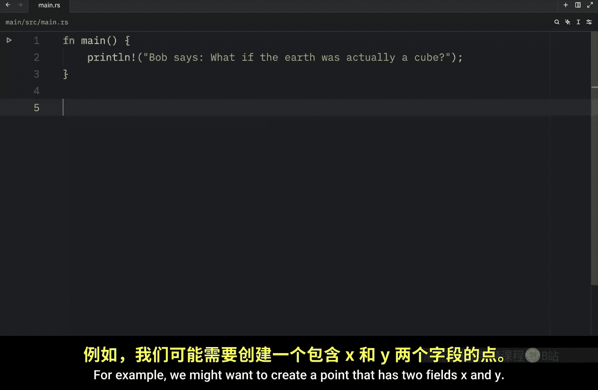

在本节课中，我们将继续学习泛型，并了解如何在结构体（`struct`）和枚举（`enum`）中使用它们。泛型允许我们编写灵活且可重用的代码，而无需为每种数据类型重复编写逻辑。

上一节我们介绍了泛型函数，本节中我们来看看如何将泛型应用于自定义数据类型。

## 泛型结构体


结构体可以使用泛型来定义其字段的类型。例如，我们可能想创建一个具有两个字段 X 和 Y 的点。

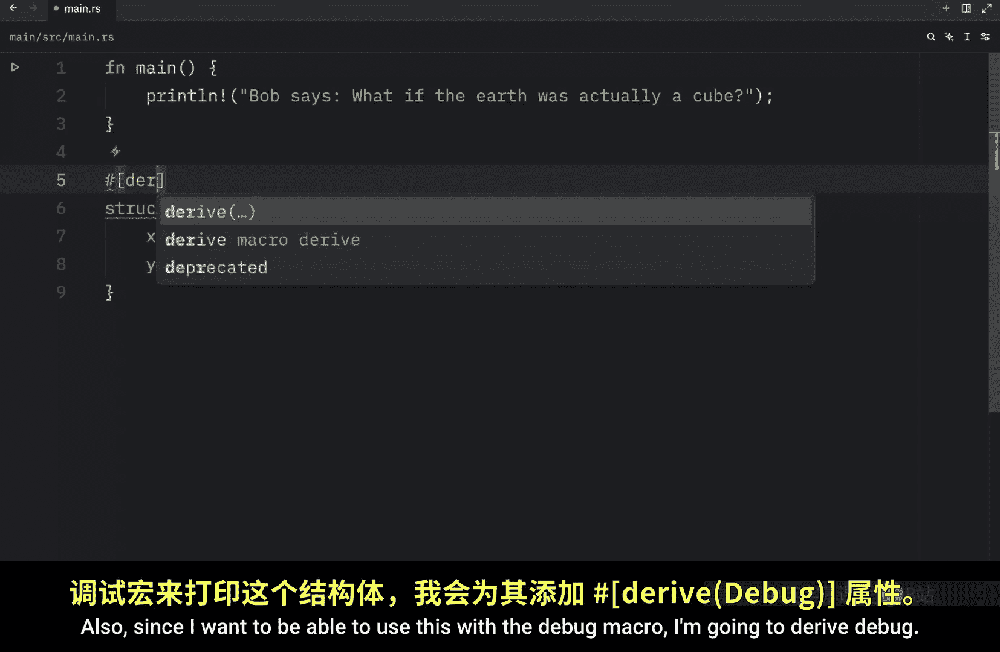

以下是定义一个泛型 `Point` 结构体的方法：


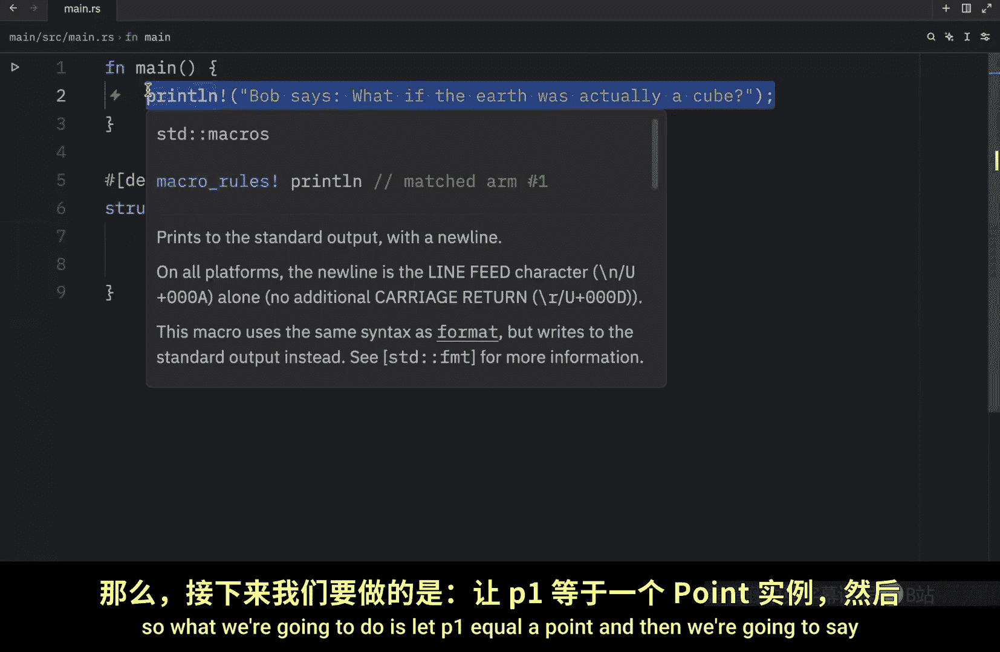

```rust
#[derive(Debug)]
struct Point<T> {
    x: T,
    y: T,
}
```

我们使用尖括号 `<T>` 来声明一个名为 `T` 的泛型类型。结构体内部的字段 `x` 和 `y` 都使用这个类型 `T`。`#[derive(Debug)]` 是为了能够使用 `println!` 宏打印结构体。

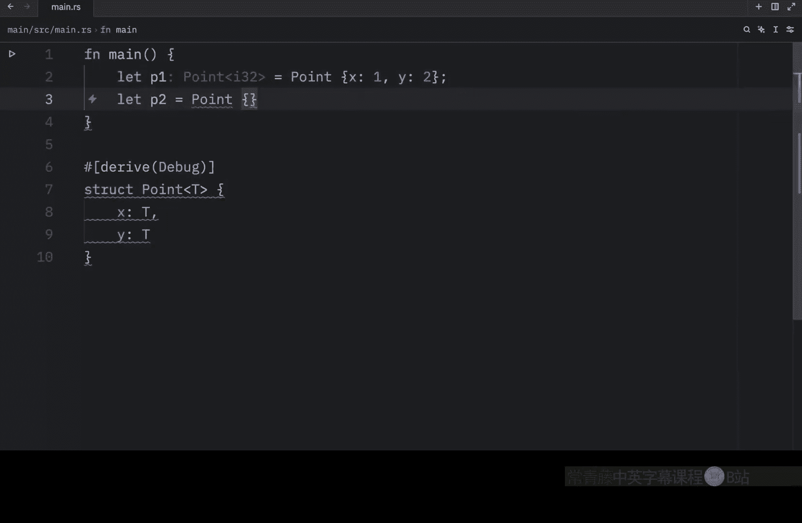

现在，当我们创建 `Point` 实例时，可以使用任何类型，只要 `x` 和 `y` 的类型相同。

以下是创建不同类型 `Point` 实例的示例：

```rust
fn main() {
    let p1 = Point { x: 1, y: 2 }; // T 被推断为 i32
    let p2 = Point { x: 1.5, y: 2.5 }; // T 被推断为 f64

    println!("{:?}, {:?}", p1, p2);
}
```

运行此代码将输出两个点：一个包含整数，另一个包含浮点数。这都归功于泛型。再次强调，两个字段的类型必须匹配，代码才能正常工作。我们不能插入 `1.5` 和 `2`，因为 `2` 是整数而 `1.5` 是浮点数。使用泛型时，你实际上是在约定这些位置必须是相同的类型。

## 多个泛型参数

如果你的代码需要多个泛型类型，可以在结构体中指定额外的泛型参数。

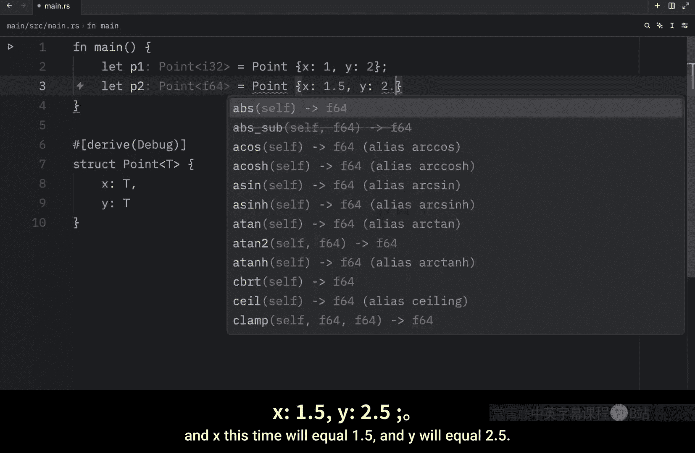


例如，我们可以让 `x` 和 `y` 使用不同的类型：

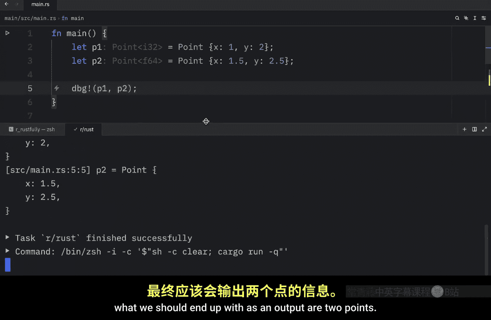


```rust
#[derive(Debug)]
struct Point<T, U> {
    x: T,
    y: U,
}
```

按照惯例，我们使用 `T` 和 `U` 作为泛型参数名（`U` 是 `T` 之后的下一个字母）。现在，`y` 是 `U` 类型。

以下是使用示例：

```rust
fn main() {
    let p1 = Point { x: 1.5, y: 2 }; // T 为 f64, U 为 i32
    let p2 = Point { x: 1, y: 2 }; // T 和 U 均为 i32

    println!("{:?}, {:?}", p1, p2);
}
```

在这个例子中，第一个点的泛型类型被推断为 `f64` 和 `i32`，而第二个点则都是 `i32`。

## 为泛型添加约束（Trait Bounds）

为结构体添加泛型类型虽然增加了灵活性，但有时可能过于灵活。理论上，我们可以插入任何类型，包括在“点”的上下文中没有意义的类型，比如字符串。

为了避免这种情况，我们可以为泛型类型添加约束（Trait Bounds），只允许特定的类型。例如，我们可以约束 `Point` 只接受数值类型。

首先，我们需要添加一个提供数值特质的 crate（例如 `num`）。在 `Cargo.toml` 中添加依赖：

```toml
[dependencies]
num = "0.4"
```

然后，我们可以修改结构体定义，为泛型 `T` 添加 `Num` 特质约束：

```rust
use num::Num;


#[derive(Debug)]
struct Point<T: Num> {
    x: T,
    y: T,
}
```

通过 `T: Num`，我们为类型 `T` 添加了约束，意味着 `T` 必须实现 `Num` 特质（即必须是数值类型）。

现在，如果我们尝试使用非数值类型（如字符串或布尔值）创建 `Point`，Rust 编译器会报错：

```rust
fn main() {
    // 以下代码将无法编译
    // let p = Point { x: "hello", y: "world" }; // 错误：字符串不是数值类型
    // let p = Point { x: true, y: false }; // 错误：布尔值不是数值类型

    let p = Point { x: 1.5, y: 2.0 }; // 正确：浮点数是数值类型
    println!("{:?}", p);
}
```

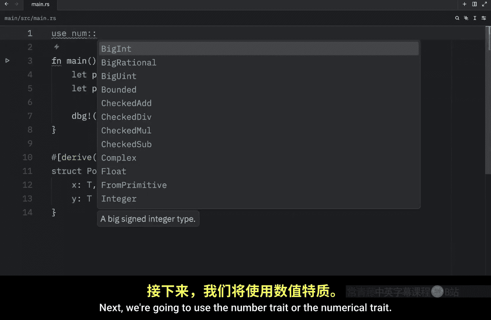

这样，我们确保了 `Point` 结构体只用于有意义的数值类型，提高了代码的安全性和清晰度。

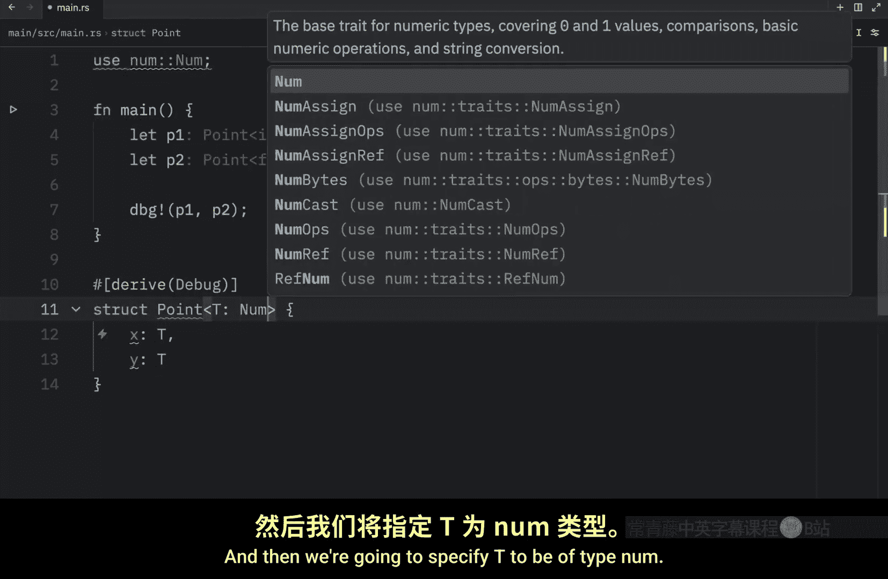

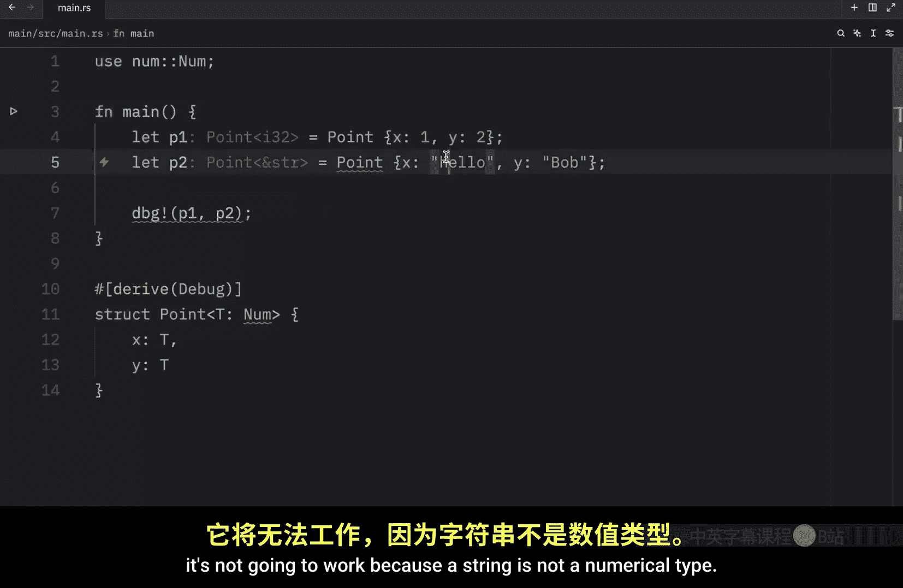

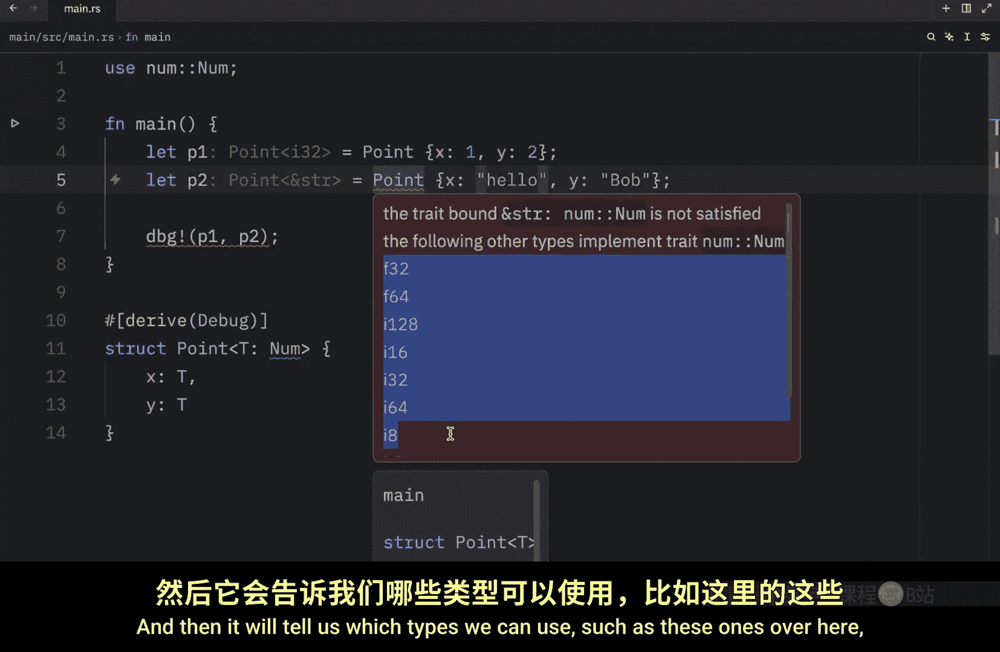

## 泛型枚举

枚举也可以使用泛型。一个经典的例子是标准库中的 `Option<T>` 和 `Result<T, E>` 枚举。

让我们尝试重新创建 `Option` 枚举来理解其原理：

```rust
enum MyOption<T> {
    Some(T),
    None,
}
```

这个枚举有一个泛型类型 `T`。变体 `Some` 包含一个 `T` 类型的值，而 `None` 不包含任何值。

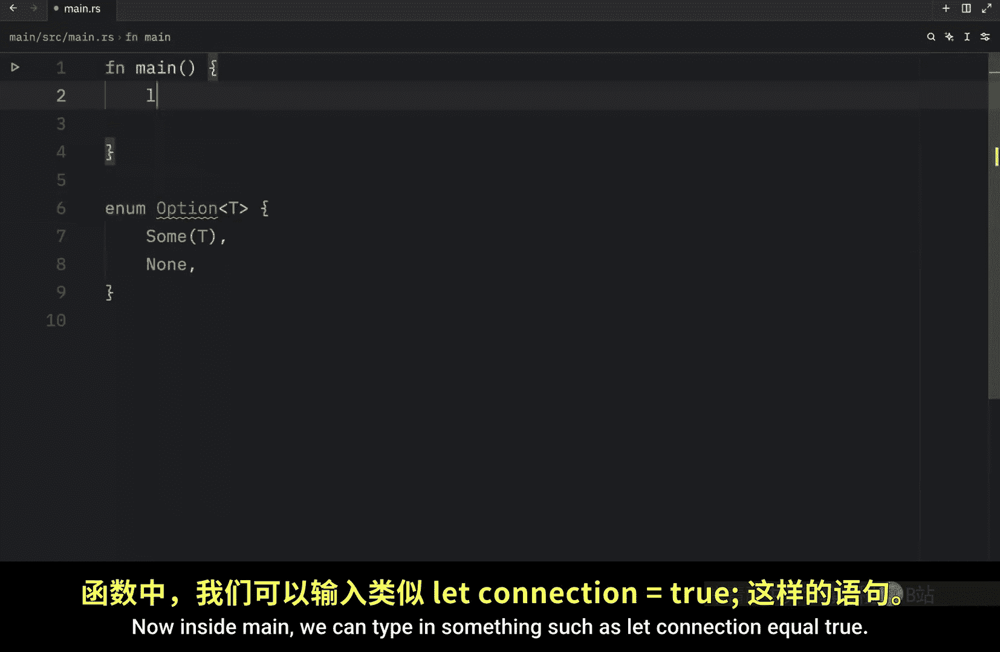


以下是一个使用示例，模拟检查网络连接：

```rust
fn main() {
    let connection = true;

    let result = if connection {
        MyOption::Some("Connected")
    } else {
        MyOption::None
    };

    // 注意：我们的 MyOption 没有实现 Debug，这里仅为演示逻辑。
    // 实际中可以使用标准库的 Option<T>，它已实现 Debug。
    // println!("{:?}", result);
}
```

在这个例子中，`MyOption` 现在是 `&str` 类型。如果我们传入一个整数，它就会变成 `i32` 类型。这就是枚举的泛型部分。

就像函数和结构体一样，枚举也可以有多个泛型参数。最常见的例子是 `Result` 枚举：

```rust
enum Result<T, E> {
    Ok(T),
    Err(E),
}
```

它包含两个泛型类型：`T` 代表成功时返回的值（`Ok` 变体），`E` 代表错误时返回的类型（`Err` 变体）。这对于可能成功或失败的操作非常方便。

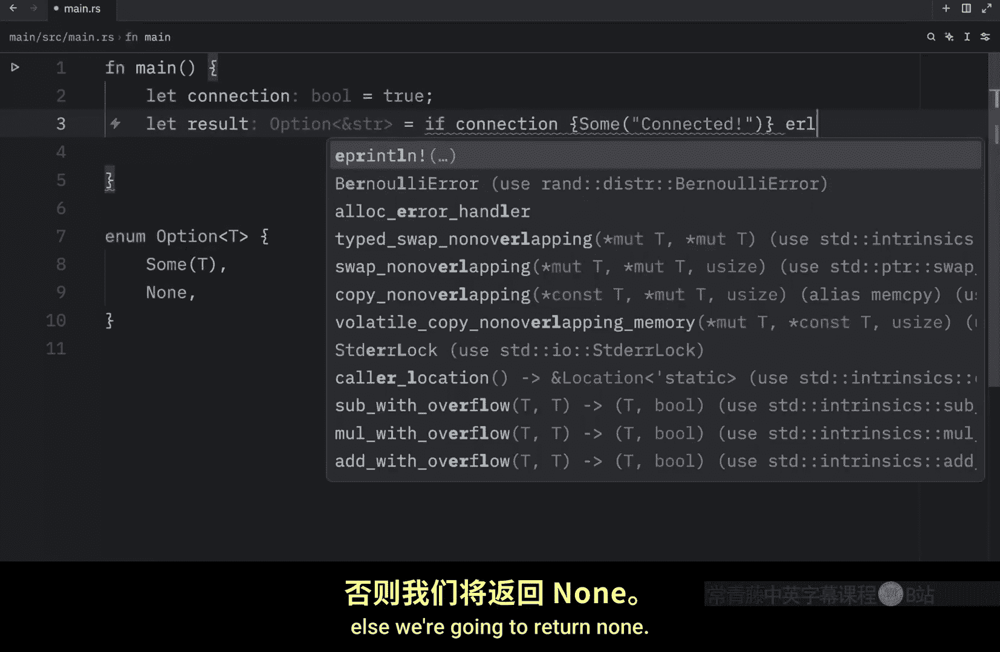

## 总结

本节课中我们一起学习了如何在 Rust 的结构体和枚举中使用泛型。
*   我们定义了泛型结构体 `Point<T>`，使其字段可以使用灵活但一致的类型。
*   我们了解了如何使用多个泛型参数（如 `Point<T, U>`）来允许字段具有不同的类型。
*   我们探讨了通过添加特质约束（如 `T: Num`）来限制泛型类型，确保代码的语义正确性和安全性。
*   最后，我们查看了泛型在枚举中的应用，例如自定义的 `MyOption<T>` 和标准库中的 `Result<T, E>`，它们利用泛型优雅地处理了可能包含值或错误的情况。


泛型是编写强大、灵活且可重用 Rust 代码的核心工具之一，在自定义数据类型中应用泛型能极大地提升代码的抽象能力和适用性。