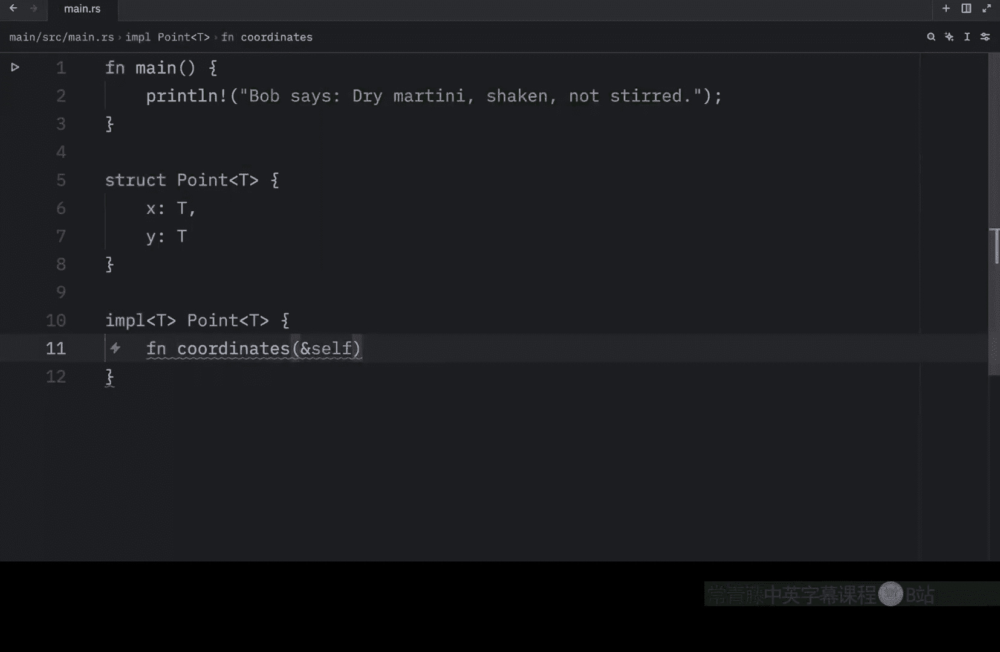
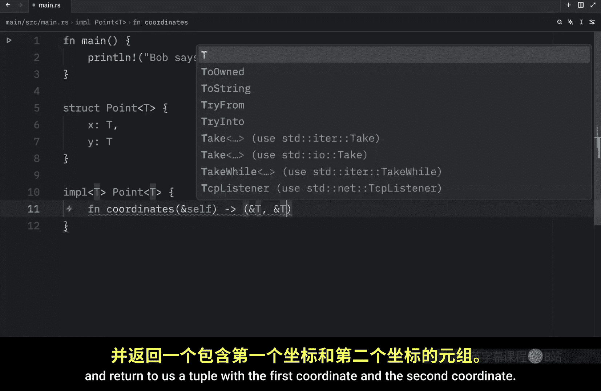
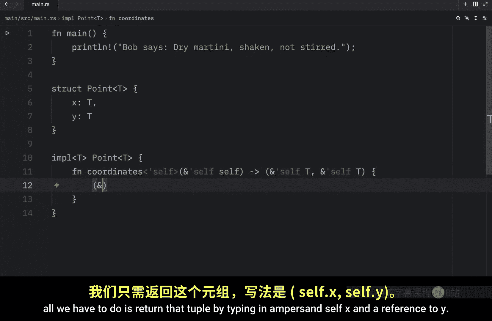
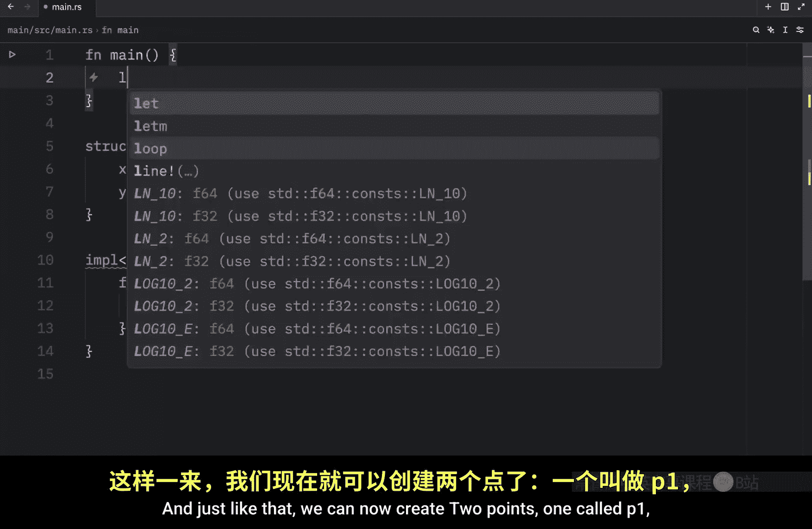
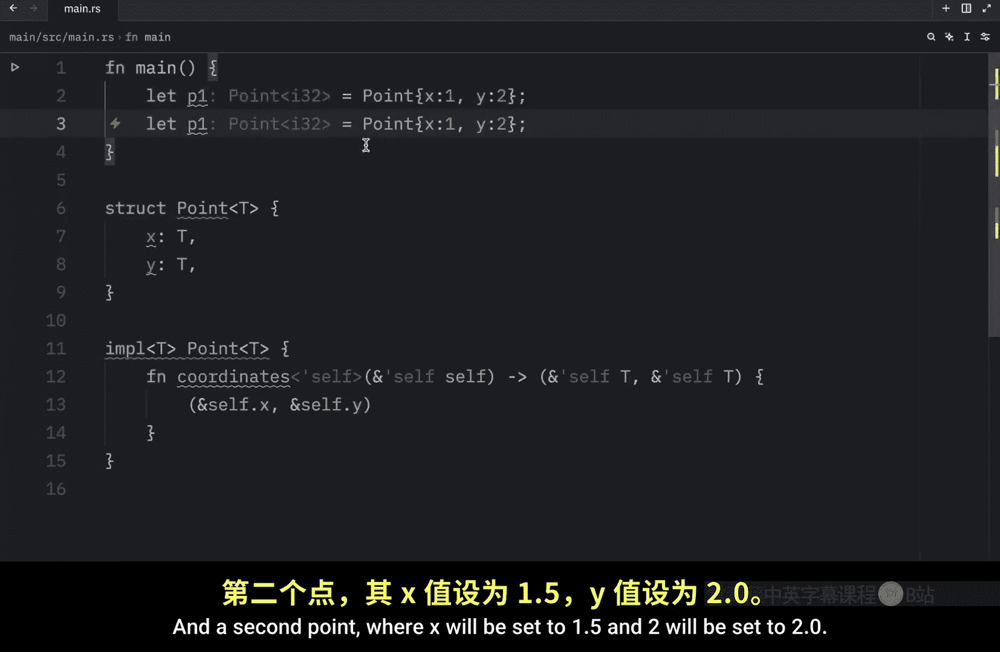
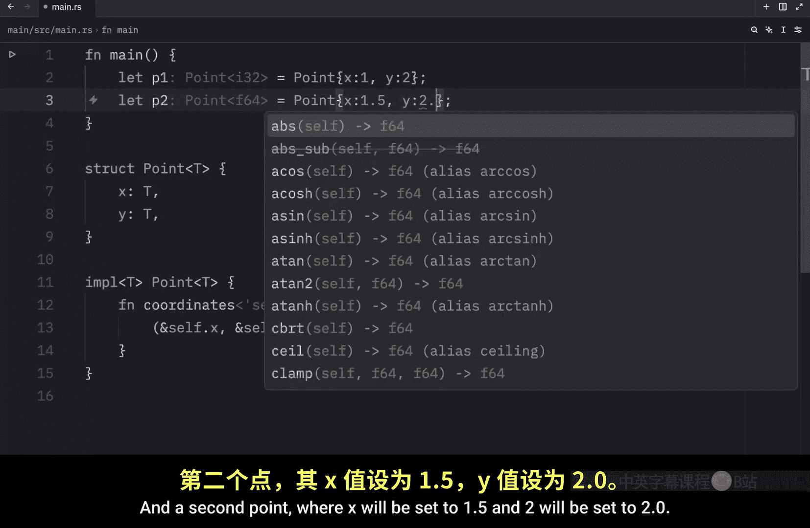
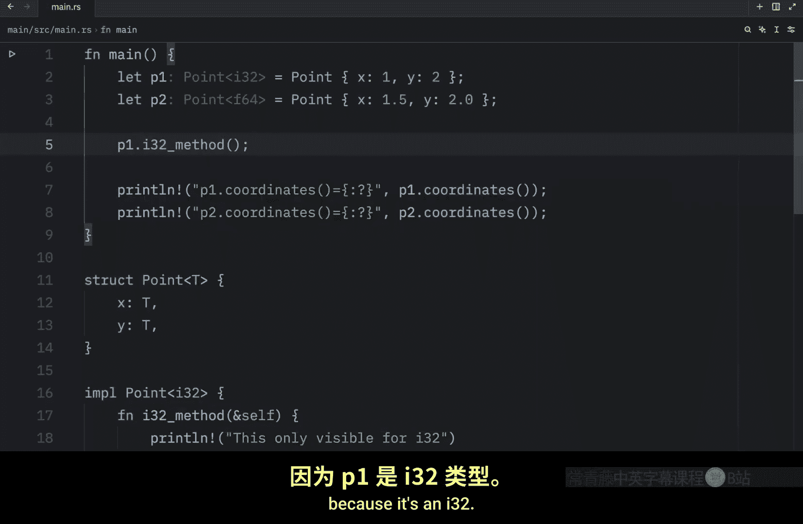
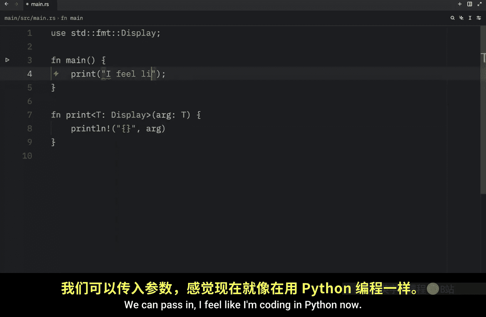
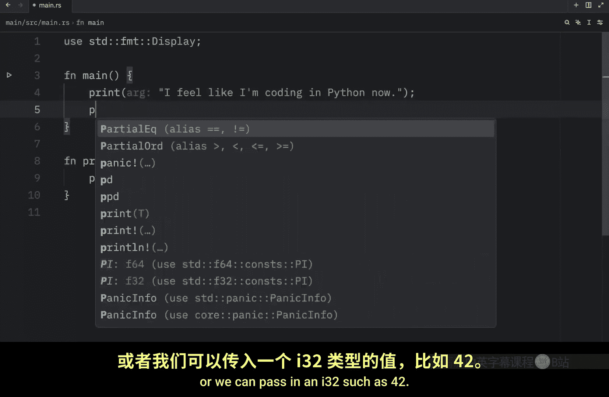
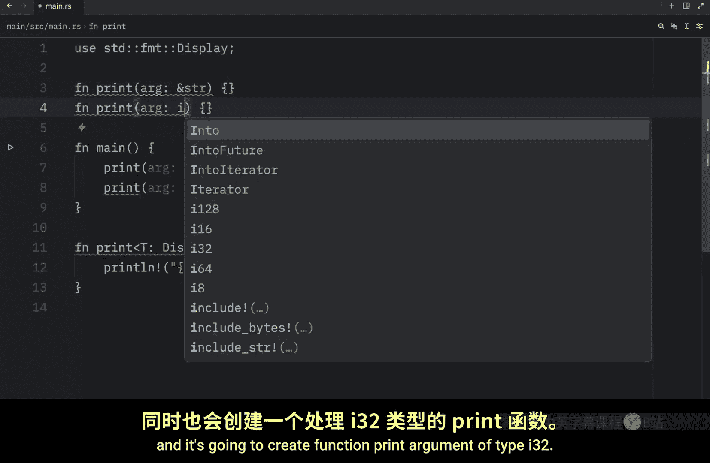

# 064：泛型在方法定义中的使用 🧬

在本节课中，我们将学习如何在 Rust 的方法定义中使用泛型。我们将创建一个泛型结构体，为其实现泛型方法，并探讨如何为特定类型添加约束以及使用多层泛型。最后，我们会了解 Rust 如何通过单态化来保证泛型代码的运行时性能。

## 创建泛型结构体与实现

上一节我们介绍了泛型的基本概念，本节中我们来看看如何为结构体定义泛型方法。

首先，我们创建一个名为 `Point` 的泛型结构体，它包含两个类型为 `T` 的坐标 `x` 和 `y`。



```rust
struct Point<T> {
    x: T,
    y: T,
}
```

接下来，我们为这个泛型结构体实现一个方法。在 `impl` 块中，我们需要声明泛型参数 `T`，并将其与 `Point<T>` 关联。

```rust
impl<T> Point<T> {
    fn coordinates(&self) -> (&T, &T) {
        (&self.x, &self.y)
    }
}
```

这个方法名为 `coordinates`，它返回一个包含 `x` 和 `y` 坐标引用的元组。

现在，我们可以创建两个使用不同具体类型的 `Point` 实例。







```rust
fn main() {
    let p1 = Point { x: 1, y: 2 }; // Point<i32>
    let p2 = Point { x: 21.5, y: 2.0 }; // Point<f64>

    println!("{:?}", p1.coordinates()); // 输出: (1, 2)
    println!("{:?}", p2.coordinates()); // 输出: (21.5, 2.0)
}
```





通过一个结构体和一个实现块，我们就能让 `Point` 独立地处理 `i32` 和 `f64` 类型的数据。

## 为特定类型添加约束

有时，我们希望某些方法只对特定的类型可用。这可以通过为特定类型单独实现一个 `impl` 块来实现。

以下是为 `Point<i32>` 专门实现一个方法 `i32_method` 的示例。

```rust
impl Point<i32> {
    fn i32_method(&self) {
        println!("This method is only available for Point<i32>");
    }
}
```




现在，只有 `p1`（类型为 `Point<i32>`）可以调用 `i32_method`。`p2`（类型为 `Point<f64>`）则无法调用此方法。

```rust
p1.i32_method(); // 可以调用
// p2.i32_method(); // 这行代码会编译错误
```

## 在实现块中使用多层泛型

泛型不仅可以用在结构体定义上，还可以在方法中引入新的、独立的泛型参数。


假设我们想为 `Point` 添加一个方法，为坐标数据打上标签。这个方法需要一个新的泛型参数 `L` 来表示标签的类型。


```rust
impl<T> Point<T> {
    fn label<L>(self, label: L) -> (L, T, T) {
        (label, self.x, self.y)
    }
}
```

`label` 方法接收一个 `self`（消耗所有权）和一个任意类型的 `label`，返回一个包含标签和两个坐标的元组。

现在我们可以这样使用它：

```rust
fn main() {
    let p1 = Point { x: 1, y: 2 };
    let point_with_label = p1.label("coordinates"); // 标签类型为 &str
    println!("{:?}", point_with_label); // 输出: ("coordinates", 1, 2)

    // 也可以使用其他类型作为标签
    let p2 = Point { x: 3, y: 4 };
    let another_label = p2.label(10); // 标签类型为 i32
    println!("{:?}", another_label); // 输出: (10, 3, 4)
}
```

## 泛型的性能：单态化

你可能会担心使用泛型会影响程序的运行时性能。好消息是，在 Rust 中，使用泛型不会比使用具体类型（如 `i32` 或 `f64`）运行得更慢。

Rust 通过在编译时进行 **单态化** 来实现这一点。单态化是一个将泛型代码转换为特定代码的过程，编译器会用实际使用的具体类型来填充泛型参数。


例如，考虑以下泛型函数：

```rust
use std::fmt::Display;

fn print<T: Display>(item: T) {
    println!("{}", item);
}
```

当我们在代码中这样调用它时：

```rust
print("Hello");
print(42);
```

编译器在编译时，会为实际用到的类型生成两个具体的函数：





```rust
// 编译器生成的代码（概念上）
fn print_for_str(item: &str) {
    println!("{}", item);
}
fn print_for_i32(item: i32) {
    println!("{}", item);
}
```

编译器只会生成代码中实际使用的那些类型的变体（例如 `&str` 和 `i32`），而不会为所有可能的类型生成代码，从而消除了运行时开销。

## 总结





本节课中我们一起学习了 Rust 泛型在方法定义中的高级用法。
我们首先创建了一个泛型 `Point` 结构体并为其实现了通用方法。
接着，我们探讨了如何通过为特定类型（如 `Point<i32>`）单独实现 `impl` 块来添加类型约束。
然后，我们学习了如何在方法中引入新的、独立于结构体的泛型参数。
最后，我们了解了 Rust 如何通过编译时的单态化过程来保证泛型代码的零成本抽象，确保其运行时性能与使用具体类型编写的代码无异。