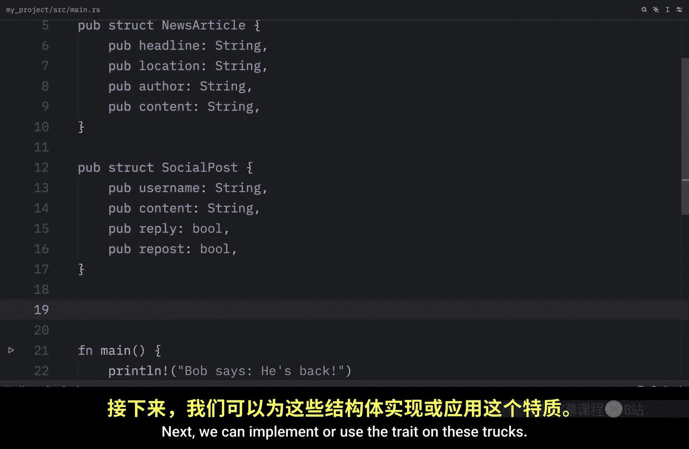
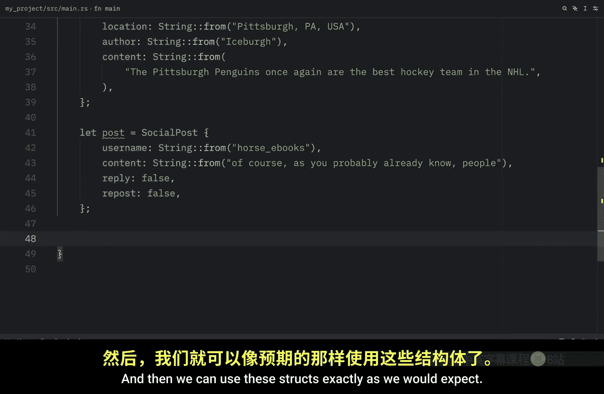
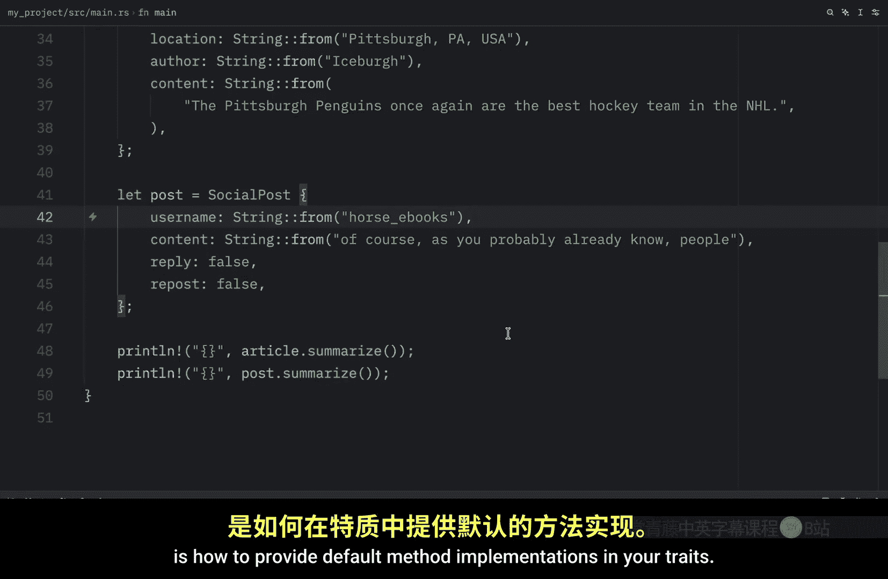
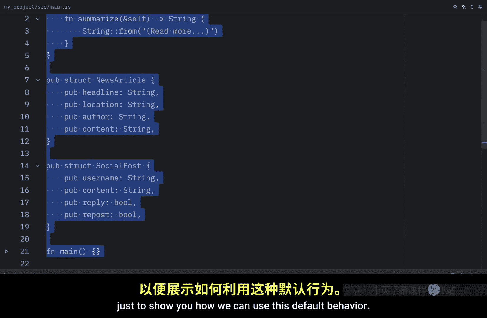

# 065：Trait 基础 🧩

在本节课中，我们将要学习 Rust 中一个非常强大的特性：Trait。Trait 用于定义一组可以被不同类型共享的方法签名，是实现多态行为的关键。我们将从如何定义和实现一个 Trait 开始。

## 什么是 Trait？

Trait 定义了一组方法签名，不同的类型可以实现这些方法。其目的是将多个类型可以共享的行为（方法签名）进行分组。

要定义一个 Trait，你需要使用 `trait` 关键字，后跟 Trait 的名称。你可以在定义前添加 `pub` 关键字，以允许其他模块依赖此 Trait。在 Trait 内部，你只需提供方法签名。

例如，我们可以定义一个名为 `Summary` 的 Trait，它包含一个 `summarize` 方法：

```rust
pub trait Summary {
    fn summarize(&self) -> String;
}
```

这里我们只提供了方法签名 `summarize`，它接收一个 `&self` 参数并返回一个 `String`。具体的类型将在后续实现中为这些方法提供函数体。一个 Trait 可以声明多个方法，但在此示例中我们只定义了一个。

## 为具体类型实现 Trait



上一节我们介绍了如何定义 Trait，本节中我们来看看如何为具体的类型实现它。

我们将创建两个结构体（`struct`）作为示例：
*   `NewsArticle`：包含标题、地点、作者和内容。
*   `SocialPost`：包含用户名、内容、回复和转发信息。

以下是这两个结构体的定义：

```rust
struct NewsArticle {
    headline: String,
    location: String,
    author: String,
    content: String,
}

struct SocialPost {
    username: String,
    content: String,
    reply: bool,
    repost: bool,
}
```

接下来，我们可以为这些结构体实现 `Summary` Trait。


以下是实现 `Summary` Trait 的步骤：


1.  **为 `NewsArticle` 实现 Trait**：
    我们使用 `impl Summary for NewsArticle` 语法。编译器会提示我们必须实现 Trait 中定义的所有方法（即 `summarize`）。我们实现一个 `summarize` 方法，返回一个包含标题、作者和地点的格式化字符串。

    ```rust
    impl Summary for NewsArticle {
        fn summarize(&self) -> String {
            format!("{} by {} ({})", self.headline, self.author, self.location)
        }
    }
    ```



2.  **为 `SocialPost` 实现 Trait**：
    同样地，我们为 `SocialPost` 实现 `Summary` Trait。这里我们实现 `summarize` 方法，返回一个包含用户名和内容的字符串。

    ```rust
    impl Summary for SocialPost {
        fn summarize(&self) -> String {
            format!("{}: {}", self.username, self.content)
        }
    }
    ```

现在，我们可以像使用普通方法一样使用这些结构体的 `summarize` 功能。首先创建结构体实例，然后调用其 `summarize` 方法：

```rust
fn main() {
    let article = NewsArticle {
        headline: String::from("Penguins Win the Stanley Cup Championship!"),
        location: String::from("Pittsburgh, PA, USA"),
        author: String::from("Iceburgh"),
        content: String::from("The Pittsburgh Penguins once again are the best hockey team in the NHL."),
    };

    let post = SocialPost {
        username: String::from("horse_ebooks"),
        content: String::from("of course, as you probably already know, people"),
        reply: false,
        repost: false,
    };

    println!("{}", article.summarize());
    println!("{}", post.summarize());
}
```

运行此程序，你将看到两个结构体各自输出的摘要信息。Trait 要求我们实现特定的功能，之后我们就可以像平常一样使用这些结构体了。

## 提供默认方法实现

我们已经学会了如何为类型实现 Trait，现在让我们看看如何为 Trait 中的方法提供默认实现。




首先，我们修改 `Summary` Trait 的定义，为 `summarize` 方法提供一个默认实现：


```rust
pub trait Summary {
    fn summarize(&self) -> String {
        String::from("(Read more...)")
    }
}
```

这个默认实现返回字符串 `"(Read more...)"`。实现此 Trait 的类型可以选择保留这个默认实现，也可以选择性地覆盖它。默认实现甚至可以调用 Trait 中的其他方法（包括那些必须实现的方法）。

为了演示如何使用默认行为，我们创建两个新的结构体：

```rust
struct SimpleNote {
    content: String,
}

struct DetailedPost {
    username: String,
    content: String,
}
```

以下是实现 `Summary` Trait 的两种方式：



1.  **使用默认实现**：
    为 `SimpleNote` 实现 `Summary` 时，我们可以提供一个空的实现块 `{}`。由于 `summarize` 方法已有默认实现，我们无需再提供函数体。

    ```rust
    impl Summary for SimpleNote {}
    ```

2.  **覆盖默认实现**：
    为 `DetailedPost` 实现 `Summary` 时，我们选择覆盖默认的 `summarize` 方法，提供我们自己的实现。

    ```rust
    impl Summary for DetailedPost {
        fn summarize(&self) -> String {
            format!("{} posted: {}", self.username, self.content)
        }
    }
    ```

最后，在 `main` 函数中创建实例并调用方法：

```rust
fn main() {
    let note = SimpleNote {
        content: String::from("This is a simple note."),
    };

    let post = DetailedPost {
        username: String::from("rustacean"),
        content: String::from("Learning traits is fun!"),
    };

    println!("{}", note.summarize()); // 输出默认实现
    println!("{}", post.summarize()); // 输出覆盖后的实现
}
```

运行此程序，你将看到 `SimpleNote` 使用了默认实现，而 `DetailedPost` 使用了我们自定义的实现。

## 总结


本节课中我们一起学习了 Rust Trait 的基础知识。我们首先了解了 Trait 的定义和作用，即定义一组共享的行为。接着，我们实践了如何为具体的结构体类型实现 Trait，并调用实现的方法。最后，我们探索了如何为 Trait 方法提供默认实现，这为类型提供了灵活性：它们可以选择使用默认行为，也可以提供自定义的实现。掌握 Trait 是理解 Rust 多态和代码复用的重要一步。