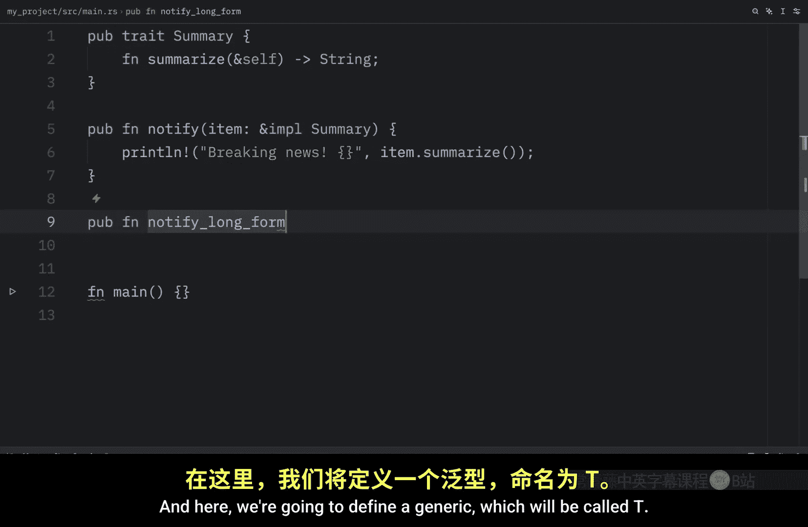
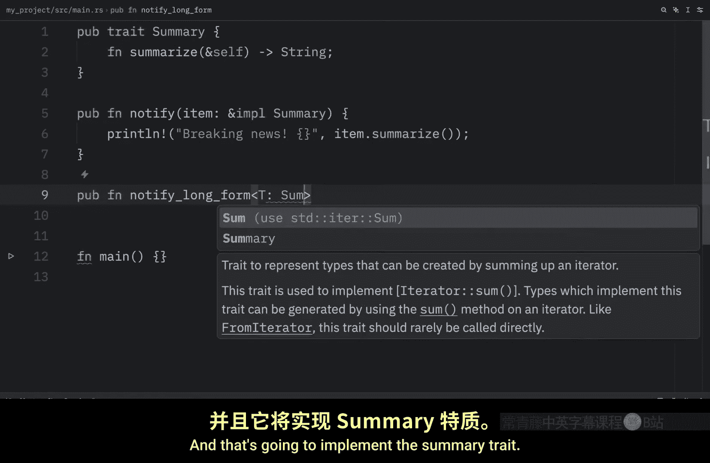
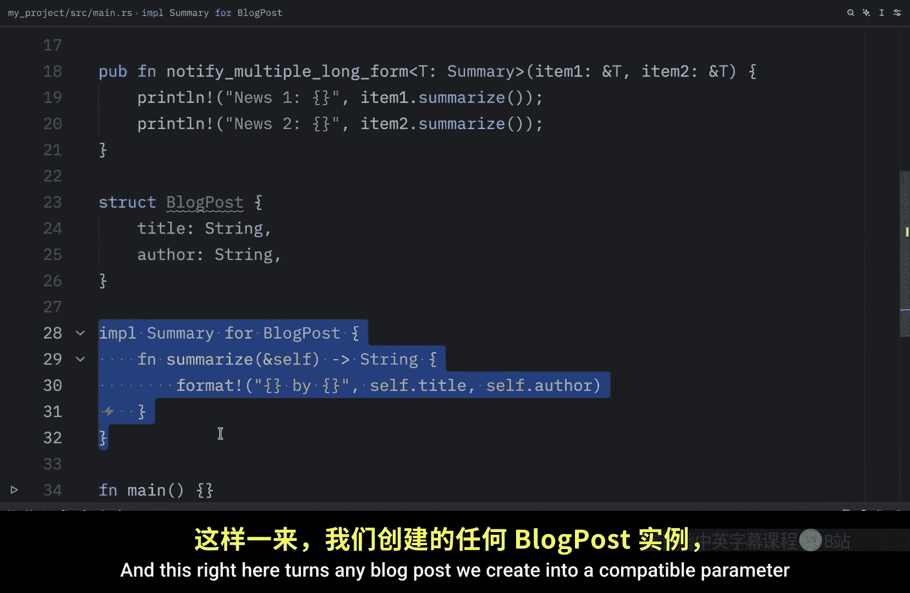
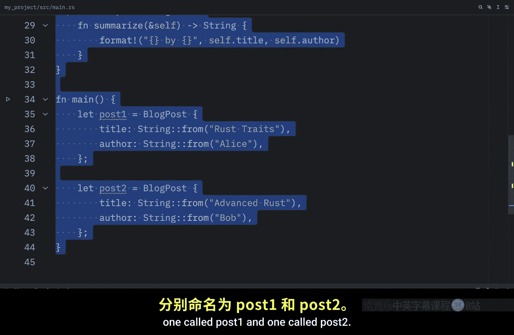
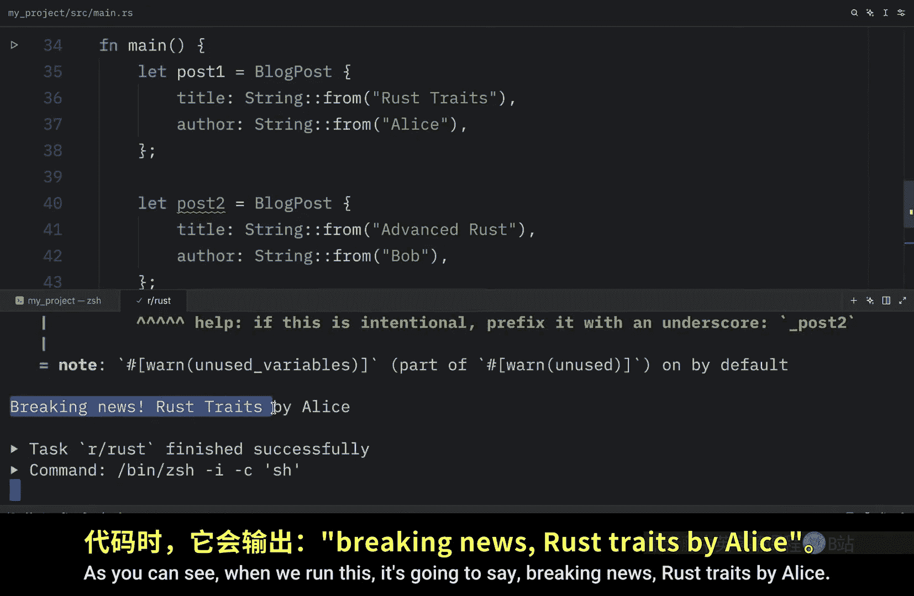

# 066：在 Rust 中使用 Trait 作为约束

在本节课中，我们将学习如何在 Rust 中使用 Trait 作为泛型函数的约束。我们将介绍两种语法形式：简写形式和显式泛型形式，并学习如何组合多个 Trait 约束。

## 使用 Trait 约束的两种形式

上一节我们学习了如何定义简单的 Trait。本节中，我们来看看如何将其用作泛型函数的约束。这主要有两种形式：简写语法和显式泛型语法。

### 简写语法

我们将使用上一课中定义的 `Summary` Trait，它有一个名为 `summarize` 的函数。

以下是使用简写语法定义函数的方法：

```rust
pub fn notify(item: &impl Summary) {
    println!("Breaking news! {}", item.summarize());
}
```

定义此 `item` 参数时，必须指定其实现了 `Summary` Trait，否则代码将无法工作。

### 显式泛型语法



接下来，我们使用显式泛型语法，这是实现相同功能的完整形式。

以下是使用显式泛型语法的示例：

```rust
pub fn notify_long<T: Summary>(item: &T) {
    println!("Breaking news! {}", item.summarize());
}
```

这里我们定义了一个泛型类型 `T`，它被约束为必须实现 `Summary` Trait。参数 `item` 是 `T` 的引用。函数内部的代码与简写形式完全相同，两种形式最终实现的功能一致。

## 处理多个参数

使用多个参数时，方法也很直接。

以下是处理多个参数的示例：

*   对于简写形式，可以这样定义：
    ```rust
    pub fn notify_two(item1: &impl Summary, item2: &impl Summary) {
        // ...
    }
    ```
*   对于显式泛型形式，使用相同的泛型类型可能更方便：
    ```rust
    pub fn notify_two_long<T: Summary>(item1: &T, item2: &T) {
        // ...
    }
    ```




## 实际应用示例



为了使用这些函数，我们需要创建一个结构体并为其实现 `Summary` Trait。

以下是创建结构体和实现 Trait 的步骤：

1.  定义一个 `BlogPost` 结构体：
    ```rust
    struct BlogPost {
        title: String,
        author: String,
    }
    ```
2.  为 `BlogPost` 实现 `Summary` Trait：
    ```rust
    impl Summary for BlogPost {
        fn summarize(&self) -> String {
            format!("{} by {}", self.title, self.author)
        }
    }
    ```
    此实现使我们创建的任何 `BlogPost` 实例都能作为参数传递给所有 `notify` 函数。

现在，在 `main` 函数中，我们可以创建两个不同的结构体实例并调用函数。

以下是在 `main` 函数中调用函数的示例：

```rust
fn main() {
    let post1 = BlogPost { title: String::from("Rust Traits"), author: String::from("Alice") };
    let post2 = BlogPost { title: String::from("Ownership"), author: String::from("Bob") };

    notify(&post1); // 输出：Breaking news! Rust Traits by Alice
    notify_long(&post1); // 输出相同

    notify_two(&post1, &post2); // 可以传递多个参数
}
```

我们只需按照函数签名定义的要求，传递实现了 `Summary` Trait 的结构体引用即可。


## 组合多个 Trait 约束






有时，我们需要一个类型同时实现多个 Trait，以便使用来自所有这些 Trait 的方法。使用 `+` 运算符语法可以实现这一点。

例如，如果我们希望 `item` 同时实现 `Summary` 和 `Display` Trait。

以下是组合多个 Trait 约束的示例：

1.  首先需要从标准库导入 `Display` Trait。
2.  使用 `+` 运算符指定多个约束：
    ```rust
    use std::fmt::Display;

    // 简写形式
    pub fn notify_display(item: &(impl Summary + Display)) {
        println!("Item: {}", item); // 现在可以正常打印，因为实现了 Display
        println!("Summary: {}", item.summarize());
    }

    // 显式泛型形式
    pub fn notify_display_long<T: Summary + Display>(item: &T) {
        println!("Item: {}", item);
        println!("Summary: {}", item.summarize());
    }
    ```

为了使用这些函数，我们需要创建一个同时实现这两个 Trait 的类型。

以下是创建并实现所需 Trait 的示例：

1.  定义一个 `Article` 结构体。
2.  为其实现 `Summary` Trait。
3.  还需要使用 `std::fmt` 中的格式化工具为其实现 `Display` Trait：
    ```rust
    use std::fmt;

    struct Article {
        title: String,
        author: String,
    }

    impl Summary for Article {
        fn summarize(&self) -> String {
            format!("{} by {}", self.title, self.author)
        }
    }

    impl fmt::Display for Article {
        fn fmt(&self, f: &mut fmt::Formatter) -> fmt::Result {
            write!(f, "Article: {} ({})", self.title, self.author)
        }
    }
    ```

现在，在 `main` 函数中，我们可以创建 `Article` 实例并调用新函数。

以下是在 `main` 函数中调用新函数的示例：

```rust
fn main() {
    let article = Article { title: String::from("Understanding Traits"), author: String::from("Charlie") };
    notify_display(&article);
}
```

运行代码将输出格式化后的文章信息和摘要。如果使用泛型版本，将得到完全相同的输出，因为这两种方法在功能上是相同的。

## 总结


本节课中，我们一起学习了在 Rust 中使用 Trait 作为泛型约束的核心方法。我们掌握了两种主要语法：简写的 `&impl Trait` 形式和显式的 `<T: Trait>` 泛型形式。我们还学习了如何为函数参数指定多个 Trait 约束，使用 `+` 运算符组合它们。这些技术使我们能够编写灵活且类型安全的函数，要求参数具备特定的行为能力。