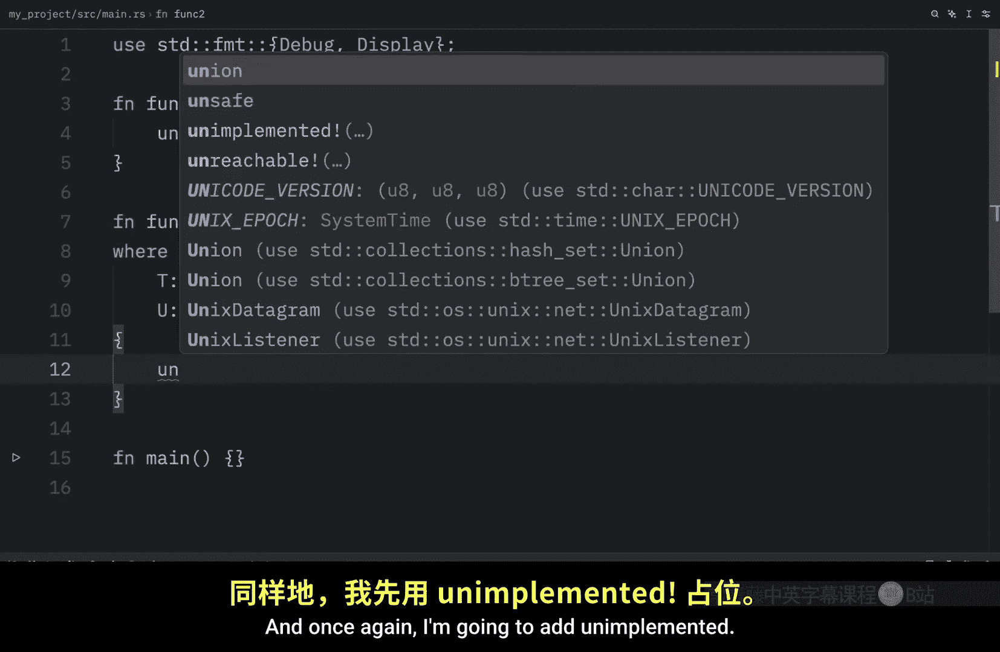
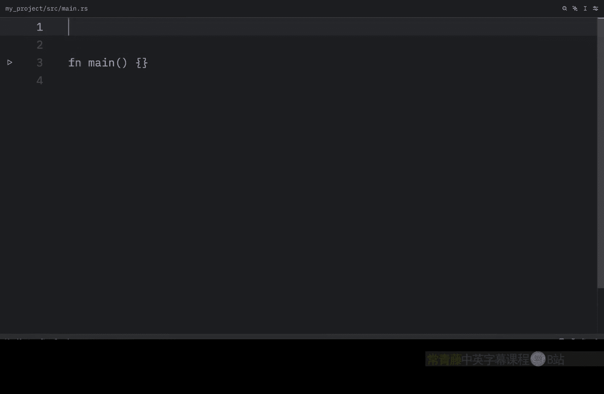
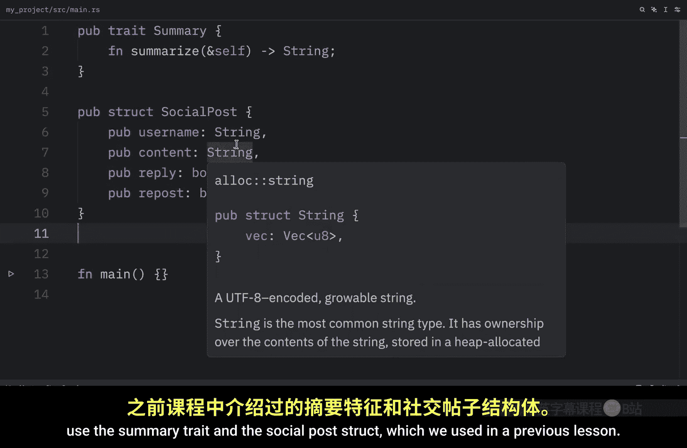
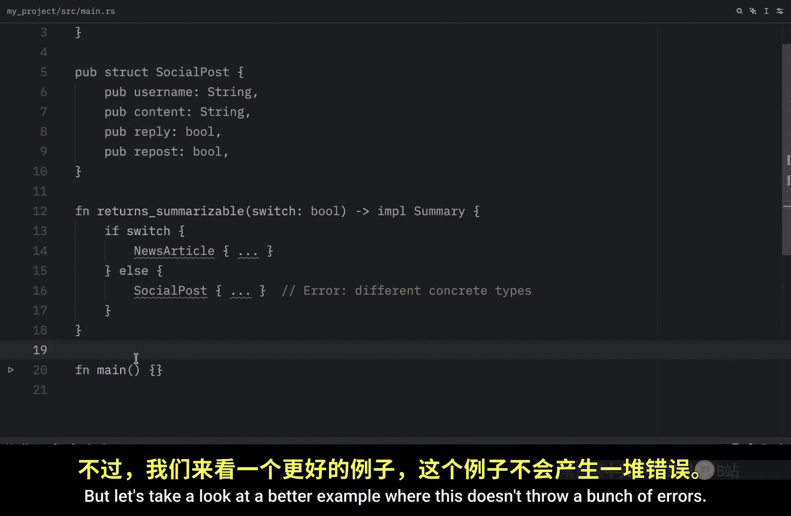

# 067：使用 `where` 子句与 `impl Trait` 语法

## 概述
在本节课中，我们将学习两个提升 Rust 代码可读性和灵活性的重要概念：`where` 子句和 `impl Trait` 语法。我们将了解如何使用 `where` 子句来简化复杂的泛型约束，以及如何使用 `impl Trait` 语法来返回实现了特定 trait 的类型。

---

## 使用 `where` 子句提升可读性

当 trait 约束变得复杂时，内联语法会使函数签名难以阅读。解决方案是将约束移动到函数签名后的 `where` 子句中。

这样做的好处是，类型参数和返回类型能保持清晰，不受约束的干扰。

为了说明这一点，让我们创建一个示例。在 `main` 函数上方，我们先导入 `Display` 和 `Debug` trait。

```rust
use std::fmt::{Display, Debug};
```

接着，在下方创建一个函数 `func1`。这个函数的签名如下：它定义了一个泛型类型 `T`，要求其实现 `Display` 和 `Clone`；同时定义了另一个泛型类型 `U`，要求其实现 `Clone` 和 `Debug`。函数接收这两个类型的参数，并返回一个 `i32`。

```rust
fn func1<T: Display + Clone, U: Clone + Debug>(t: T, u: U) -> i32 {
    unimplemented!()
}
```

如你所见，内联的 trait 约束逐渐变得难以阅读。现在，让我们使用 `where` 子句来重构这个函数。

在下方，我们创建函数 `func2`，粘贴相同的签名部分（接收泛型 `T` 和 `U`，返回 `i32`）。然后，我们使用 `where` 子句来指定约束条件。

```rust
fn func2<T, U>(t: T, u: U) -> i32
where
    T: Display + Clone,
    U: Clone + Debug,
{
    unimplemented!()
}
```

在花括号内，我们添加代码（这里同样使用 `unimplemented!`）。可以看到，当泛型变得复杂时，`where` 子句使代码更易于阅读和编辑。


---

## 使用 `impl Trait` 语法返回类型

上一节我们介绍了如何使用 `where` 子句整理复杂的约束，本节中我们来看看如何返回实现了特定 trait 的类型。我们将使用 `impl Trait` 语法来实现。

在解释之前，让我们先创建一个使用此语法的示例。这个示例需要用到之前课程中定义的 `Summary` trait 和 `SocialPost` 结构体。

首先，我们假设已有以下定义：



```rust
pub trait Summary {
    fn summarize(&self) -> String;
}

struct SocialPost {
    // ... 字段定义
}
impl Summary for SocialPost {
    fn summarize(&self) -> String {
        // ... 实现细节
        String::from("这是一个社交帖子的摘要。")
    }
}
```

接着，我们可以创建一个名为 `returns_summarizable` 的函数，它返回一个实现了 `Summary` trait 的类型。

```rust
fn returns_summarizable() -> impl Summary {
    SocialPost {
        // ... 初始化字段
    }
}
```

在函数内部，我们需要返回一个具体实现了 `Summary` 的类型。在这个例子中，我们返回一个 `SocialPost`。关键在于，调用者只知道返回的类型实现了 `Summary`，而不需要知道具体的结构体类型。

这种方式的优点是，返回的具体类型依赖于 trait 的实现，而不是具体的结构体类型。这里我们返回的是 `SocialPost`，但如果我们有一个同样实现了 `Summary` 的 `Article` 结构体，也可以返回它。

但需要注意一个限制：我们不能在不同的条件分支中返回两种不同的具体类型，即使它们都实现了同一个 trait。

---

## 一个更完整的示例

为了更好地理解没有错误的情况，让我们看一个更完整的例子。我们将回到“推特”时代，创建一个 `Tweet` 结构体。



首先，定义 `Summary` trait 和 `Tweet` 结构体，并为 `Tweet` 实现 `Summary`。





```rust
pub trait Summary {
    fn summarize(&self) -> String;
}

struct Tweet {
    username: String,
    content: String,
}

impl Summary for Tweet {
    fn summarize(&self) -> String {
        format!("@{} 发推说：{}", self.username, self.content)
    }
}
```

接着，创建一个名为 `returns_summarizable` 的函数，它返回一个实现了 `Summary` trait 的类型。由于 `Tweet` 实现了 `Summary`，所以一切正常。

```rust
fn returns_summarizable() -> impl Summary {
    Tweet {
        username: String::from("rustacean"),
        content: String::from("学习 Rust 的 trait 真有趣！"),
    }
}
```

在 `main` 函数中，我们可以调用这个函数，并打印返回项的摘要。

```rust
fn main() {
    let item = returns_summarizable();
    println!("摘要：{}", item.summarize());
}
```

运行此程序，我们将得到如下输出：
```
摘要：@rustacean 发推说：学习 Rust 的 trait 真有趣！
```

这种方式很酷的一点在于，我们可以返回任何实现了 `Summary` trait 的类型。即使我们将返回的 `Tweet` 改为另一个实现了 `Summary` 的 `Article`，代码也能正常工作（当然，前提是我们需要先创建并实现 `Article`）。

---


## 总结
本节课中我们一起学习了两个 Rust 的核心特性：
1.  **`where` 子句**：用于将复杂的泛型 trait 约束从函数签名中分离出来，显著提升代码的可读性和可维护性。
2.  **`impl Trait` 语法**：用于在返回位置指定“某个实现了特定 trait 的类型”，它提供了返回抽象类型的灵活性，同时保持了代码的简洁性，但需注意其不能用于返回多种可能的具体类型。


掌握这两个工具，将帮助你编写出更清晰、更灵活的 Rust 代码。