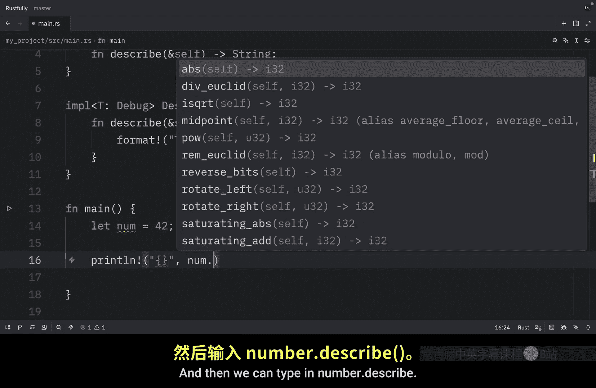
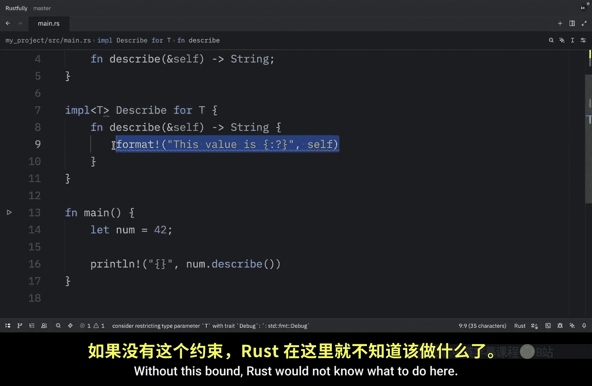

# 068：再见，Rust 的 Trait

在本节课中，我们将要学习如何根据 Trait 约束来有条件地实现方法。这将是我们在进入生命周期主题之前，关于 Trait 的最后一课。

## 概述

条件实现允许你仅在类型的泛型满足特定 Trait 约束时，才为其添加方法。这通过 `impl` 块后跟 Trait 及其约束来实现。Rust 还使用“一揽子实现”，即为所有满足某个约束的类型自动实现一个 Trait。这种方法保持了类型的灵活性，防止误用，并且仅在内层类型有能力支持时才暴露更丰富的 API。

上一节我们介绍了 Trait 的基本用法，本节中我们来看看如何更精细地控制方法的实现。

## 无条件方法实现

首先，让我们看一个如何定义无条件方法的例子。

我们将创建一个名为 `Pair` 的结构体，它持有两个类型为 `T` 的值 `x` 和 `y`。

```rust
struct Pair<T> {
    x: T,
    y: T,
}
```

接下来，我们可以为 `Pair<T>` 创建一个实现块，定义一个创建新 `Pair` 的方法。

```rust
impl<T> Pair<T> {
    fn new(x: T, y: T) -> Self {
        Self { x, y }
    }
}
```

这个方法适用于任何类型 `T`，对所有类型都可用。

## 条件方法实现

如果我们想创建条件方法，就必须在这里添加一些约束，例如 `Display` 和 `PartialOrd`。显然，如果我们想使用 `Display`，需要从标准库中导入它。

以下是添加了条件约束的实现块：

```rust
use std::fmt::Display;

impl<T: Display + PartialOrd> Pair<T> {
    fn cmp_display(&self) {
        if self.x >= self.y {
            println!("最大的成员是 x，值为 {}", self.x);
        } else {
            println!("最大的成员是 y，值为 {}", self.y);
        }
    }
}
```

在 `main` 函数中，我们可以创建一个 `Pair`。

```rust
fn main() {
    let pair = Pair::new(4, 10);
}
```

我们可以创建任何类型的 `Pair`。因为我们在 `new` 方法中定义的是泛型 `T`，所以它适用于任何类型。

由于这里的元素类型同时满足 `Display` 和 `PartialOrd` 约束，我们可以对这个 `pair` 使用 `cmp_display` 方法。

```rust
    pair.cmp_display();
```

运行程序，我们将得到输出：`最大的成员是 y，值为 10`。

现在，看看当我们引入一些不满足这些 Trait 约束的类型时会发生什么，例如 `Vec`。

```rust
    let pair_vec = Pair::new(vec![1, 2], vec![3, 4]);
    // pair_vec.cmp_display(); // 这行代码将无法编译
```

因为 `Vec` 不满足 `Display` 和 `PartialOrd` 约束，所以 `cmp_display` 方法对这些类型不可用。

## 一揽子实现

最后，让我们介绍一揽子实现。一揽子实现允许为所有满足约束的类型实现一个 Trait。

一个例子是标准库为所有实现了 `Display` Trait 的类型自动实现了 `ToString`。在这个例子中，我们将使用 `Debug` Trait。

首先，我们定义一个简单的 Trait：

```rust
trait Describable {
    fn describe(&self) -> String;
}
```

然后，在下面我们可以创建一揽子实现：

```rust
use std::fmt::Debug;

impl<T: Debug> Describable for T {
    fn describe(&self) -> String {
        format!("这个值是 {:?}", self)
    }
}
```

这将为所有实现了 `Debug` 的类型实现 `Describable` Trait，允许我们使用 `format!` 宏和 `:?` 格式化说明符。

现在在我们的 `main` 函数中，我们可以这样使用：

```rust
fn main() {
    let number = 42;
    println!("{}", number.describe());
}
```

运行后，我们得到的输出是：`这个值是 42`。


如果没有这个 `Debug` 约束，Rust 将不知道在这里该做什么。


## 总结



本节课中我们一起学习了 Rust 中 Trait 的条件实现和一揽子实现。

我们了解到：
*   使用 `impl<T: TraitA + TraitB>` 语法可以为满足特定 Trait 约束的泛型类型有条件地添加方法。
*   一揽子实现使用 `impl<T: TraitA> TraitB for T` 的语法，为所有满足前置约束的类型自动实现一个 Trait。
*   这些特性使得 API 设计更加灵活和安全，只在类型有能力支持时才提供相关功能，避免了编译期错误。



掌握这些知识，你将能更好地设计泛型代码的接口，使其既强大又不易误用。