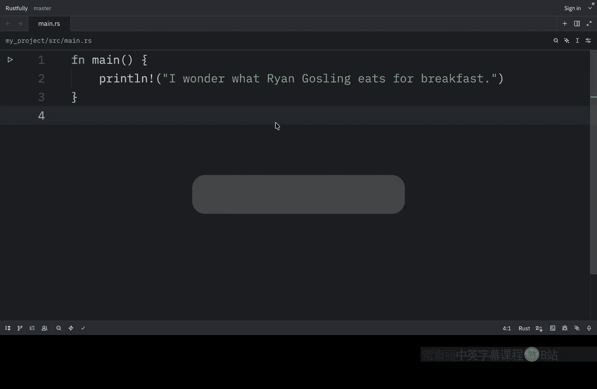
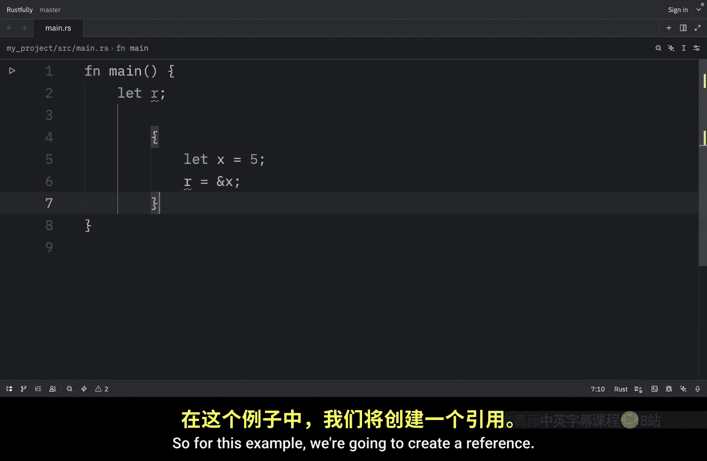
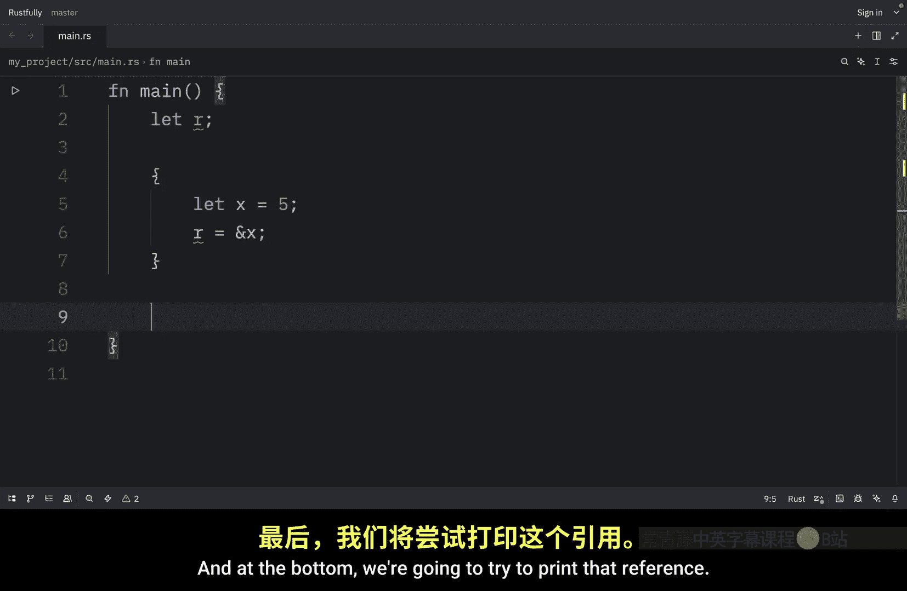
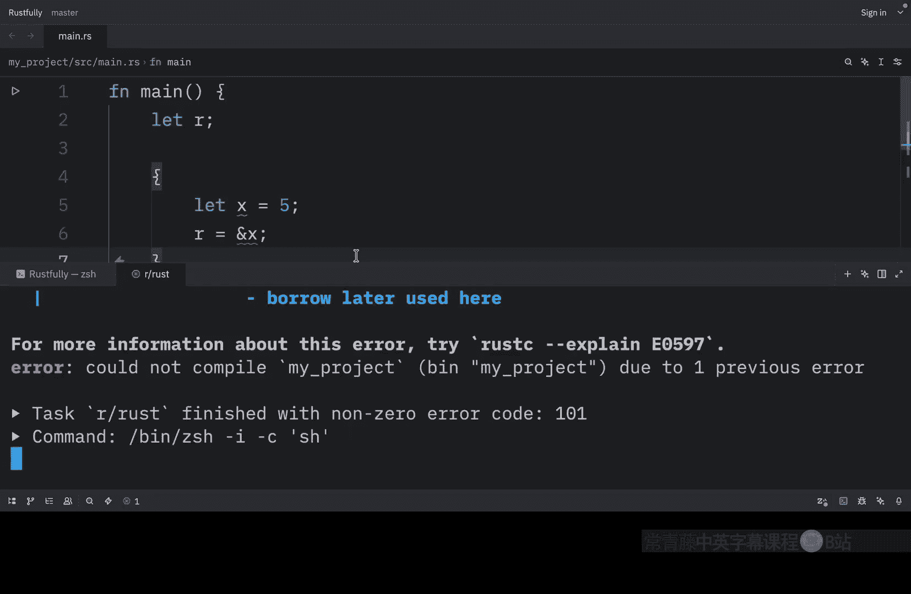
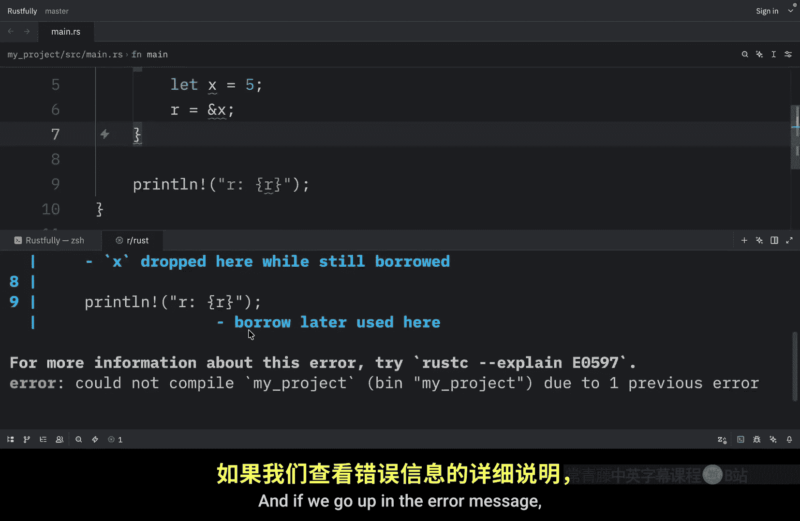
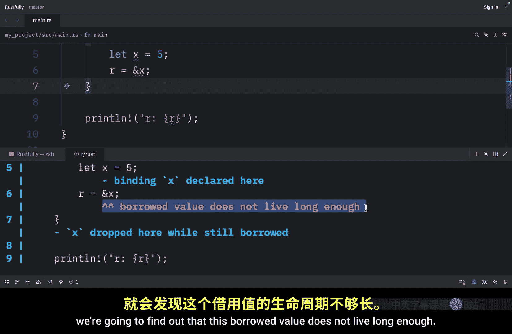
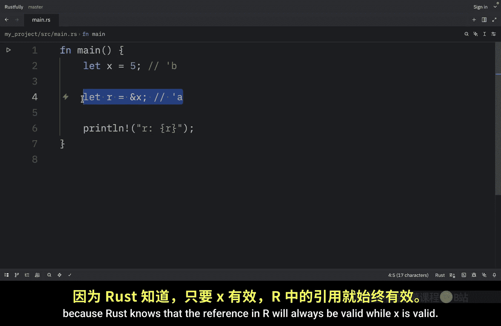
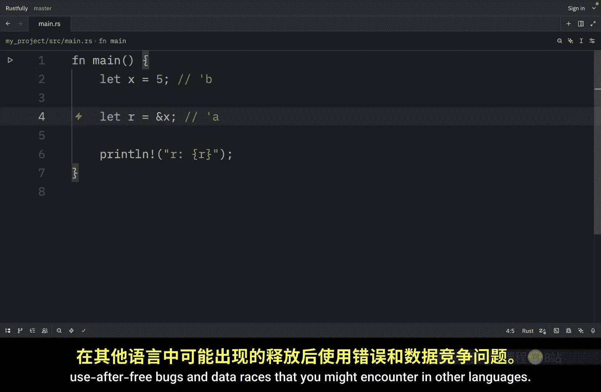

# 069：你好，Rust的生命周期 ⏳

在本节课中，我们将要学习 Rust 中一个至关重要的概念：**生命周期**。生命周期是另一种我们一直在使用但尚未明确讨论的泛型。与确保类型具有我们所需的行为不同，生命周期确保引用在我们需要它们有效的时间内保持有效。Rust 中的每个引用都有一个生命周期，即该引用有效的范围。

大多数情况下，生命周期是隐式且由编译器推断的，就像大多数情况下类型被推断一样。我们只有在引用的生命周期可能以几种不同方式相关联时，才需要标注生命周期。生命周期标注甚至是大多数其他编程语言所没有的概念。因此，如果你来自 Python 或 Java 等语言，可能会感到陌生，但别担心，我们将循序渐进地学习。

## 生命周期的主要目标 🎯

上一节我们介绍了生命周期的基本概念，本节中我们来看看它的核心目标。

生命周期的主要目标是**防止悬垂引用**。如果允许悬垂引用存在，将导致程序引用非其预期引用的数据。



让我们看一个无法编译的示例。

## 一个悬垂引用的例子 ❌

以下是导致悬垂引用的代码示例：

```rust
fn main() {
    let r; // 声明一个引用变量 r

    {
        let x = 5; // 在内部作用域中创建一个变量 x
        r = &x; // 尝试让 r 引用 x
    } // 内部作用域结束，x 被销毁

    println!("r: {}", r); // 尝试使用 r，此时它指向的内存已无效
}
```

当我们尝试运行这段代码时，会得到一个错误。因为 `r` 是一个悬垂引用。错误信息会指出“被借用的值存活时间不够长”，原因是当内部作用域结束时，`x` 将离开作用域，但 `r` 在外部作用域中仍然有效，因为它的作用域更大。在这种情况下，我们说 `r` “活得更长”。

如果 Rust 允许这段代码运行，`r` 将引用 `x` 离开作用域时已被释放的内存，我们对 `r` 所做的任何操作都将无法正确工作。


## Rust 如何检查：借用检查器 🔍







上一节我们看到了一个错误示例，本节中我们来看看 Rust 如何确定代码无效。





Rust 使用一个**借用检查器**。Rust 编译器内置的借用检查器会比较作用域，以确定所有借用是否有效。

让我们用标注来可视化生命周期。我们可以说 `r` 有一个生命周期标注 `'a`，它从这里开始，`r` 将在这里离开作用域，这是生命周期结束的地方。然后，这里有一个新的生命周期 `'b` 开始，它在这里结束。

以下是生命周期标注的可视化表示：

```
生命周期 'a: |--------------------------|
变量 r:      |----> (引用 x)            |


生命周期 'b:        |-------|
变量 x:             |--5--|
```


在编译时，Rust 会比较两个生命周期的大小，发现 `r` 拥有生命周期 `'a`，但它引用的内存（`x`）只拥有生命周期 `'b`。程序被拒绝，因为 `'b` 比 `'a` 短。被引用的主体（`x`）没有引用（`r`）活得长。

## 修复代码 ✅

上一节我们分析了错误原因，本节中我们来修复代码，使其没有悬垂引用。

为此，我们需要确保被引用的数据比引用存活得更久。修改后的代码如下：

```rust
fn main() {
    let x = 5; // 将 x 定义在外部作用域

    let r = &x; // r 引用 x

    println!("r: {}", r); // 可以安全使用 r
}
```

现在，我们可以再次添加生命周期标注。这里 `x` 拥有生命周期 `'b`，`r` 拥有生命周期 `'a`。在这种情况下，`x` 的生命周期比 `'a` 更长。这意味着 `r` 可以引用 `x`，因为 Rust 知道，只要 `x` 有效，`r` 中的引用就始终有效。


当你持有一个引用时，Rust 确保它所指向的数据在该引用存在的整个期间都是有效的。这防止了你在其他语言中可能遇到的“释放后使用”错误和数据竞争。


## 总结 📝

本节课中我们一起学习了 Rust 的生命周期。

*   **生命周期**是引用有效的范围。
*   其主要目标是**防止悬垂引用**。
*   大多数情况下，生命周期由编译器**隐式推断**。
*   **借用检查器**在编译时比较作用域，确保引用始终有效。
*   核心规则是：**引用的生命周期不能长于其引用的数据的生命周期**。






理解生命周期是掌握 Rust 所有权和借用系统的关键一步，它能帮助编写出内存安全且高效的代码。