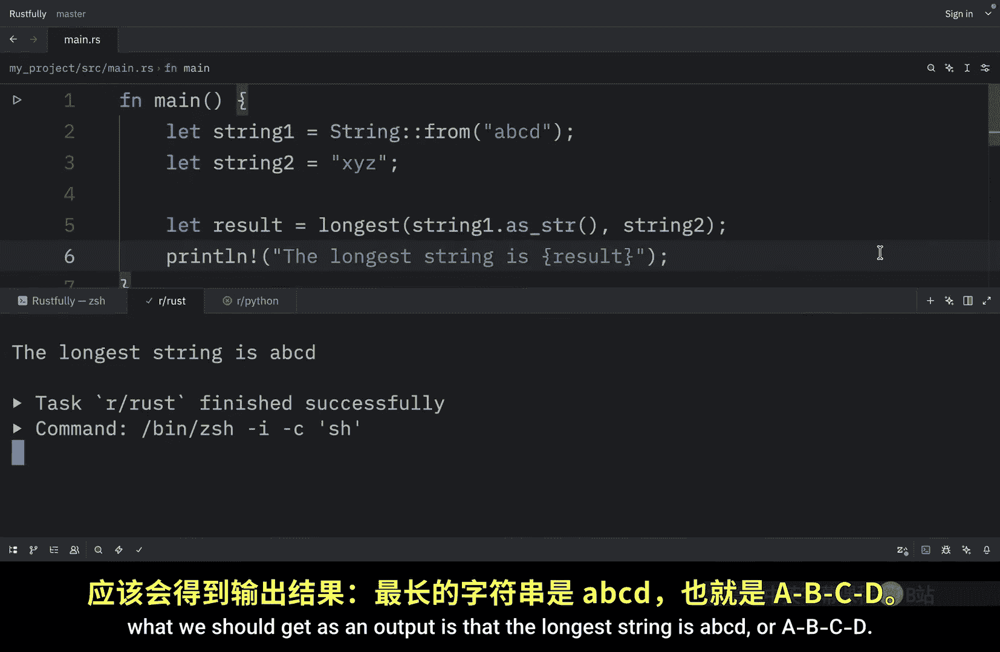
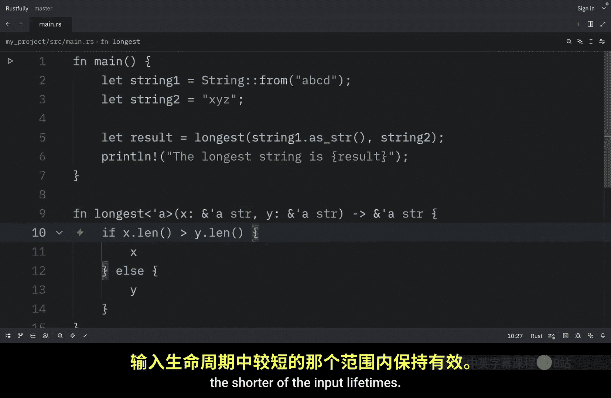

# 070：函数中的泛型生命周期 🧬

在本节课中，我们将学习如何在函数签名中使用泛型生命周期参数。我们将编写一个函数，用于比较并返回两个字符串切片中较长的一个，并理解为何以及如何使用生命周期注解来确保代码的安全性。

上一节我们介绍了 Rust 中生命周期的基本概念以及编译器如何进行分析。本节中，我们来看看如何在函数参数和返回值中应用泛型生命周期。

## 函数目标与问题引入

我们的目标是编写一个名为 `longest` 的函数，它接收两个字符串切片（即引用）作为参数，并返回其中较长的一个切片。使用切片而非 `String` 类型是为了避免函数获取参数的所有权。


如果尝试在不添加生命周期注解的情况下实现这个函数，代码将无法编译。以下是问题代码：

```rust
fn longest(x: &str, y: &str) -> &str {
    if x.len() > y.len() {
        x
    } else {
        y
    }
}
```

编译器无法判断返回的引用是指向 `x` 还是 `y`。因为在编译时，我们无法确定程序实际会执行 `if` 分支还是 `else` 分支。因此，Rust 的借用检查器需要明确的指引来确定返回引用的有效范围。

## 生命周期注解语法

生命周期注解的语法有些特别。它们用于描述多个引用生命周期之间的关系，而不会改变任何引用的实际存活时间。

以下是生命周期注解的要点：


*   生命周期参数名必须以撇号（`'`）开头。
*   名称通常全小写且非常简短，类似于泛型类型参数（如 `T`）。
*   大多数人使用 `'a` 作为第一个生命周期注解。
*   生命周期注解位于引用的 `&` 符号之后，并用一个空格与引用类型分隔。

示例：
*   常规引用：`&i32`
*   带有显式生命周期的引用：`&'a i32`
*   带有显式生命周期的可变引用：`&'a mut i32`

单个生命周期注解本身没有太多意义，因为它们旨在描述多个引用生命周期之间的关系。

## 为函数添加生命周期注解

为了在函数签名中使用生命周期注解，我们需要在函数名和参数列表之间的尖括号内声明泛型生命周期参数，就像声明泛型类型参数一样。

以下是修复后的 `longest` 函数签名：

```rust
fn longest<'a>(x: &'a str, y: &'a str) -> &'a str {
    if x.len() > y.len() {
        x
    } else {
        y
    }
}
```

这个签名向 Rust 表达了一个关键约束：**返回的引用将与两个参数中生命周期较短的那个保持一致，并且在该生命周期内有效**。

具体来说，它告诉 Rust：
1.  对于某个生命周期 `'a`，函数接受两个参数。
2.  这两个参数都是字符串切片，其生命周期至少与 `'a` 一样长。
3.  函数返回的字符串切片，其生命周期也至少与 `'a` 一样长。

通过这个约束，借用检查器可以确保函数在任何使用场景下都是安全的。

## 理解生命周期约束

需要明确的是，在函数签名中指定生命周期参数，**并不会改变**任何传入或返回值的实际生命周期。我们只是为借用检查器提供了一套规则，让它能够拒绝那些不符合这些约束的调用。

`longest` 函数本身不需要确切知道 `x` 和 `y` 会活多久，它只需要知道存在某个作用域（被 `'a` 替代）能够满足签名中的关系即可。

## 函数使用示例

现在我们可以使用这个带有生命周期注解的函数了。以下是一个示例：

```rust
fn main() {
    let string1 = String::from("abcd");
    let string2 = "xyz";

    let result = longest(string1.as_str(), string2);
    println!("The longest string is {}", result);
}
```

在这个例子中，`string1` 和 `string2` 的切片被传递给 `longest` 函数。函数返回的 `result` 引用的有效生命周期，被限制为 `string2` 切片（生命周期较短者）的生命周期内，因此打印是安全的。

## 核心要点总结

本节课中我们一起学习了函数中泛型生命周期的应用。核心在于理解并建立输入参数与返回值之间的生命周期关系。

以下是编写返回引用的函数时的关键思路：

*   当函数返回一个引用时，其生命周期必须与某个输入参数的生命周期相关联。
*   返回引用的有效时间，**至少要与输入参数中生命周期较短的那个一样长**。
*   生命周期注解 `'a` 是一个用于在签名中建立这种关系的占位符，它代表了所有输入引用重叠的那段生命周期。






通过为函数签名添加恰当的生命周期注解，我们既能够编写灵活、高效的引用操作函数，又能借助 Rust 编译器确保内存安全。