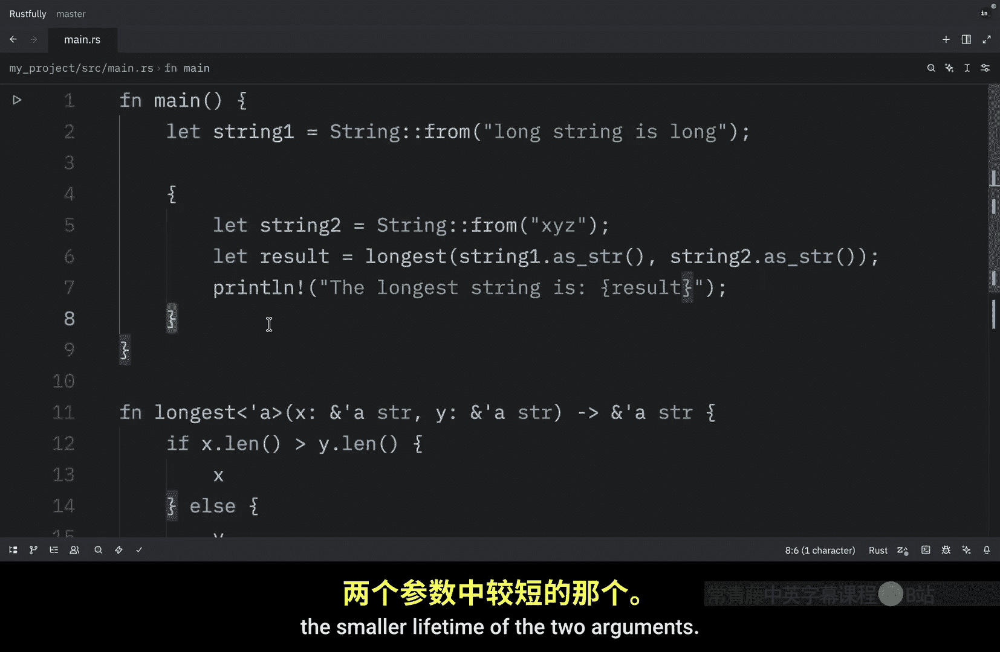
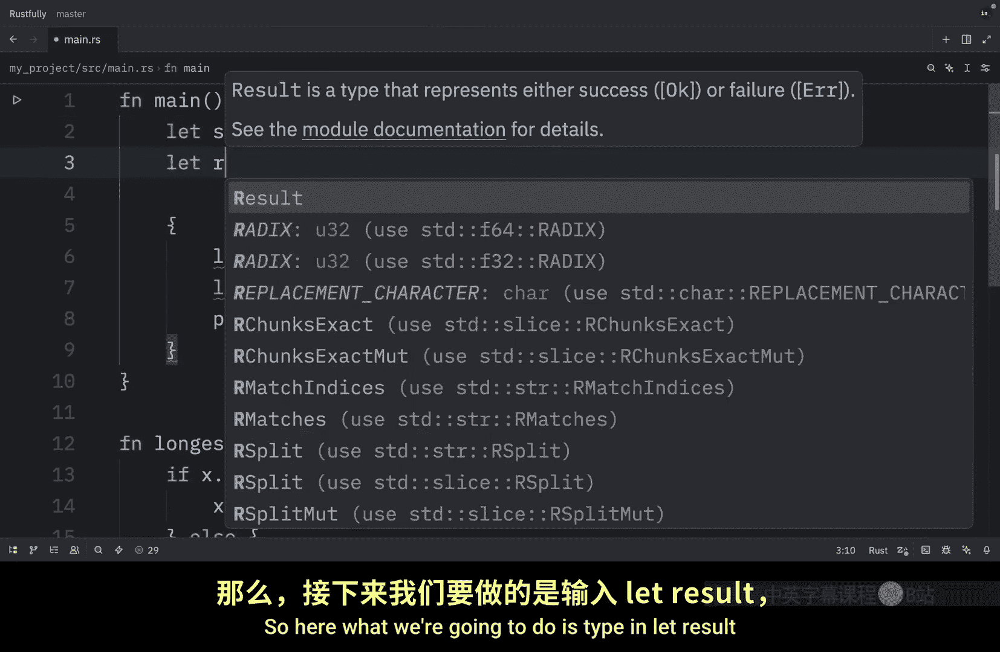
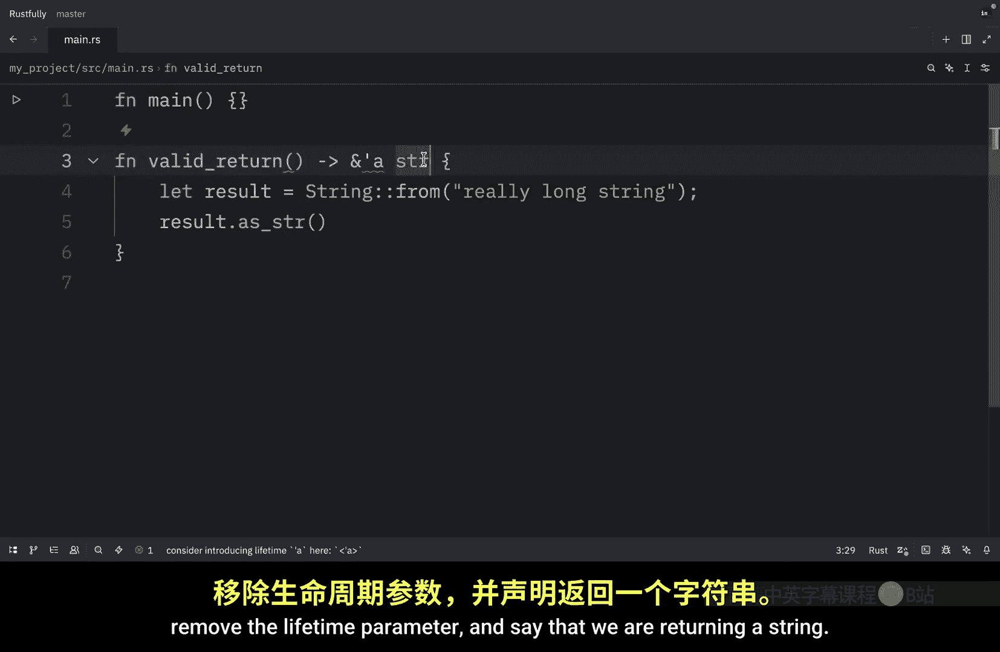

# 071：函数中的生命周期注解

在本节中，我们将继续学习 Rust 中的生命周期。我们将重点探讨如何在函数签名中注解生命周期，理解编译器如何利用这些注解进行借用检查，以及如何避免常见的错误，例如悬垂引用。

上一节我们介绍了生命周期注解的基本概念，本节中我们来看看如何在函数中使用它们。

## 函数签名中的生命周期注解

生命周期注解位于函数签名中，而非函数体内。这些注解成为函数契约的一部分，就像签名中的类型一样。让函数签名包含生命周期契约意味着 Rust 编译器的分析可以更简单。如果函数的注解方式或调用方式出现问题，编译器错误可以更精确地指向我们代码的特定部分及其约束。

当我们将具体的引用传递给带有生命周期参数的函数时，用于替换泛型生命周期的具体生命周期是参数作用域重叠的部分。换句话说，泛型生命周期将获得等于输入引用生命周期中较短者的具体生命周期。

## 生命周期注解实践

让我们通过一个例子来看看生命周期注解如何通过传入具有不同具体生命周期的引用来限制 `longest` 函数。

以下是示例代码：

```rust
fn main() {
    let string1 = String::from("long string is long");
    {
        let string2 = String::from("xyz");
        let result = longest(string1.as_str(), string2.as_str());
        println!("The longest string is {}", result);
    }
}
```

在这个例子中，`string1` 的有效期直到外部作用域结束，而 `string2` 只到内部作用域结束。此处的 `result` 引用了在内部作用域结束前有效的值。这意味着借用检查器会批准此代码，因为返回的引用没有超过两个输入生命周期中较短的那个。

## 生命周期约束导致的错误

现在，让我们尝试一个例子，展示 `result` 中引用的生命周期必须是两个参数中较短的生命周期。

以下是修改后的代码：

```rust
fn main() {
    let result;
    {
        let string2 = String::from("xyz");
        result = longest(string1.as_str(), string2.as_str());
    }
    println!("The longest string is {}", result);
}
```

运行此代码会产生错误。错误信息表明，为了使 `result` 对 `println!` 语句有效，`string2` 需要有效直到外部作用域结束。换句话说，`string2` 存活得不够久。





作为人类，我们可以查看这段代码并看到 `string1` 比 `string2` 长，因此 `result` 将包含对 `string1` 的引用。由于 `string1` 尚未离开作用域，对 `string1` 的引用对 `println!` 语句仍然有效。然而，编译器无法看到在这种情况下引用是有效的。我们已经告诉 Rust，`longest` 函数返回的引用的生命周期与传入引用的生命周期中较短者相同。因此，借用检查器将此代码视为可能包含无效引用。

## 指定生命周期参数的方式

指定生命周期参数的方式取决于函数的功能。

例如，如果我们将 `longest` 函数的实现更改为始终返回第一个参数，而不是最长的字符串切片，则不需要在 `y` 参数上指定生命周期。

以下是修改后的函数签名：

```rust
fn longest<'a>(x: &'a str, y: &str) -> &'a str {
    x
}
```

在这个例子中，我们为参数 `x` 和返回类型指定了生命周期参数 `'a`，但没有为参数 `y` 指定，因为 `y` 的生命周期与 `x` 或返回值的生命周期没有任何关系。

这是一个重要的见解：**你只需要注解相互关联的生命周期**。如果一个参数的生命周期不影响返回值，你就不需要注解它。

## 返回引用与悬垂引用

当从函数返回引用时，返回类型的生命周期参数需要与某个参数的生命周期参数匹配。如果返回的引用不指向任何一个参数，那么它必须指向在此函数内部创建的值。

然而，这将是一个悬垂引用，因为该值将在函数结束时离开作用域。

以下是一个会产生编译错误的例子：

```rust
fn invalid_return<'a>() -> &'a str {
    let result = String::from("a very long string");
    result.as_str() // 错误！返回局部变量的引用
}
```

问题在于 `result` 在函数结束时离开作用域并被清理，而我们却试图从函数返回一个对 `result` 的引用。我们无法指定任何生命周期参数来改变这个悬垂引用，Rust 不会允许我们创建悬垂引用。

在这种情况下，最好的修复方法是返回一个拥有所有权的数据类型，而不是引用，这样调用函数就需要负责清理该值。

以下是修复后的代码：




```rust
fn valid_return() -> String {
    let result = String::from("a very long string");
    result // 返回所有权，而不是引用
}
```

当然，这也可以简化为直接返回字符串字面量或 `String`。

## 总结

本节课中我们一起学习了函数中生命周期注解的核心机制。生命周期语法是关于连接函数各种参数和返回值的生命周期。一旦它们被连接起来，Rust 就有足够的信息来允许内存安全操作，并禁止会创建悬垂指针或以其他方式违反内存安全的操作。


你可以将生命周期注解视为告诉编译器的一种方式：“嘿，我返回的这个引用与这个参数的生命周期绑定，所以请确保调用者正确使用它。” 通过遵循这些规则，你可以编写出既安全又高效的 Rust 代码。