# 072：结构体中的生命周期 📚

在本节课中，我们将要学习如何在 Rust 的结构体中处理引用，以及为什么必须为包含引用的结构体添加生命周期注解。我们将通过一个具体的例子来理解生命周期注解的必要性，并了解编译器在特定情况下如何自动推断生命周期。

---

## 结构体与引用

到目前为止，我们定义的结构体都持有自有类型。我们也可以定义持有引用的结构体，但在这种情况下，我们需要在结构体定义中为每一个引用添加生命周期注解。


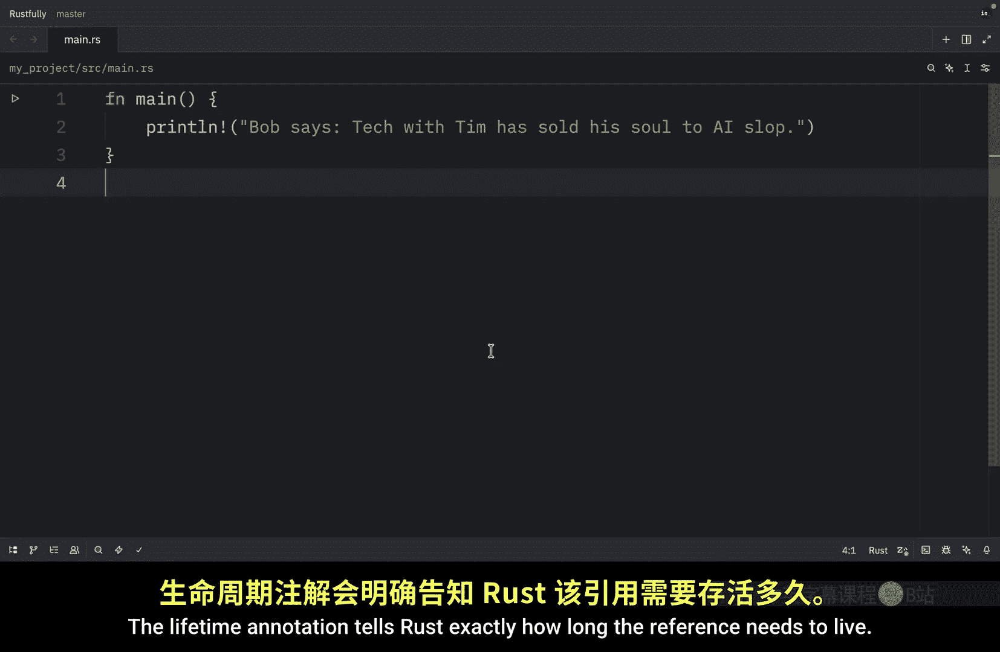

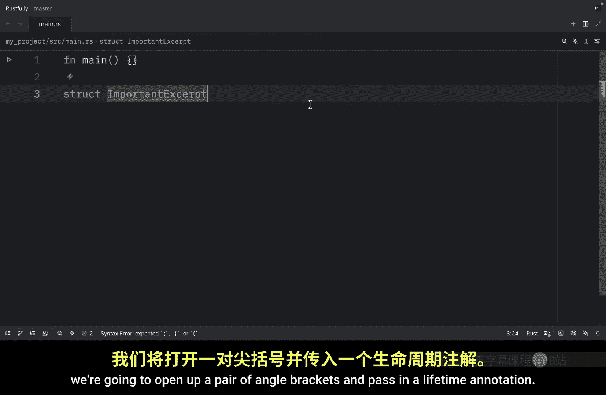

这一点非常重要，因为如果一个结构体持有一个引用，那么该引用必须在结构体存在的整个期间都保持有效。生命周期注解告诉 Rust 该引用需要存活的确切时长。

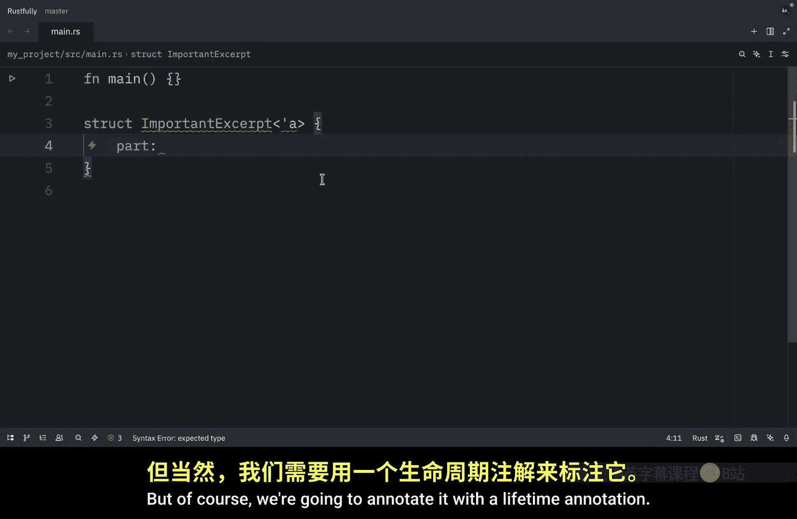

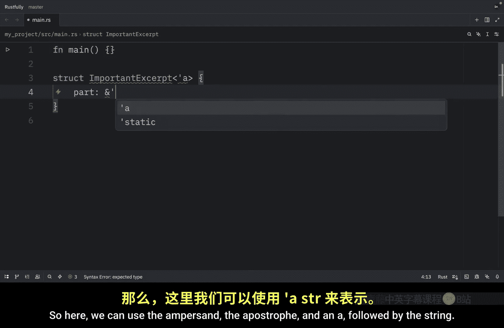

## 定义持有引用的结构体

让我们创建一个持有字符串切片的结构体。这个结构体需要一个生命周期注解，因为它包含一个引用。

以下是定义过程：
1.  我们创建一个名为 `ImportantExcerpt` 的结构体。
2.  在结构体名称后，我们使用尖括号 `<>` 传入一个生命周期注解，例如 `'a`。
3.  在结构体内部，我们定义一个字段 `part`，其类型为字符串切片 `&str`，并使用相同的生命周期注解 `'a` 进行标注。

用代码表示如下：
```rust
struct ImportantExcerpt<'a> {
    part: &'a str,
}
```

这个结构体有一个字段 `part`，它持有一个字符串切片引用。与泛型数据类型类似，我们在结构体名称后的尖括号内声明泛型生命周期参数的名称，以便在结构体定义体中使用该生命周期参数。


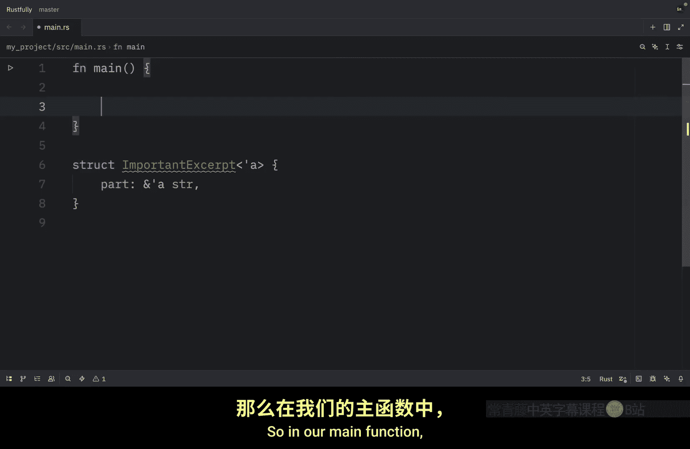


这个注解意味着：一个 `ImportantExcerpt` 的实例不能比它在其 `part` 字段中持有的引用活得更久。换句话说，在该结构体所引用的数据离开作用域之前，该结构体必须被销毁。

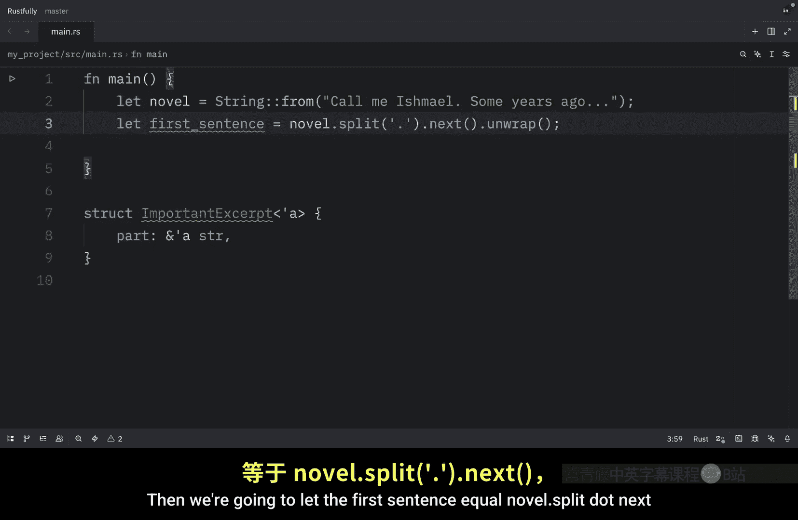

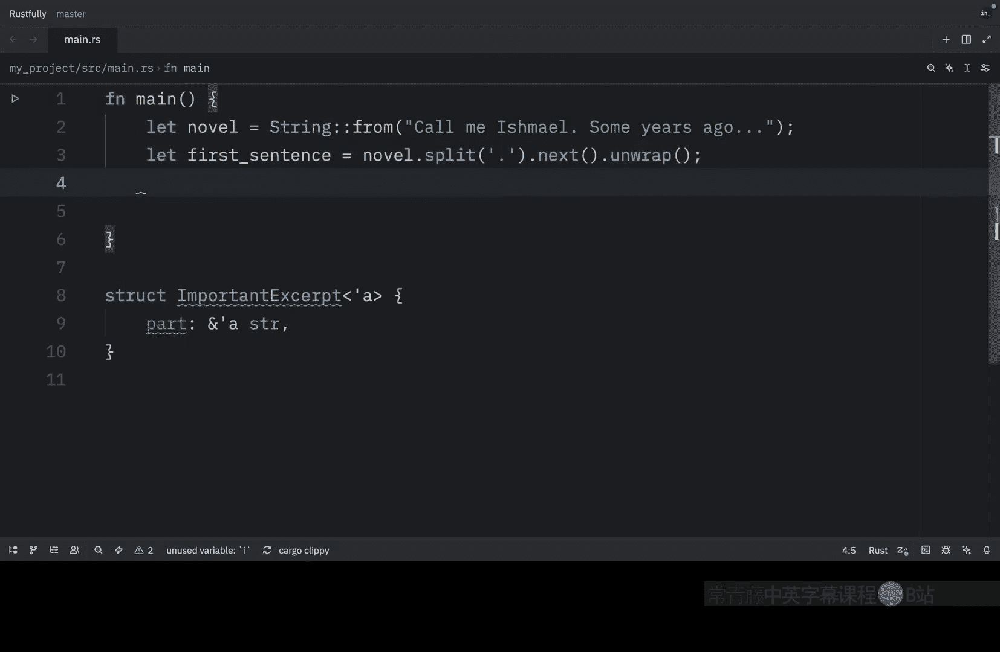

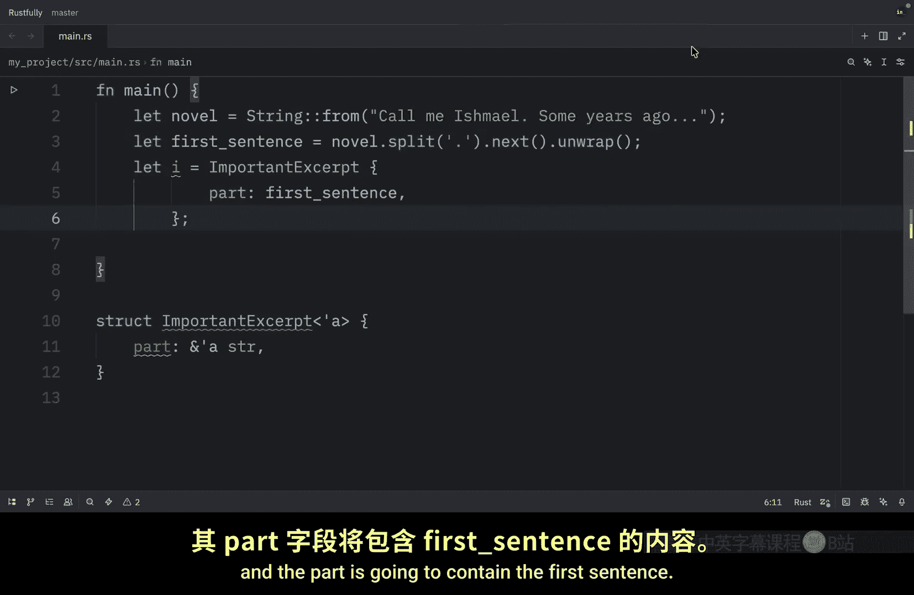

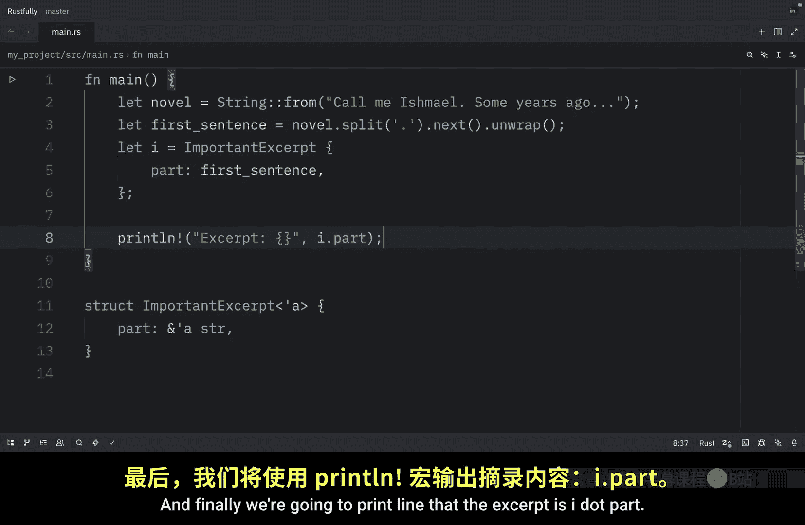

## 实践示例


让我们看看这在实践中是如何工作的。在 `main` 函数中，我们将：
1.  创建一个字符串 `novel`。
2.  使用 `.split('.').next()` 方法获取第一句话，并解包得到 `first_sentence`。
3.  使用 `first_sentence` 创建一个 `ImportantExcerpt` 实例 `i`。
4.  打印出摘录的内容。

以下是代码实现：
```rust
fn main() {
    let novel = String::from("Call me Ishmael. Some years ago...");
    let first_sentence = novel.split('.').next().unwrap();
    let i = ImportantExcerpt { part: first_sentence };
    println!("The excerpt is: {}", i.part);
}
```

在这个例子中，`novel` 和 `first_sentence` 必须至少与 `i` 活得一样长。`novel` 的数据在 `ImportantExcerpt` 实例创建之前就已存在，并且直到 `ImportantExcerpt` 离开作用域后，`novel` 才离开作用域。因此，`ImportantExcerpt` 实例中的引用是有效的。

如果我们尝试创建一个引用在结构体之前离开作用域的 `ImportantExcerpt` 实例，将会得到一个编译错误。这正是生命周期机制所要防止的情况。

## 生命周期省略规则

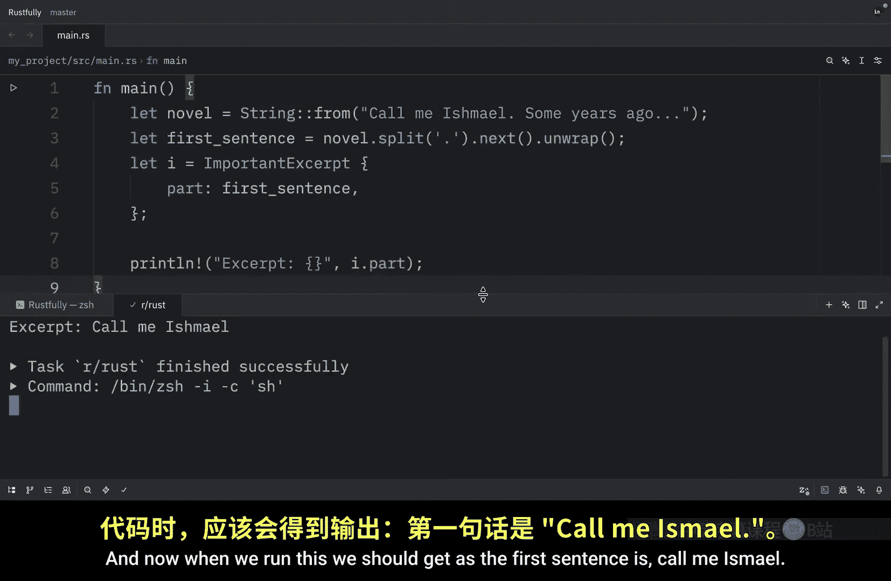

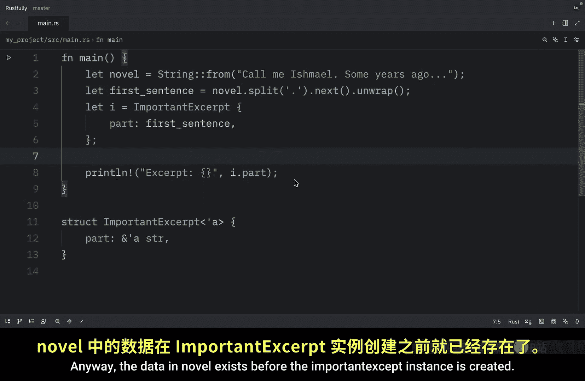


至此，你已经了解到每个引用都有生命周期，并且需要为使用引用的函数或结构体指定生命周期参数。然而，我们已经见过一些没有生命周期注解也能编译的函数。

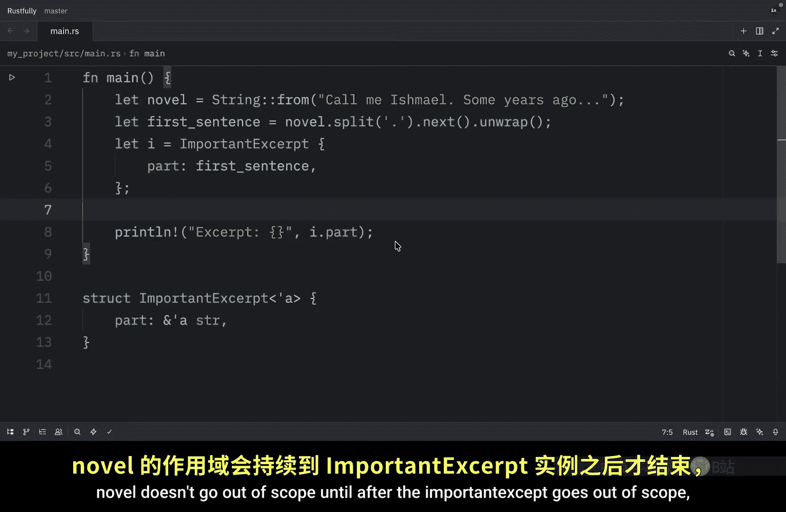


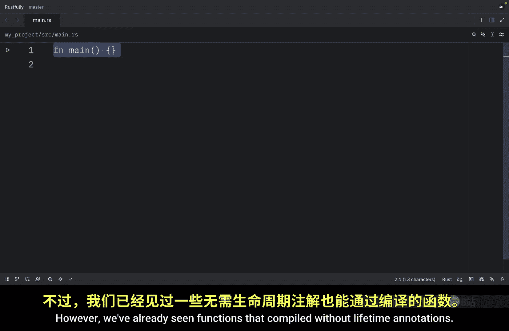

例如，以下是一个名为 `first_word` 的函数，其参数和返回类型都是引用，但它可以在没有显式生命周期注解的情况下编译：
```rust
fn first_word(s: &str) -> &str {
    // ... 函数体
}
```

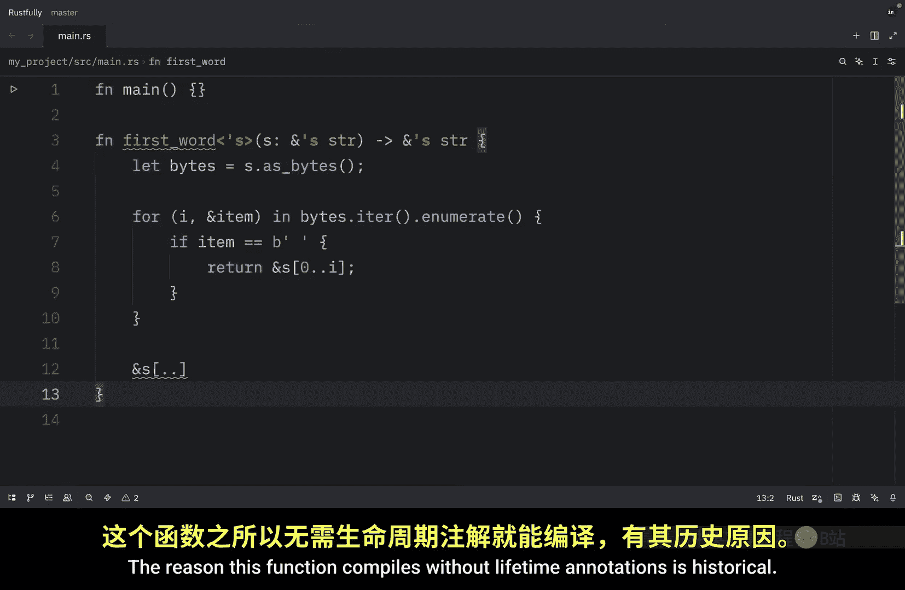

这个函数之所以能在没有生命周期注解的情况下编译，有其历史原因。在早期版本中，这段代码无法编译，因为每个引用都需要显式的生命周期。那时的函数签名会像这样书写：`fn first_word<'a>(s: &'a str) -> &'a str`。

在编写了大量 Rust 代码后，Rust 团队发现 Rust 程序员在特定情况下会反复输入相同的生命周期注解。这些情况是可预测的，并且遵循少数确定的模式。开发者将这些模式编程到编译器的代码中，使得借用检查器可以在这些情况下推断生命周期，从而不需要显式注解。

这些被编程到 Rust 引用分析中的模式被称为 **生命周期省略规则**。这些不是程序员需要遵循的规则，而是一组编译器会考虑的特定情况。如果你的代码符合这些情况，你就不需要显式地编写生命周期。

生命周期省略规则并不提供完整的推断。如果在 Rust 应用了这些规则后，对于引用应具有的生命周期仍然存在歧义，编译器不会猜测剩余引用的生命周期应该是多少。相反，编译器会给你一个错误，你可以通过添加生命周期注解来解决它。

函数或方法参数上的生命周期被称为 **输入生命周期**，返回值上的生命周期被称为 **输出生命周期**。当没有显式注解时，编译器使用三条规则来推断引用的生命周期。我们将在下一集中详细讨论这些规则。就目前而言，只需知道编译器通常可以为常见模式自动推断生命周期。

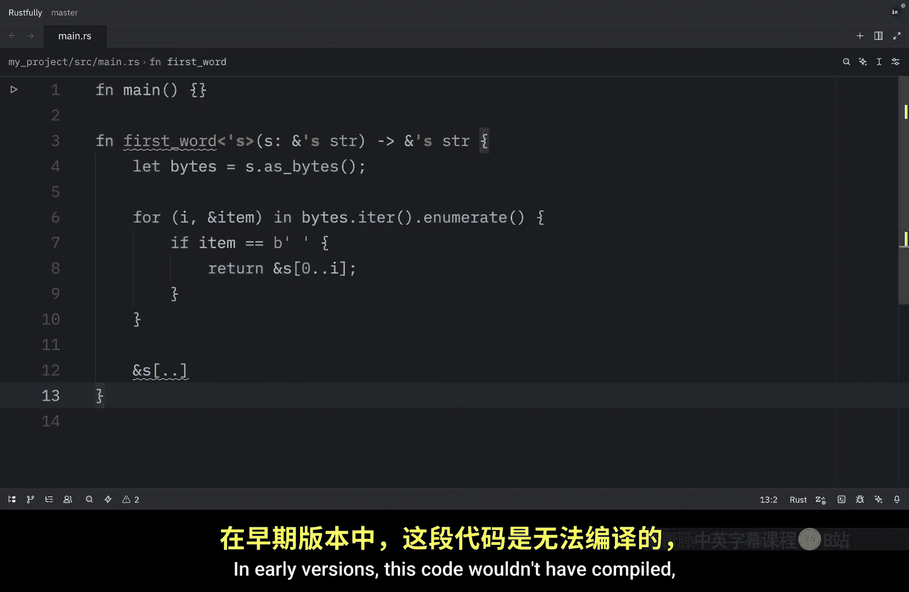

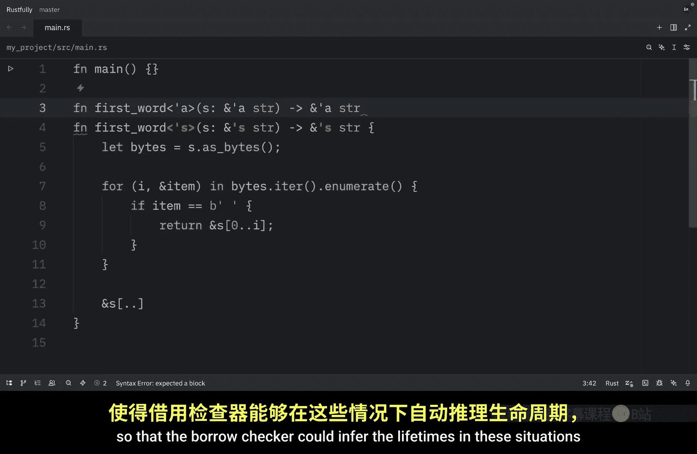

生命周期省略非常有帮助，因为它意味着我不必为每个函数都编写生命周期注解。大多数时候，编译器可以推断出来。当它无法推断时，它会明确告诉我需要添加什么。

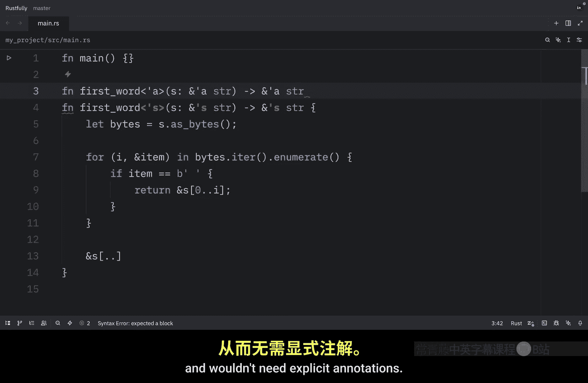

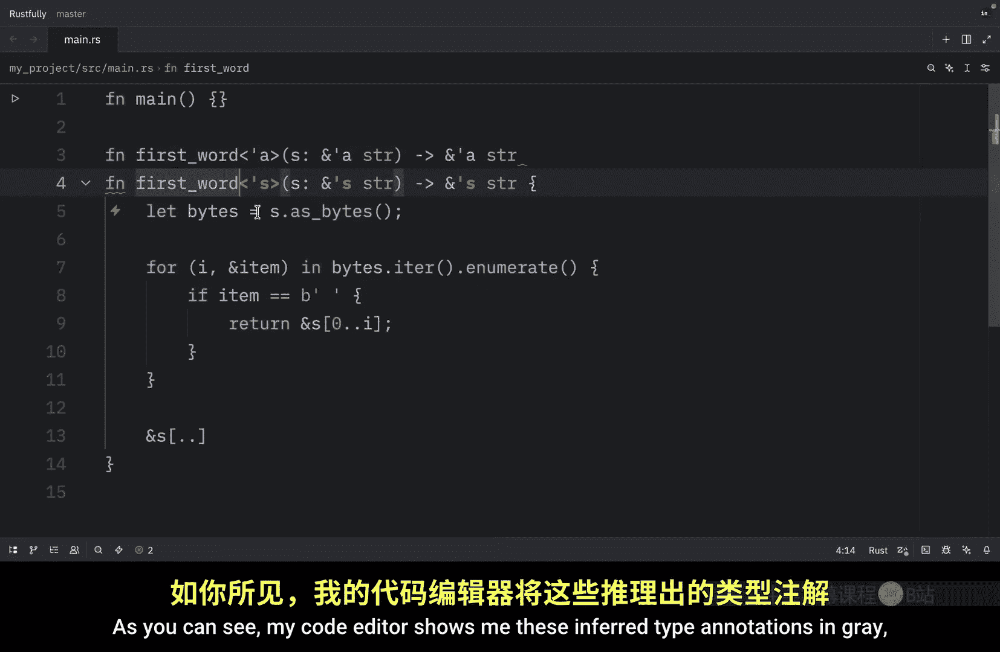

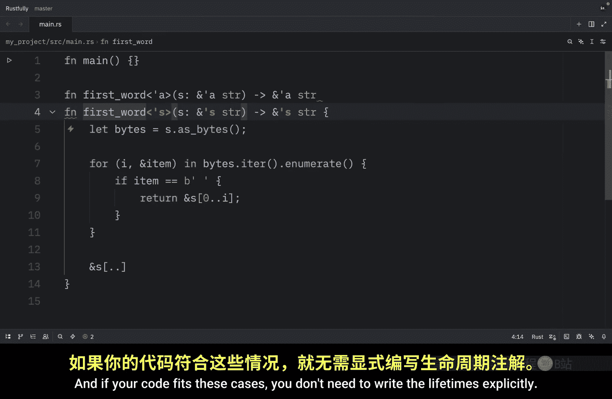

## 运行示例函数

在结束本课之前，让我们运行一下 `first_word` 函数。

以下是示例代码：
```rust
fn main() {
    let text = String::from("Hello world!");
    let word = first_word(&text);
    println!("The first word is: {}", word);
}

fn first_word(s: &str) -> &str {
    let bytes = s.as_bytes();
    for (i, &item) in bytes.iter().enumerate() {
        if item == b' ' {
            return &s[0..i];
        }
    }
    &s[..]
}
```

当我们运行这段代码时，应该会得到输出：`The first word is: Hello`。

---

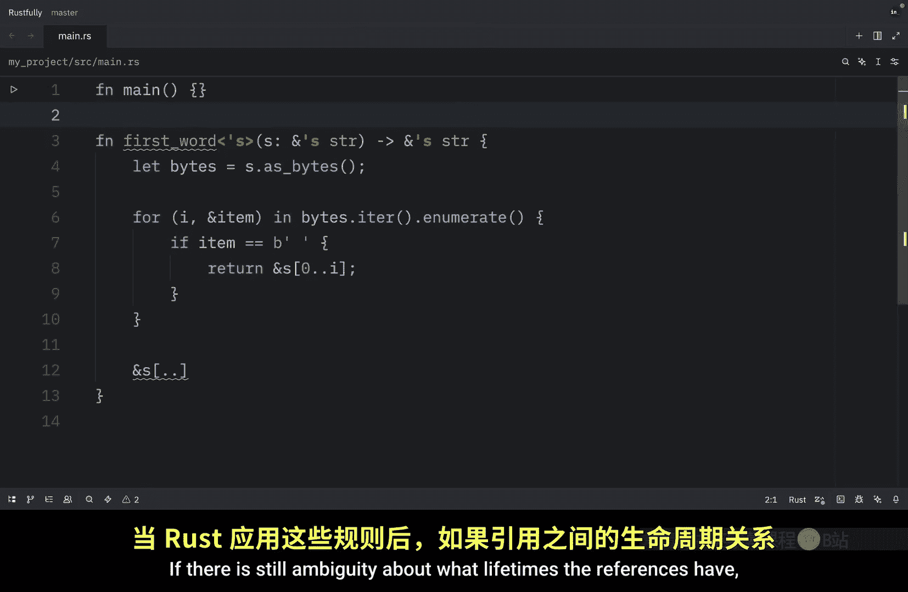


## 总结

本节课中我们一起学习了：
1.  **结构体中的生命周期**：当结构体持有引用时，必须使用生命周期注解来确保引用的有效性不会超过结构体本身。
2.  **生命周期注解的语法**：在结构体名后使用 `<'a>` 声明，并在引用字段上使用 `&'a` 进行标注。
3.  **生命周期省略规则**：编译器内置的一组规则，可以在常见模式下自动推断生命周期，减少了程序员需要编写的显式注解。
4.  **输入与输出生命周期**：区分了参数和返回值的生命周期概念。


理解生命周期是掌握 Rust 所有权系统的关键一步。通过结构体中的生命周期管理，我们可以安全地构建复杂的数据结构，同时确保内存安全。