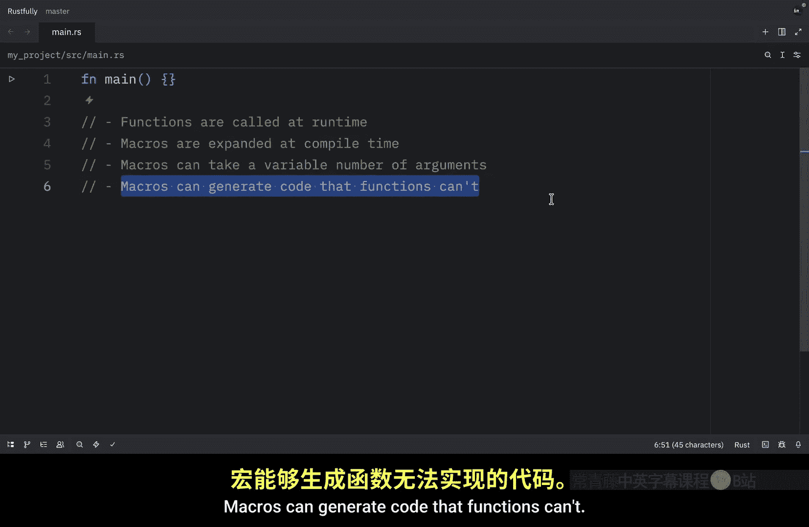
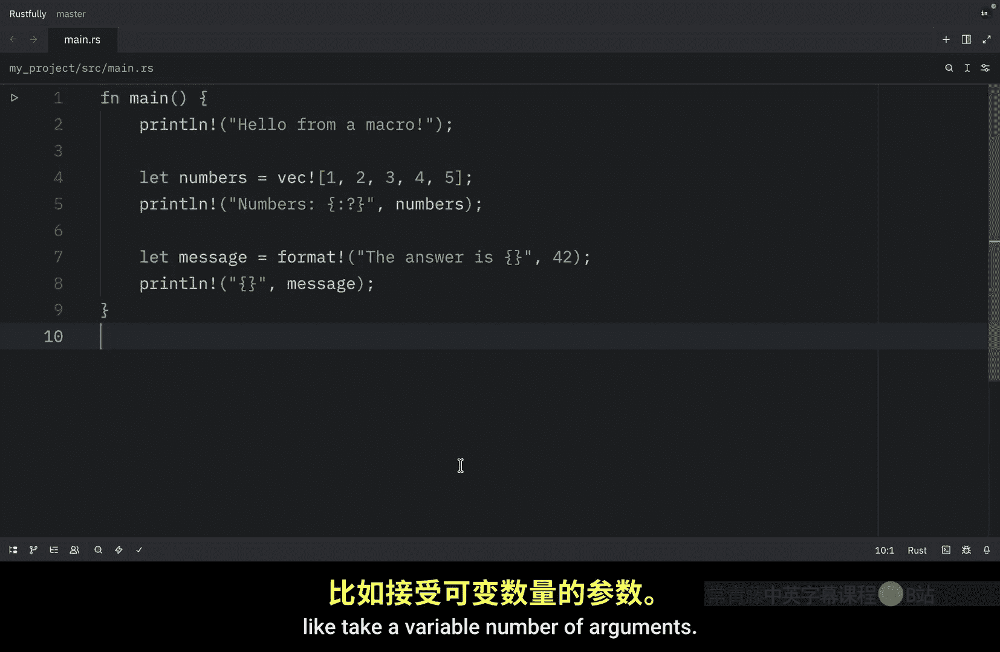
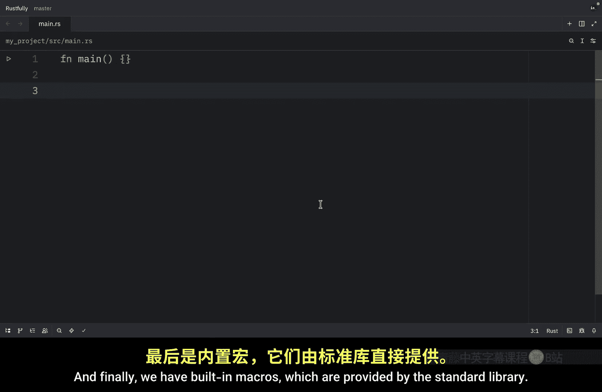
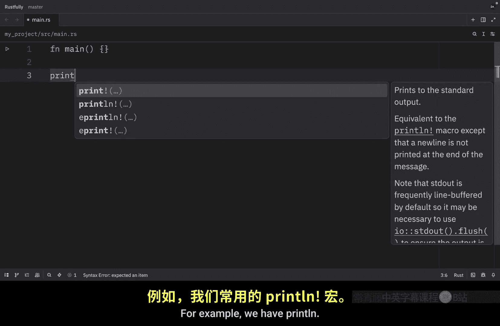
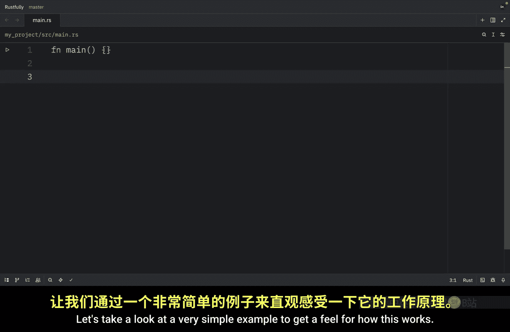
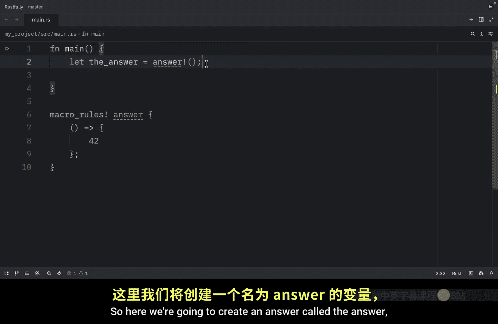
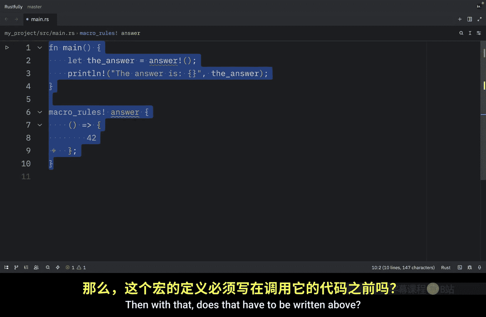
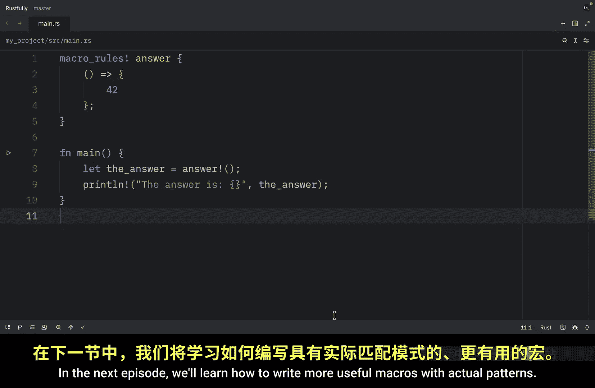

# 075：Rust 中的声明宏 🧩

在本节课中，我们将要学习 Rust 中最强大的特性之一：声明宏。宏是一种编写代码来生成其他代码的方式，这被称为元编程。理解宏的基础知识后，它会成为你 Rust 工具箱中极其有用的工具。

## 什么是宏？

宏是一种定义可重用代码模式的方法。当你调用宏时，它会在编译时、程序实际运行之前展开成代码。这与函数有几个重要的区别。


以下是宏与函数的主要区别：
*   函数在运行时被调用，宏在编译时被展开。
*   宏可以接受可变数量的参数。
*   宏可以生成函数无法生成的代码。

你其实一直在使用宏而没有意识到。`println!` 是一个宏，`vec!` 也是一个宏，甚至用于创建格式化字符串的 `format!` 也是宏。感叹号 `!` 是你区分宏和函数的方式。当你看到 `println!` 或 `vec!` 时，你就知道你在调用宏，而不是函数。这很重要，因为宏可以做函数做不到的事情，比如接受可变数量的参数。

## 为什么要使用宏？





有以下几个充分的理由使用宏：
*   **代码生成**：宏可以为你生成重复的代码。
*   **可变参数**：宏可以接受不同数量的参数。
*   **编译时检查**：宏可以在编译时执行检查。
*   **领域特定语言**：宏可以为特定任务创建迷你语言。

我个人喜欢将宏视为减少样板代码并使代码更具表现力的一种方式，但你应该谨慎使用它们，并非所有东西都需要是宏。

## 宏的类型

Rust 有三种类型的宏：
1.  **声明宏**：这是我们本系列要学习的类型。它们使用 `macro_rules!` 宏编写，基于模式匹配，是最常见且最容易理解的。
2.  **过程宏**：它们更高级，作为 Rust 代码编写，本系列不会涉及。
3.  **内置宏**：由标准库提供。例如 `println!` 或 `print!` 都是内置宏。


在本系列中，我们专注于声明宏，因为它们最容易上手，并且涵盖了大多数用例。

## 宏的工作原理

当你编写宏时，你本质上是在编写一个模式匹配。宏系统查看你传递给宏的代码，将其与你定义的模式进行匹配，然后基于这些模式生成代码。这一切都发生在编译时，因此没有运行时开销。宏会展开成常规的 Rust 代码，然后正常编译。

让我们看一个非常简单的例子来感受一下这是如何工作的。我们将创建一个只返回数字 42 的宏。这个宏叫做 `answer!`，它不接受任何参数，正如空括号所示。






```rust
macro_rules! answer {
    () => {
        42
    };
}
```

当你调用它时，它会展开为数字 42。现在让我们尝试使用它。

```rust
let the_answer = answer!();
println!("The answer is {}", the_answer);
```



当编译器看到 `answer!()` 时，它会将其与我们的模式（即空括号）匹配，并将其替换为 42。因此，在编译后的代码中，`the_answer` 就变成了 42。这是一个简单的例子，但它展示了基本思想：宏匹配模式并生成代码。





在下一集中，我们将学习如何编写具有实际模式的更有用的宏。

## 总结




本节课中我们一起学习了 Rust 声明宏的基础概念。我们了解了宏是什么，它与函数的区别，以及使用宏的优势。我们还介绍了 Rust 中宏的三种类型，并重点讲解了声明宏的工作原理。通过一个简单的例子，我们看到了宏如何在编译时匹配模式并生成代码。理解这些基础知识是掌握 Rust 宏编程的第一步。