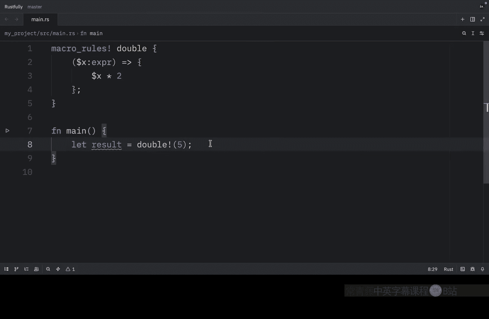
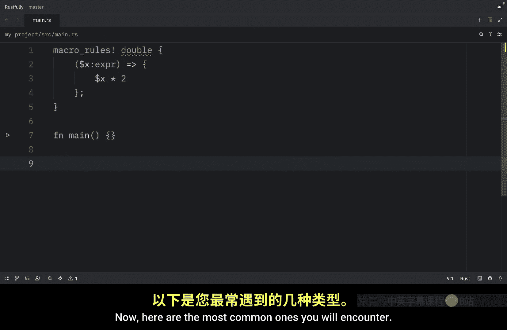
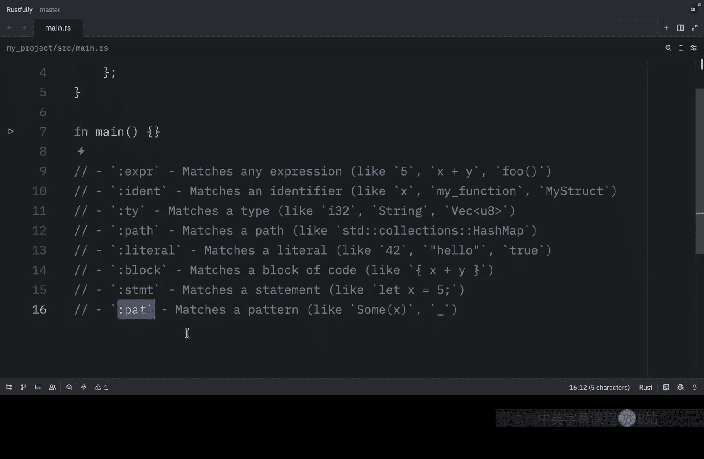
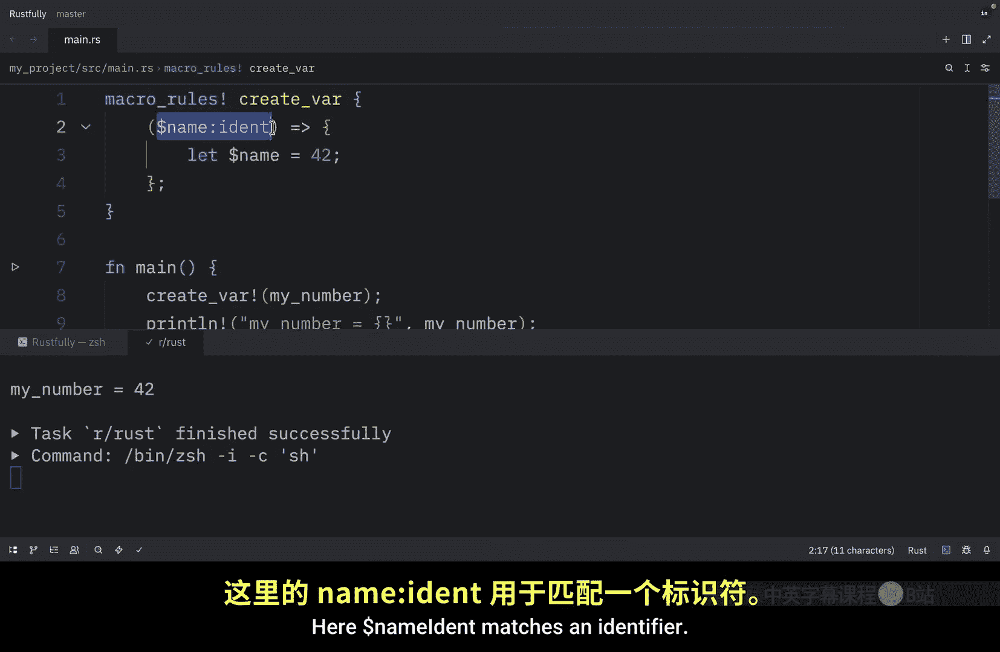
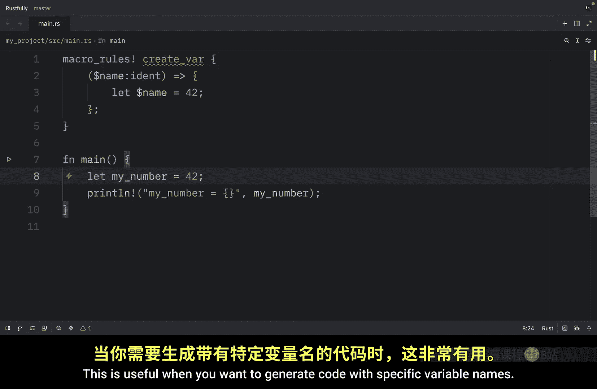
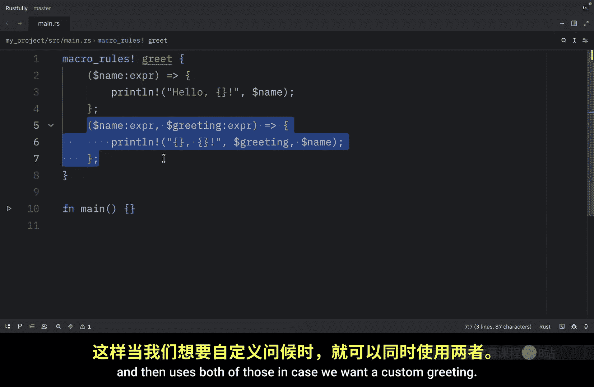
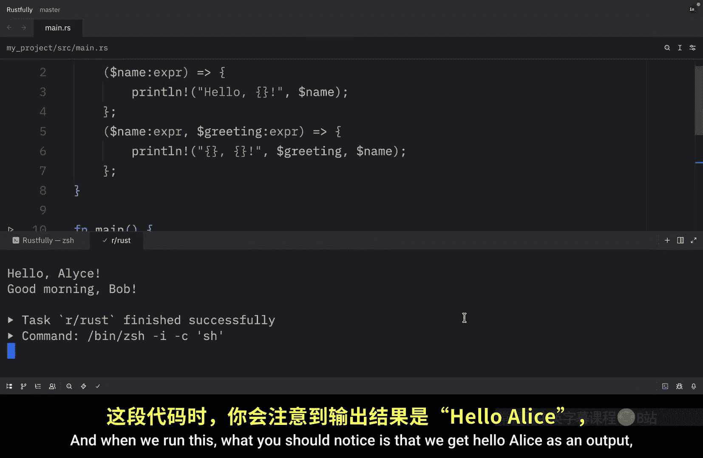
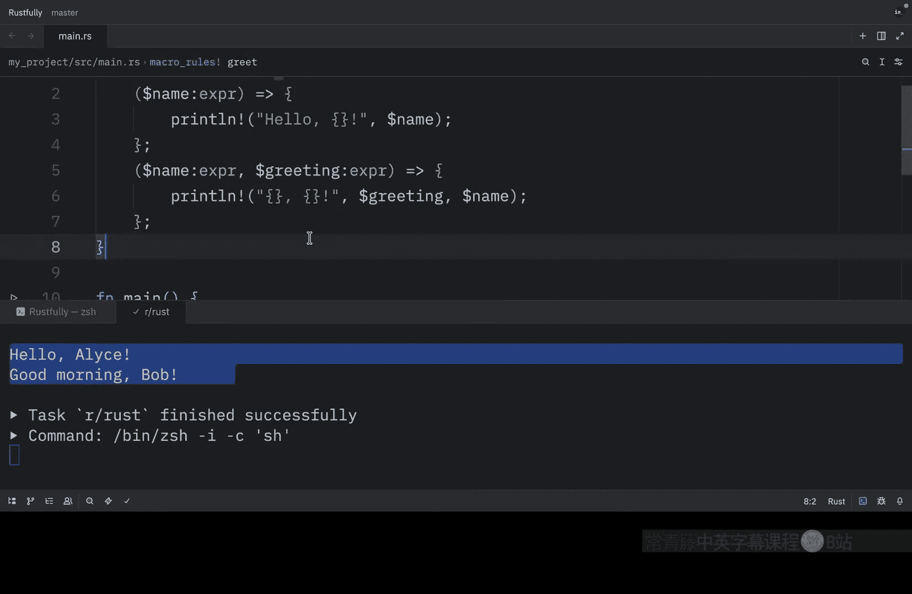
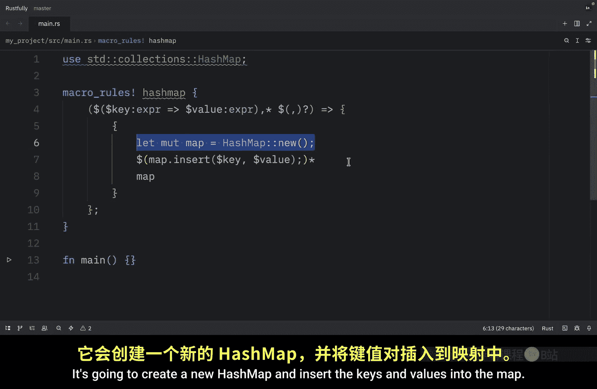
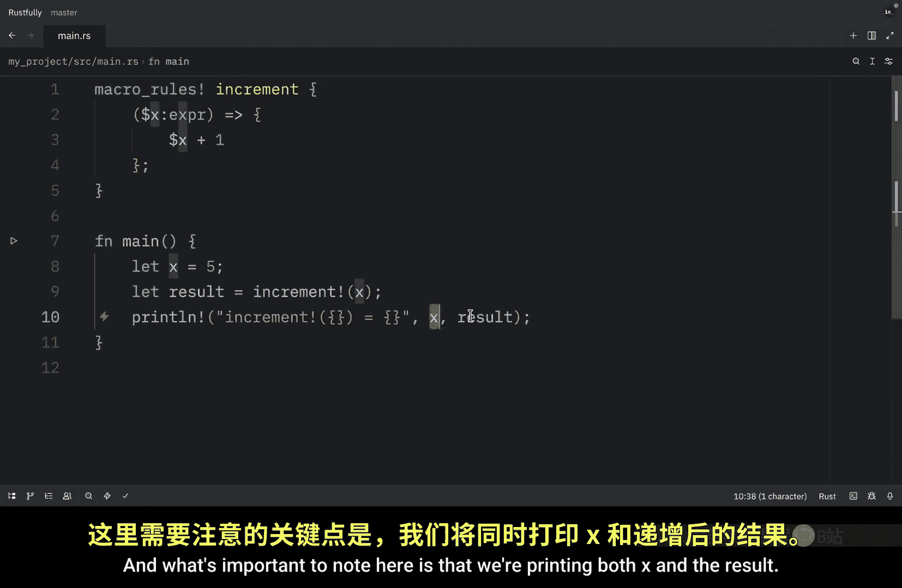

Rust 初学者教程：P76：声明式宏入门 🧩

在本节课中，我们将要学习如何编写 Rust 中的声明式宏。我们将从最基本的宏结构开始，逐步介绍其语法、片段指示符、多模式匹配等核心概念，并通过实际例子展示宏如何简化代码。

上一节我们了解了宏是什么，本节中我们来看看如何编写它们。




声明式宏的语法使用 `macro_rules!` 宏本身，这有点“元”的意味，但你会习惯的。宏的基本结构如下所示：

```rust
macro_rules! macro_name {
    (pattern) => { generated_code };
}
```

我们有 `macro_rules!`，后面跟着宏名、要匹配的模式以及要生成的代码。

让我们从一个简单的宏开始，它接受一个参数，这个宏的功能是将一个数字加倍。`macro_rules!` 声明一个新宏，`double` 是宏的名称。这里的这部分是匹配表达式的模式。`$x` 被称为元变量，用于捕获匹配的值。这里的 `expr` 是一个片段指示符，表示匹配一个表达式。然后我们有了生成的代码，`$x` 会被匹配到的值替换。




为了展示它是如何工作的，我们可以创建一个名为 `result` 的变量，它将使用 `double!` 宏，并在其中插入 `5`。然后我们可以打印出 5 的倍数。当我们运行这段代码时，输出应该是 `10`。或者，我们可以移除所有内容，插入 `10 + 5` 的倍数，无论结果是什么。最终，我们将得到 `30`。

回到 `5` 的例子，当我们调用 `double!(5)` 时，宏系统将 `5` 与模式 `$x:expr` 进行匹配。它将 `5` 捕获到元变量 `$x` 中。然后它生成代码 `5 * 2`，这意味着最终它将 `double!(5)` 替换为 `5 * 2`。当我们处理像 `10 + 5` 这样的表达式时，也会发生同样的事情。这部分被插入到这里，而这里的这部分替换了那个位。




接下来，我想谈谈片段指示符。这里的这部分被称为片段指示符，它帮助宏系统了解期望哪种 Rust 代码。




以下是您将遇到的最常见的几种：
*   `expr`：匹配任何表达式，如 `5`、`x + y` 或一个函数调用。
*   `ident`：匹配一个标识符，如 `x`、`my_function` 或 `MyStruct`。
*   `ty`：匹配一个类型，如 `i32`、`String` 或 `Vec<u8>`。
*   `path`：匹配一个路径，如标准库中的 `std::collections::HashMap`。
*   `literal`：匹配一个字面量，如 `42`、`"hello"` 和 `true`。
*   `block`：匹配一个代码块，如 `{ x + y }`。
*   `stmt`：匹配一个语句，如 `let x = 5;`。
*   `pat`：匹配一个模式，如 `Some(x)` 或 `_`。




随着学习的深入，我们会看到更多，但 `expr` 和 `ident` 是最常用的。




接下来，让我们创建一个使用 `ident` 来创建变量的宏。我们将创建一个名为 `create_var` 的宏，这次我们使用一个名为 `$name` 的元变量，并指定 `ident` 片段指示符。

要使用它，我们可以输入 `create_var!(my_number)`，当我们打印 `my_number` 时，输出应该是 `42`。这里的 `$name:ident` 匹配一个标识符。当我们用 `my_number` 调用 `create_var!` 时，宏展开为 `let my_number = 42;`。这在您想用特定变量名生成代码时很有用。





宏也可以有多个模式，这对于处理不同情况很有用。让我们创建一个可以处理一个或两个参数的宏，这个宏将被称为 `greet`。第一个模式接受一个名字并向该名字问好。第二个模式接受一个名字和一个问候语，然后在需要自定义问候时使用两者。


要使用它，我们可以输入 `greet!(Alice)`，这是我的天才编剧，然后我们将问候 Bob，他是我想象中的伟大虚构人物。当我们运行这个时，您会注意到我们得到“Hello, Alice!”作为输出，并且得到自定义问候语作为输出。

当您调用 `greet!` 时，宏系统会按顺序尝试匹配每个模式。第一个匹配的模式被使用。因此，`greet!(Alice)` 匹配第一个模式，而 `greet!(Bob, "Good morning")` 匹配第二个模式。这与其他语言中的函数重载非常相似，但它是在编译时通过模式匹配发生的。

现在，让我们创建一个真正有用的宏，一个用一些初始值创建哈希映射的宏。这是您可能经常想做的事情。




首先，我们需要从 `collections` 中导入 `HashMap`。然后，我们将创建我们的 `macro_rules!` 并称之为 `hashmap`。在这里面，我们将有一个相当奇特的模式，这个模式将生成以下代码：它将创建一个新的哈希映射，将键和值插入到映射中，然后返回该映射。


这个宏使用了重复，我们将在接下来的几个视频中详细介绍。现在只需注意，它允许我们像这样创建一个哈希映射。在 `main` 函数中，我们将创建一个 `map`，它将使用 `hashmap!` 宏，我们需要做的就是提供键和值，非常简单。然后我们可以打印里面的值，当我们运行这个时，我们会得到映射中索引 `1` 的值是 `1`，`2` 包含 `2`。这比写 `let mut hashmap = HashMap::new();` 然后逐个插入每个键要简洁得多。再次强调，我们将在接下来的几个视频中学习重复语法是如何工作的，但现在只需欣赏宏如何使代码更具表现力。

接下来，我想谈谈宏的卫生性。关于宏，需要理解的一个重要概念是卫生性。Rust 宏是卫生的，这意味着它们不会意外捕获或与周围代码中的变量发生冲突。让我们看一个例子。

这里我们将创建一个名为 `increment` 的宏，它所做的就是将一个值加一。在 `main` 函数中，我们可以创建一个名为 `x` 的变量。我们可以尝试递增那个变量，然后我们可以打印递增的结果。这里需要注意的是，我们同时打印了 `x` 和结果。现在当我们运行这个时，您会看到 `5` 的增量等于 `6`，`x` 不会受到宏的影响。再次强调，宏展开为 `x + 1`，但它并不修改原始的 `x`。这是因为宏生成代码，它们不执行。生成的代码在宏被调用的位置插入，并且遵循正常的 Rust 作用域规则。这通常是一件好事，它防止宏产生意外的副作用。但有时您可能希望宏创建在宏外部可见的变量，我们将在后面的例子中看到。

最后，在编写宏时，有一些常见的错误需要避免。
以下是需要注意的几点：
*   忘记分号：每个模式都需要以分号结尾。
*   使用错误的片段指示符：例如，当您需要 `ident` 时使用了 `expr`。
*   没有处理所有情况：确保您的模式覆盖所有有效的输入。
*   无限递归：小心不要创建会无限展开的宏。




个人建议是从简单开始，并彻底测试您的宏。宏错误可能令人困惑，因此最好逐步增加复杂性。


本节课中我们一起学习了 Rust 声明式宏的基础知识。我们了解了宏的基本结构 `macro_rules!`，认识了关键的片段指示符如 `expr` 和 `ident`，并学会了如何编写处理不同参数数量的多模式宏。我们还通过创建 `hashmap!` 宏的示例，看到了宏如何显著简化重复性代码。最后，我们讨论了宏的卫生性特性以及编写宏时需要避免的常见错误。掌握这些基础是有效使用和编写宏的第一步。