# 078：声明式宏中的重复模式 🔁

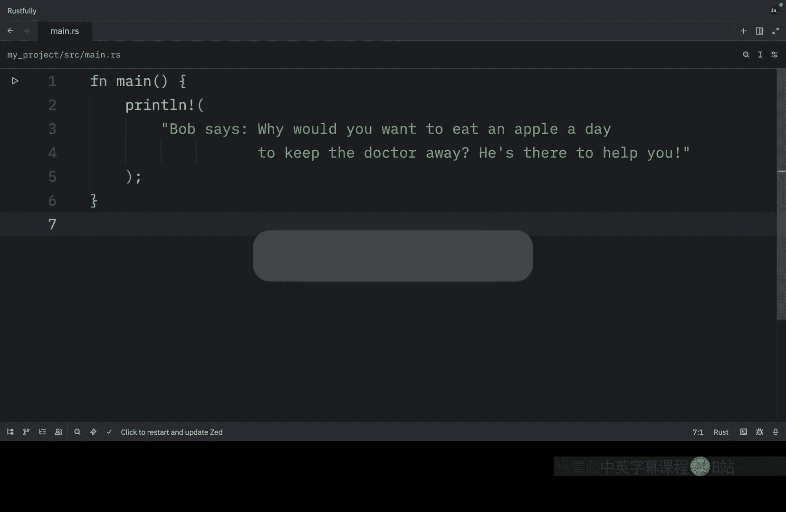

在本节课中，我们将继续学习 Rust 中的声明式宏。声明式宏最强大的特性之一是**重复**。它允许你匹配和生成可变数量的代码。如果你曾好奇像 `vec!` 这样的宏如何接受任意数量的参数，答案就是重复。重复是让宏真正强大的原因，它们可以生成手动编写会非常繁琐甚至不可能的代码。

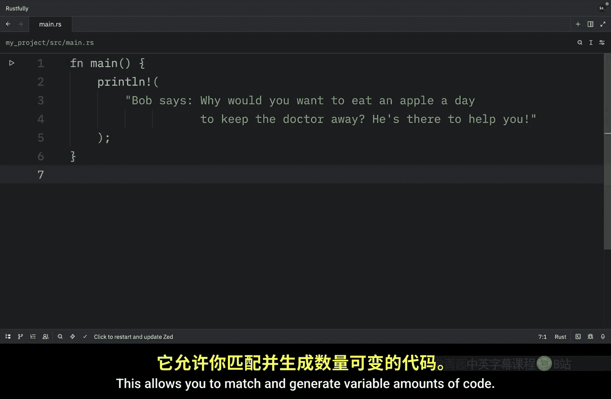

## 基础重复语法

上一节我们介绍了宏的基本概念，本节中我们来看看重复模式的基础语法。宏中的重复使用特殊的语法：`$(...)*`、`$(...)+` 和 `$(...)?`。

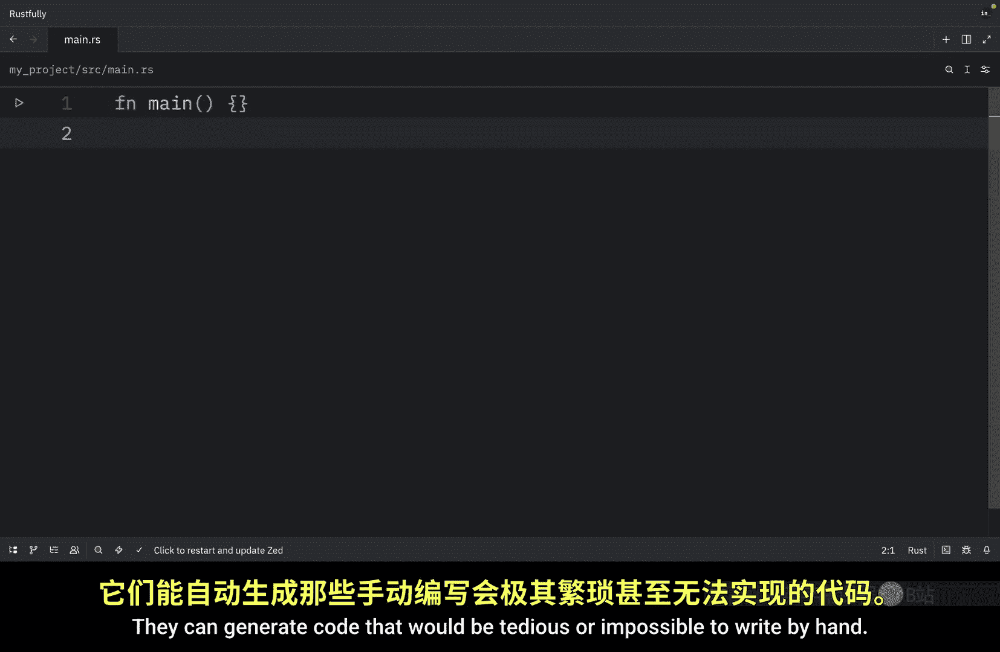

*   `$(...)*` 匹配零次或多次。
*   `$(...)+` 匹配一次或多次。
*   `$(...)?` 匹配零次或一次。

在括号内，你放置要重复的模式；在括号外，你放置为每个匹配项生成的内容。

让我们从一个实际例子开始：一个可以从任意数量的值创建元组的宏。

```rust
macro_rules! tuple {
    ($($item:expr),* $(,)?) => {
        ($($item),*)
    };
}
```


要使用它，我们可以这样做：


```rust
let t1 = tuple!(1, 2, 3);
let t2 = tuple!(4, 5, 6, 7, 8);
println!("{:?}, {:?}", t1, t2); // 输出: (1, 2, 3), (4, 5, 6, 7, 8)
```

现在让我们快速解释一下这个语法：
*   `$($item:expr),*` 匹配零个或多个由逗号分隔的表达式。
*   `$(,)?` 可选地匹配一个尾随逗号，这允许我们在元组末尾添加逗号。
*   最后，`($($item),*)` 生成一个包含所有匹配项的元组。

`*` 表示零次或多次，因此这个宏适用于任意数量的参数。

## 重复运算符详解

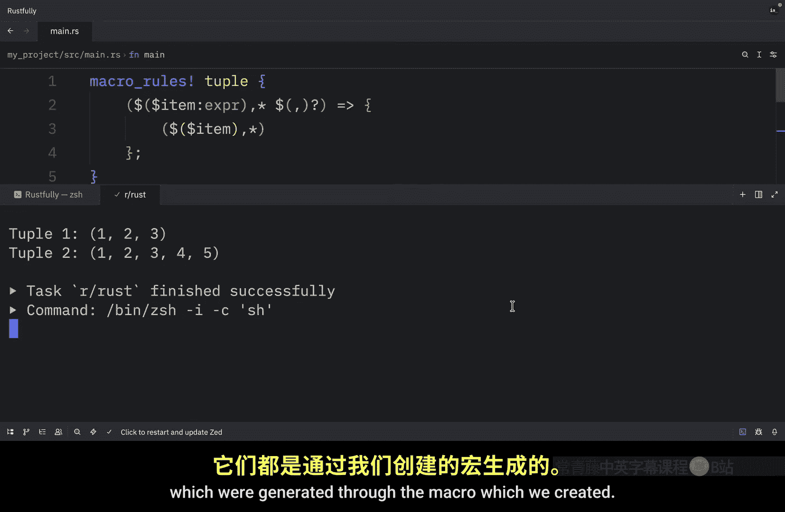


接下来，让我们详细讨论三个重复运算符。它们的工作原理如下：

*   `*`（零次或多次）：模式可以出现 0、1、2 或更多次。
*   `+`（一次或多次）：模式必须至少出现一次。
*   `?`（零次或一次）：模式必须出现零次或一次。

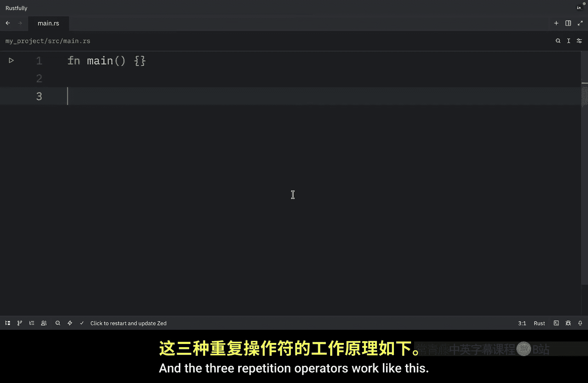

以下是每种运算符的实用示例。

首先是 `*`（零次或多次），它可以为空，这对于可选参数非常有用。

```rust
macro_rules! log {
    ($msg:expr $(, $arg:expr)*) => {
        println!($msg $(, $arg)*);
    };
}
```

然后我们可以创建另一个使用 `+`（一次或多次）的宏 `min`，它必须至少有一个参数，这对于必需列表很有用。

```rust
macro_rules! min {
    ($first:expr $(, $rest:expr)+) => {
        {
            let mut min_val = $first;
            $(
                if $rest < min_val {
                    min_val = $rest;
                }
            )+
            min_val
        }
    };
}
```

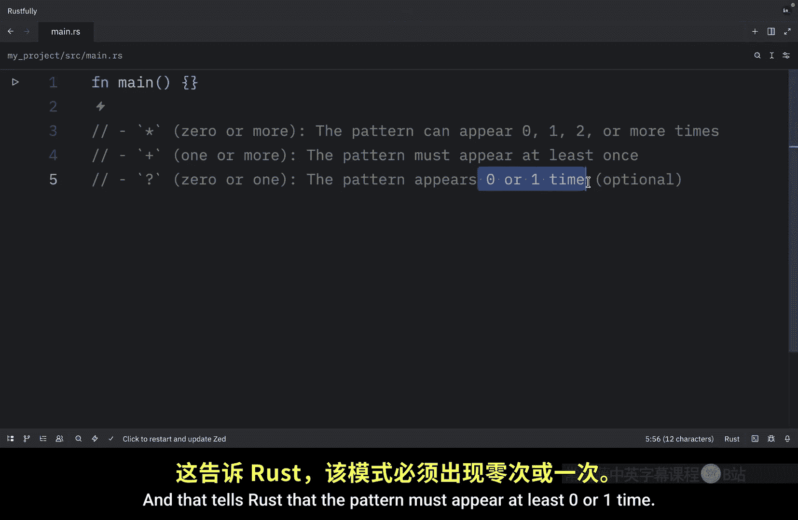


要使用这些宏：

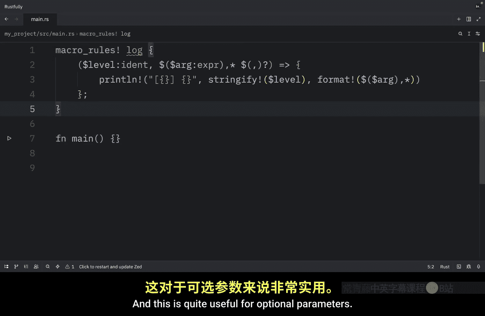


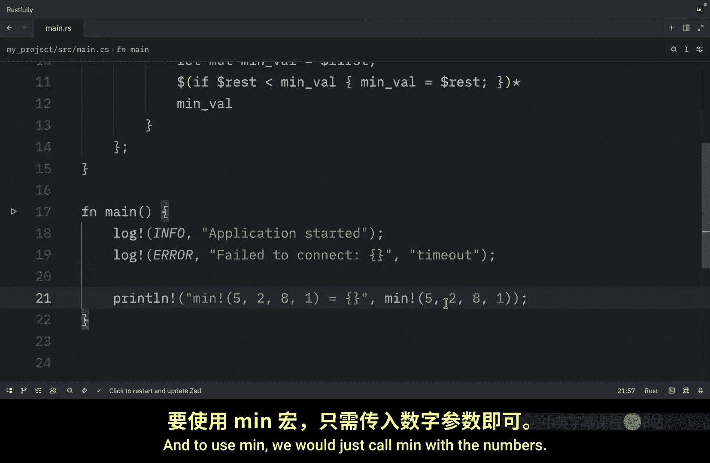

```rust
log!("应用程序已启动"); // 零个格式化参数
log!("错误：连接失败", "网络超时"); // 一个格式化参数
let result = min!(5, 2, 8, 1);
println!("最小值是: {}", result); // 输出: 最小值是: 1
```


这里需要注意的重要一点是，`log` 宏可以在没有格式化参数的情况下工作，它只需要一条消息。而 `min` 宏确实需要至少一个值。如果我们移除所有值并尝试运行程序，它将无法编译。

因此，当你想允许零次匹配时使用 `*`，当你需要至少一个值时使用 `+`。


## 重复模式中的分隔符


在重复模式中，你可以在项目之间指定一个**分隔符**。不同的分隔符可以创建不同的语法。

对于这个例子，我们将创建一个允许我们创建集合的宏。

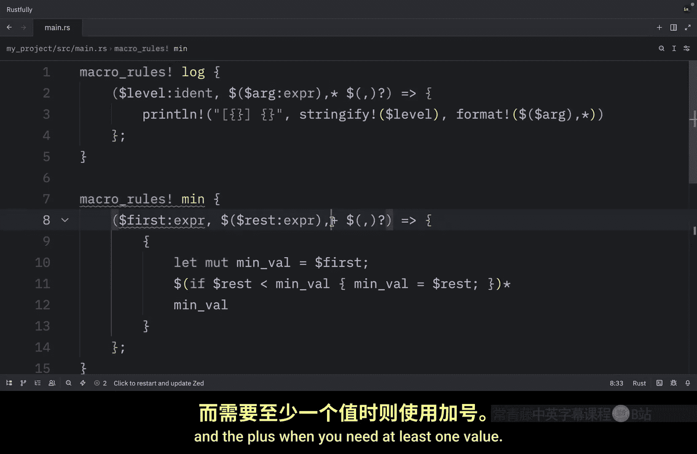


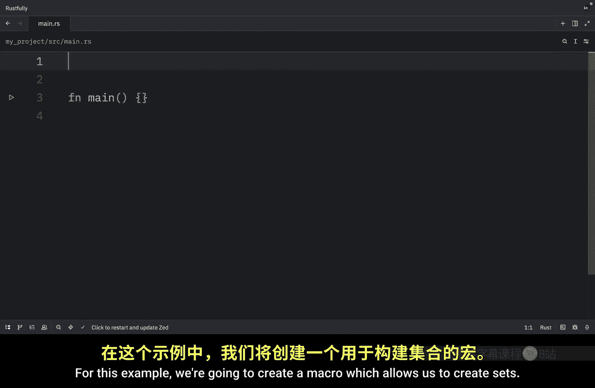

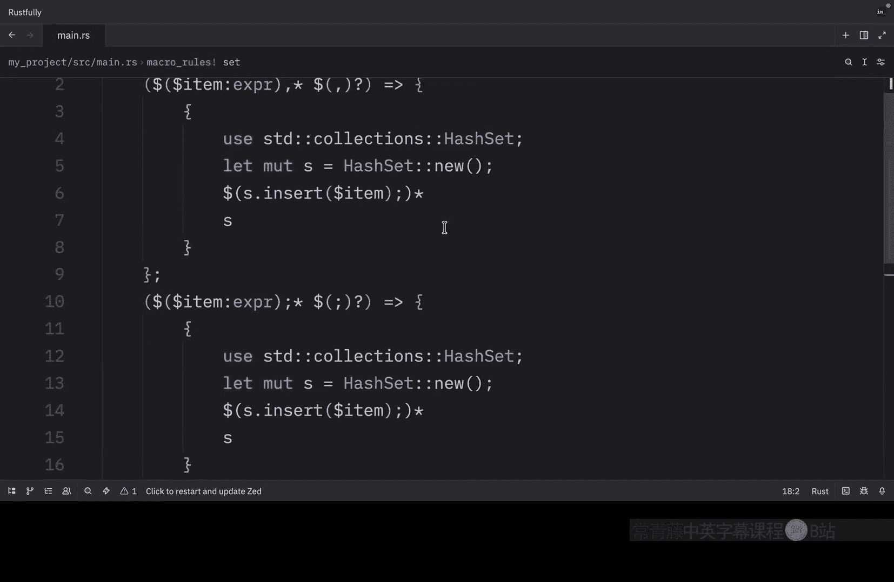

```rust
macro_rules! set {
    ($($item:expr),*) => {
        {
            let mut s = std::collections::HashSet::new();
            $(s.insert($item);)*
            s
        }
    };
    ($($item:expr);*) => {
        {
            let mut s = std::collections::HashSet::new();
            $(s.insert($item);)*
            s
        }
    };
}
```

你应该注意到这里有两个模式：一个检查逗号，另一个检查分号。两者都从我们提供的数据创建新的集合。因此，我们现在可以使用逗号和分号来创建新集合。

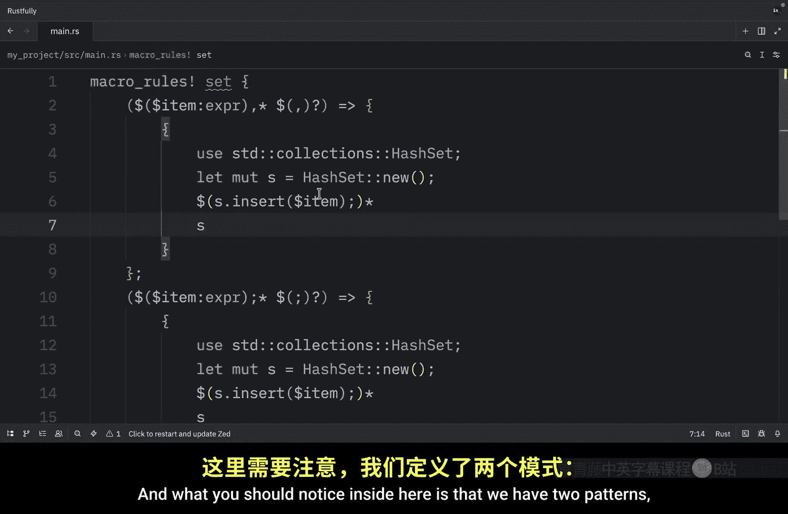


```rust
let set1 = set!{1, 2, 3, 4}; // 使用逗号
let set2 = set!{5; 6; 7; 8}; // 使用分号
```

你可以使用任何标记作为分隔符，无论是逗号、分号、箭头、加号，甚至是自定义标记。分隔符必须在模式和扩展中的每次重复之间出现。这允许你为同一个宏创建不同的语法。

## 嵌套重复

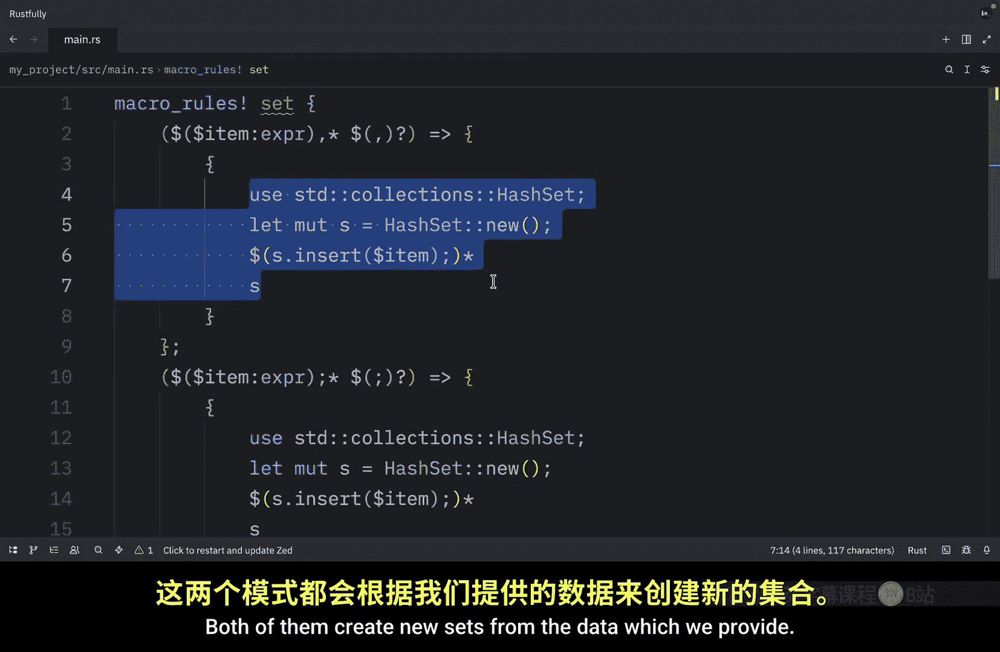

接下来是**嵌套重复**。你可以嵌套重复以处理更复杂的模式。

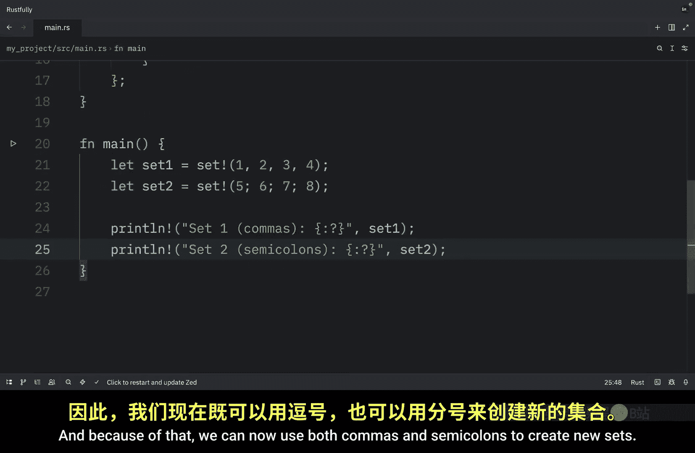


让我们创建一个宏，用简洁的语法创建一个 2D 数组（也称为矩阵）。

```rust
macro_rules! matrix {
    ($([$($elem:expr),* $(,)?]),* $(,)?) => {
        {
            let mut rows = Vec::new();
            $(
                let mut row = Vec::new();
                $(
                    row.push($elem);
                )*
                rows.push(row);
            )*
            rows
        }
    };
}
```


要使用它，我们将从这些容器创建一个矩阵并打印每一行。

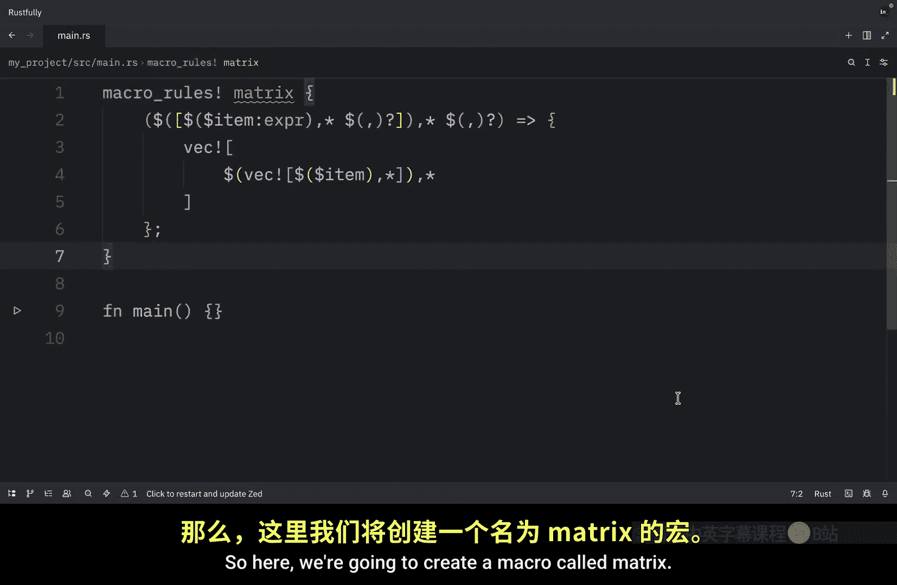

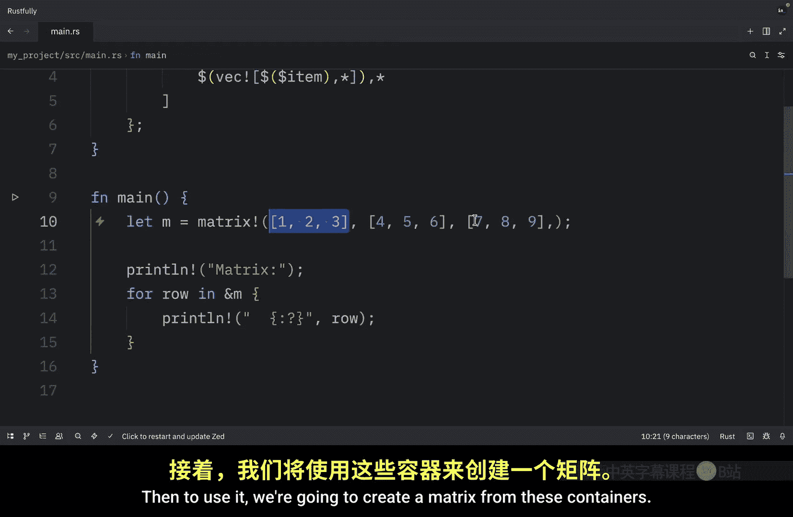

```rust
let m = matrix!(
    [1, 2, 3],
    [4, 5, 6],
    [7, 8, 9]
);
for row in &m {
    println!("{:?}", row);
}
// 输出:
// [1, 2, 3]
// [4, 5, 6]
// [7, 8, 9]
```

这里我们有：
*   **外部重复**：匹配多行。
*   **内部重复**：匹配每行中的项目。
*   在扩展中，我们有一个为每一行生成向量的模式。


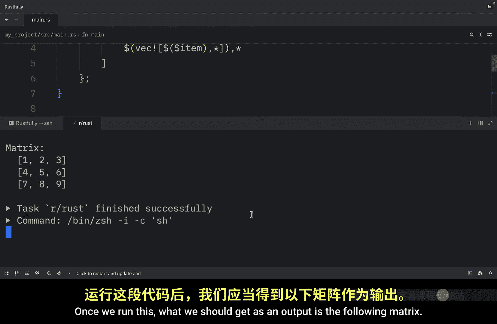

这展示了嵌套重复的强大功能。你可以用简洁、可读的语法创建复杂的数据结构。

## 总结

本节课中我们一起学习了 Rust 声明式宏中的重复模式。我们介绍了：
1.  基础重复语法：`$(...)*`、`$(...)+` 和 `$(...)?`。
2.  重复运算符的区别和应用场景。
3.  如何使用分隔符为宏定义灵活的输入语法。
4.  如何通过嵌套重复来处理和生成复杂的数据结构（如矩阵）。

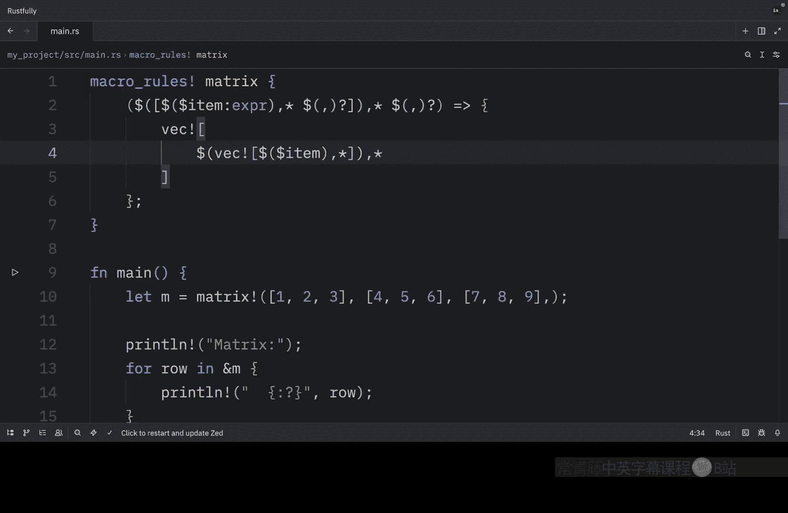

重复是宏编程的核心，它使得宏能够灵活地处理可变数量的输入，并生成强大而简洁的代码。关于重复语法还有很多内容，我们将在后续视频中继续探讨。