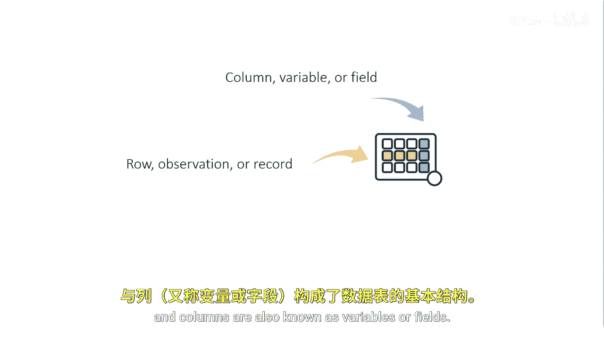
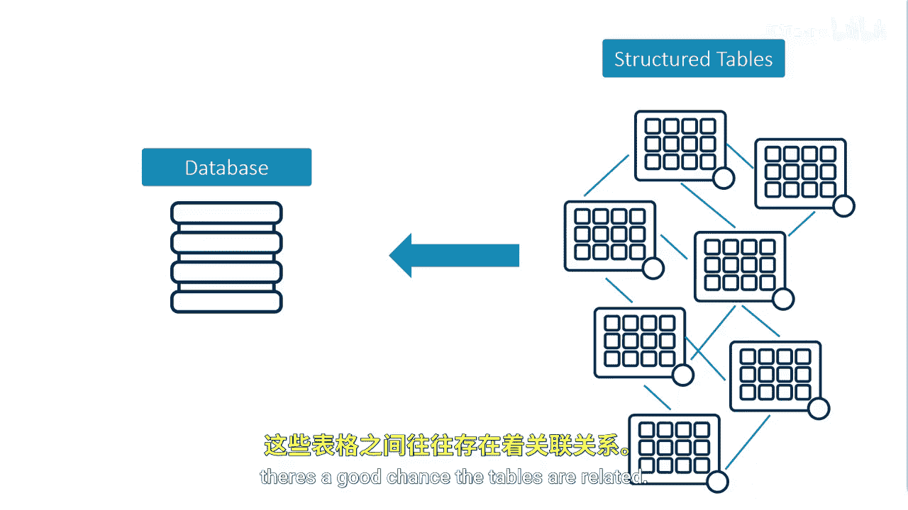
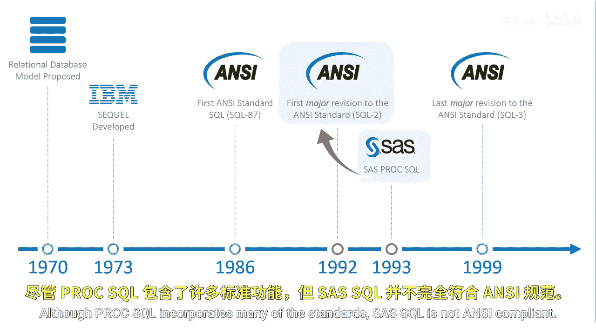

# 003：什么是SQL 🔍

在本节课中，我们将要学习SQL（结构化查询语言）的基本概念，了解它如何用于在关系型数据库中查询和管理数据。

---

在深入理解SQL之前，我们先回顾一下表的结构。

回想一下，SAS表是包含行和列的结构化表格。行也被称为观测或记录，列也被称为变量或字段。

---

数据库是一个以易于访问的形式组织起来的大型结构化表的集合。根据组织规模的不同，你可能拥有数十、数百甚至数千张表，以及数千、数百万乃至数十亿行数据。无论你的表集合规模如何，这些表之间很可能存在关联。

SQL提供了一种标准化的语言，用于搜索、分析你的数据并从中获取洞察。

---

上一节我们介绍了表和数据库的概念，本节中我们来看看一个具体的例子。以下是四个表的集合，每个表都包含行和列：

*   **客户表**：包含客户信息，如姓名、地址等。
*   **交易表**：包含客户交易信息，如客户ID、购买日期、商户等。
*   **商户表**：包含商户信息，如公司名称、地点和联系方式等。
*   **银行表**：包含银行信息，如银行名称、地点和联系方式。

这些表通过特定的键（通常称为**主键**）相互关联。主键是标识表中各行的唯一值。

*   客户表中的`Customer ID`指向特定的客户信息。
*   交易表中的`Customer ID`指向该客户的特定购买记录。交易表中的`Customer ID`通常被称为**外键**。
*   商户表中的`Merchant ID`指向特定的商户名称。
*   交易表中的`Merchant ID`指向客户在某个商户处的特定交易。

基于这些关系，我们可以开始探究数据。例如：
*   我们想找出交易表中所有来自北卡罗来纳州的客户的姓名和地址。
*   我们想计算每个商户或客户的交易数量。
*   我们想知道哪家银行通常拥有最多的交易。

我们需要一种简便的方法来提取数据并找到这些问题的答案。

---

你可以使用SQL在关系型数据库中对数据进行查询、操作和管理。

---

SQL诞生于20世纪70年代初，是在关系数据模型被提出之后发明的。自诞生以来，SQL逐渐流行，并在80年代中期通过美国国家标准协会实现了标准化。此后，该标准经历了多次修订，以包含更多功能集。

SAS在90年代通过SQL过程开始实现SQL，遵循了ANSI标准的第一个主要修订版。尽管PROC SQL包含了许多标准，但SAS SQL并非完全符合ANSI标准。

---

尽管SQL有一套标准，但理解不同的数据库管理系统对标准SQL有不同的实现方式非常重要。

诸如Oracle、Teradata、SQL Server、PostgreSQL等多种数据库管理系统都遵循ANSI标准SQL，然而，不同系统之间可能在关键字、功能和增强特性上略有差异。

虽然存在细微差别，但无论你学习哪种ANSI标准SQL的实现，理解一个系统中的SQL语言都能让你相对无缝地过渡到另一个系统。请务必阅读你所使用的特定DBMS的文档。

---

本节课中我们一起学习了SQL的基本定义、它在关系型数据库中的作用，以及表之间如何通过主键和外键建立关联。我们还了解了SQL的标准化历史以及不同数据库管理系统在实现上的细微差异。掌握这些核心概念是使用SQL进行高效数据查询和分析的基础。