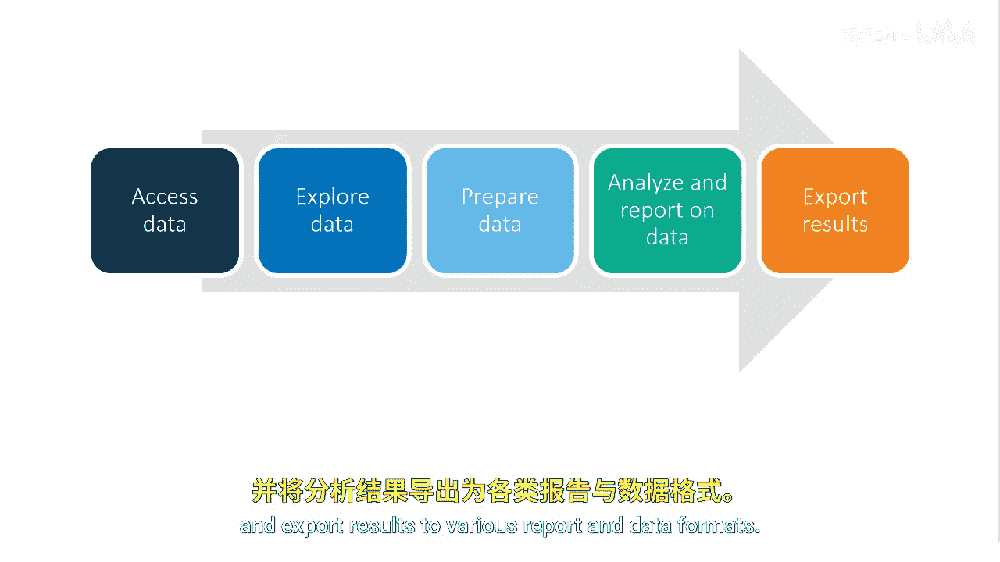

# 004：什么是PROC SQL 🛠️

在本节课中，我们将要学习PROC SQL的基础概念，了解它如何将SQL的强大功能与SAS环境相结合，以及它在数据处理流程中的作用。

## 概述

PROC SQL是SAS对结构化查询语言（SQL）的基础实现。它允许你在SAS程序中使用SQL，并包含了SAS特有的增强功能。你可以将PROC SQL视为SAS与SQL的结合体。SAS的实现让你能在SAS程序中使用SQL，同时还能利用SAS提供的额外功能，例如数据步。

## PROC SQL：SAS与SQL的结合

上一节我们介绍了PROC SQL的基本定位，本节中我们来看看它在数据处理流程中的具体角色。

在使用SQL使数据变得有意义和可操作的过程中，需要牢记SAS编程流程。SQL允许你遵循访问结构化表（如SAS表或数据库管理系统表）的基本步骤。然而，SQL无法直接访问非结构化文件，如文本、JSON或CSV文件。这时，你可以使用SAS来访问这些非结构化文件。

以下是使用SQL进行数据处理的主要步骤：

1.  **探索与理解数据**：使用SQL来探索数据，更好地理解其内容，并确定需要添加或更改的部分。
2.  **准备数据**：在理解数据之后，为分析做好准备。
3.  **分析与报告**：一旦数据准备就绪，即可对其进行分析并生成报告。

最后，在SAS环境中使用SQL，使你能够持续访问多种格式的数据，并将结果导出到各种报告和数据格式中。

## PROC SQL的输入与输出

了解了PROC SQL的流程后，我们来看看它能处理什么数据，以及能产生什么结果。

与大多数其他SAS过程步一样，PROC SQL可以读取SAS表、SAS视图或数据库管理系统视图，以及数据库管理系统表。

作为输出，默认情况下，一个PROC SQL查询会生成一份报告。然而，一个PROC SQL查询也可以创建以下内容：

*   SAS表
*   SAS视图或数据库管理系统视图
*   数据库管理系统表

## 总结

本节课中我们一起学习了PROC SQL的核心概念。我们了解到PROC SQL是SAS中实现SQL功能的过程步，它融合了SQL的标准语法和SAS的增强特性。我们明确了它在数据访问（特别是结构化数据）和完整数据处理流程（从探索、准备到分析报告）中的作用。最后，我们掌握了PROC SQL能够处理的数据源类型以及它能生成的各种结果，包括报告、新数据表和视图。