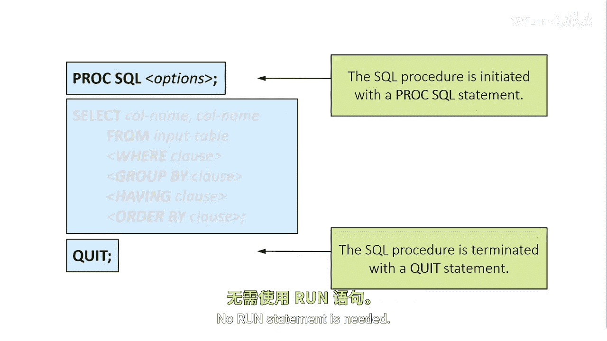
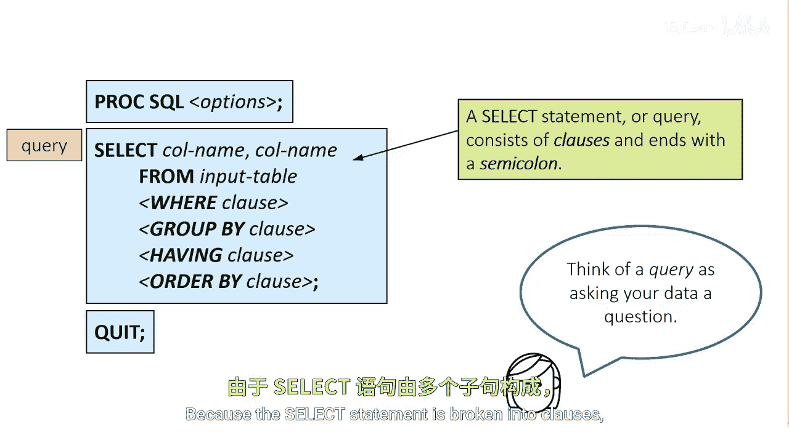

# 005：PROC SQL语法 🗂️

在本节课中，我们将要学习SAS中PROC SQL过程步的基本语法结构。我们将了解如何启动和终止SQL过程，以及构成SQL查询的核心语句和子句。

## 启动与终止SQL过程



PROC SQL过程步以 `PROC SQL` 语句开始，以 `QUIT` 语句结束。一个PROC SQL步骤中可以包含多个语句，每个语句定义一个操作并立即执行。该过程步不需要使用 `RUN` 语句。

```sas
PROC SQL;
    /* 你的SQL语句放在这里 */
QUIT;
```

## SELECT语句：核心查询工具

上一节我们介绍了如何启动SQL过程，本节中我们来看看最核心的查询工具——SELECT语句。SELECT语句是最常用的SQL语句，通常被称为查询。它从一个或多个表中检索数据，并生成一个显示数据的报告。

与PROC SQL中的许多语句一样，SELECT语句由称为“子句”的构建块组成，并以分号结束。正因为SELECT语句被分解为子句，SQL被描述为一种模块化语言。



## SELECT语句的基本结构

一个查询在SELECT子句中至少需要指定两件事。以下是必须包含的部分：

*   必须指定要检索的列名列表，列名之间用逗号分隔。
*   在FROM子句中，必须指定包含这些列的表名。


```sql
SELECT column1, column2
FROM table_name;
```

## SELECT语句的可选子句

剩余的SELECT子句是可选的，但你很可能会频繁使用它们。如果存在，子句必须按以下顺序出现：SELECT, FROM, WHERE, GROUP BY, HAVING, ORDER BY。但并非所有子句都必须出现。例如，你可以使用WHERE和ORDER BY子句，而不使用GROUP BY或HAVING子句。

以下是各可选子句的功能简介：

*   **WHERE子句**：使你能够过滤数据行。
*   **GROUP BY子句**：使你能够按组处理数据。
*   **HAVING子句**：与GROUP BY子句配合使用，用于过滤分组后的结果。
*   **ORDER BY子句**：指定查询返回行的顺序。

```sql
SELECT column1, SUM(column2)
FROM table_name
WHERE column1 > 100
GROUP BY column1
HAVING SUM(column2) > 500
ORDER BY column1 DESC;
```


## PROC SQL中的其他语句

虽然SELECT语句是最常用的语句，但PROC SQL允许使用其他语句。每个语句都以一个关键字开始，并以分号结束。

在本课程中，你将看到各种其他语句。你也可以查阅SAS文档以获取所有可用语句的列表。

---


本节课中我们一起学习了PROC SQL的基本语法框架。我们掌握了如何用 `PROC SQL` 和 `QUIT` 语句来启动和结束一个SQL会话，并深入了解了SELECT语句的构成，包括其必需的SELECT和FROM子句，以及用于过滤、分组和排序的WHERE、GROUP BY、HAVING和ORDER BY等可选子句。理解这些基本结构是编写有效SQL查询的第一步。