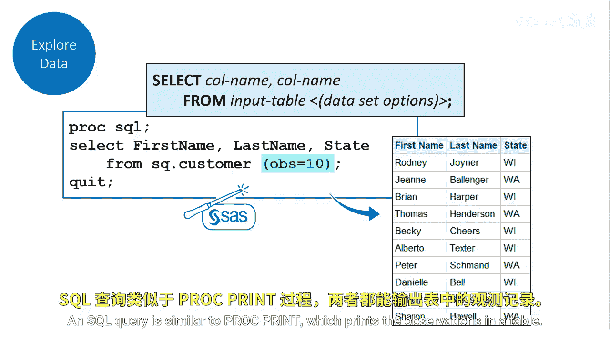
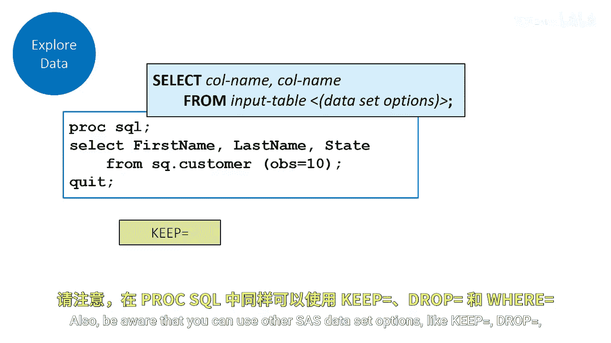

# 006：探索表

在本节课中，我们将学习如何使用Proc SQL来探索数据表。具体来说，我们将了解如何查看表的列属性以及如何预览表中的数据行。

## 查看表结构

上一节我们介绍了Proc SQL的基本概念，本节中我们来看看如何查看一个表的结构。假设你是一名正在学习Proc SQL的新分析师，你的第一个任务是探索客户表。你需要查看该表的列属性。


为此，你需要运行一个`DESCRIBE TABLE`语句。这个语句用于查看表的列名及其属性。

```sql
DESCRIBE TABLE sasuser.customer;
```

执行此语句后，SAS会将表的描述信息写入日志。结果将显示列名、列类型以及特定列的相关标签（如果存在）。`DESCRIBE TABLE`语句返回的结果与`PROC CONTENTS`过程步的结果类似。

## 预览表数据

了解了表的结构后，下一步通常是预览表中的实际数据。你希望查看客户表的前10行数据。


为此，你需要使用一个简单的`SELECT`语句，并在`FROM`子句中使用`OBS=`数据选项来限制输出的行数。

以下是具体的SQL查询语句：

```sql
SELECT firstname, lastname, state
FROM sasuser.customer(OBS=10);
```

在这个查询中：
*   `SELECT`后面跟着用逗号分隔的列名（`firstname`, `lastname`, `state`）。
*   `FROM`子句指定了要查询的表名，并使用`(OBS=10)`选项来限制只处理前10行观测。

这个查询将生成一个仅包含前10行数据的报告。你只是想预览数据，因此不需要输出整个表的报告。这种SQL查询的功能类似于`PROC PRINT`过程步，后者用于打印表中的观测。

## 注意事项与技巧



在编写查询时，有一个通用的经验法则需要注意：如果你不清楚表的大小，执行查询时需要谨慎。

根据表的大小，你可能会意外地生成一个包含10万、50万甚至上百万行的报告。这很可能是不必要的，并且可能导致问题或拖慢系统速度。

此外，需要知道的是，在Proc SQL中，你还可以使用其他SAS数据选项，例如：
*   `KEEP=`：指定要保留的变量。
*   `DROP=`：指定要删除的变量。
*   `WHERE=`：指定筛选观测的条件。

这些选项可以像`OBS=`一样，在`FROM`子句的表名后面使用，为你提供更灵活的数据控制能力。

## 总结

本节课中我们一起学习了使用Proc SQL探索数据表的两个核心操作：
1.  使用 **`DESCRIBE TABLE`** 语句查看表的列名、类型和标签等结构信息。
2.  使用 **`SELECT`** 语句并结合 **`OBS=`** 数据选项来安全、高效地预览表的前N行数据，避免因表过大而导致的问题。



掌握这些基础的数据探索技巧，是进行后续复杂查询和分析的重要第一步。