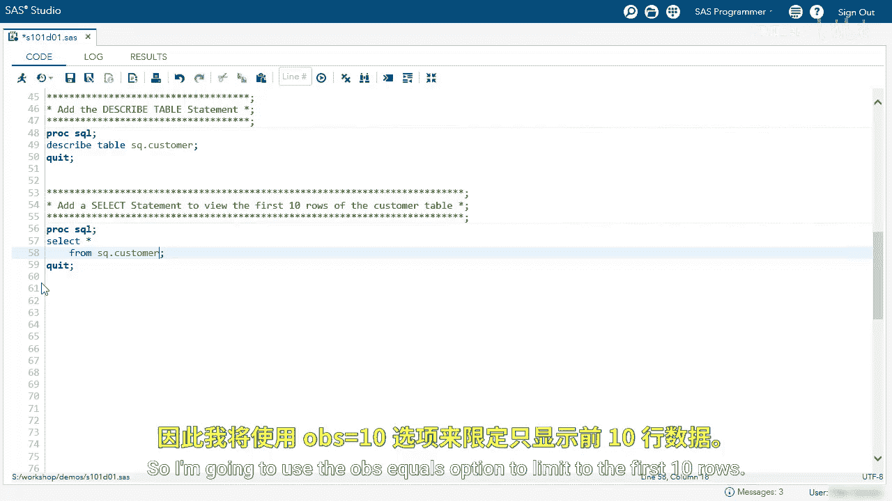
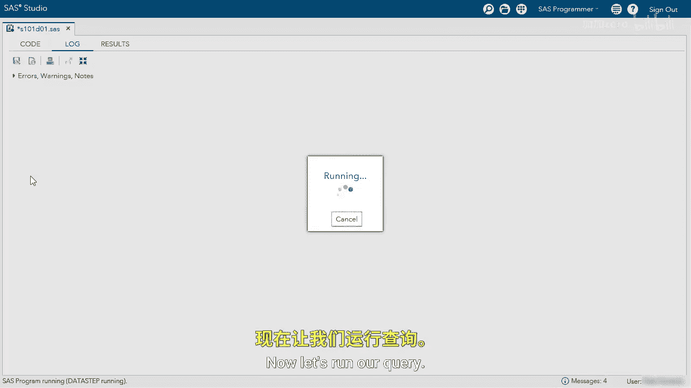
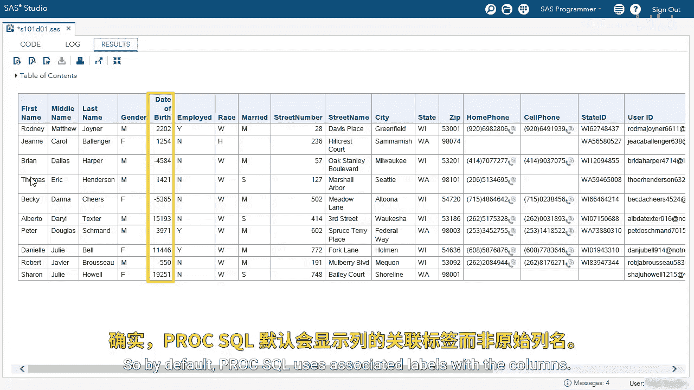
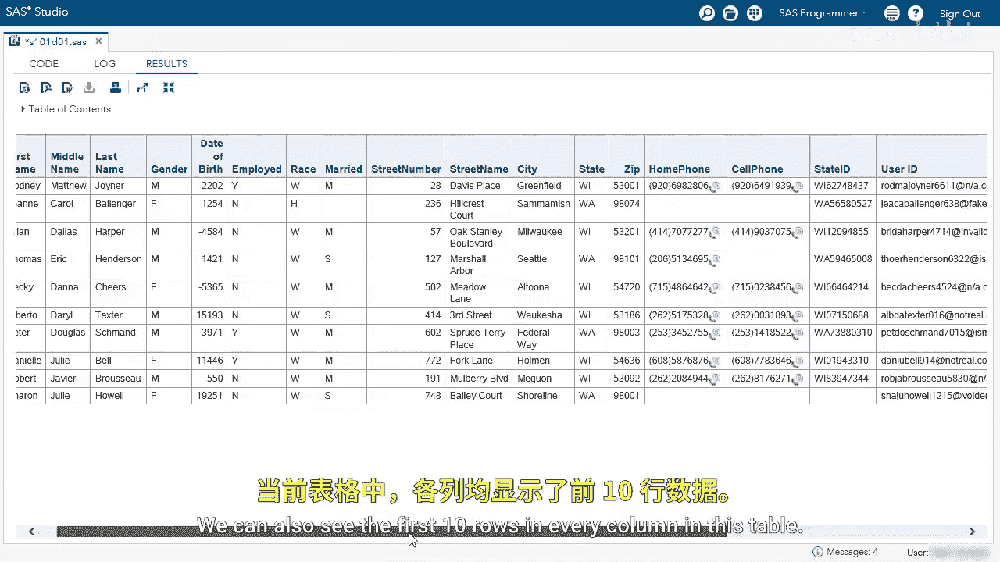

SAS高级程序员专项课程：P7：探索客户表演示 🧭

在本节课中，我们将学习如何使用SAS的PROC SQL过程来探索一个名为`customer`的数据表。我们将从查看表的结构开始，然后逐步学习如何选择特定的列和限制返回的行数，以有效地了解数据内容。

---

### 探索表结构

首先，我们需要了解`customer`表中包含哪些列以及它们的属性。为此，我们将使用`DESCRIBE TABLE`语句。

```sql
PROC SQL;
    DESCRIBE TABLE SQ.customer;
QUIT;
```

运行上述代码后，我们可以在日志中查看结果。日志会列出表中的所有列、每列的数据类型（例如字符型或数值型），以及是否存在列标签（Label）或格式（Format）。

*   **字符型列**：例如`first_name`、`middle_name`、`last_name`，它们都附有标签。
*   **数值型列**：例如`DOB`列，它的列标签是“date of birth”。这意味着虽然实际的列名是`DOB`，但在输出结果中，默认会显示更易读的标签“date of birth”。

---

### 查看表数据

了解了表结构后，下一步是查看表中的实际数据。我们将使用`SELECT`语句。

#### 选择所有列



最初，我们可以选择查看所有列。由于`customer`表有超过10万行，我们不需要一次性查看所有数据。可以使用`OBS=`选项来限制只显示前10行。



```sql
PROC SQL;
    SELECT *
    FROM SQ.customer
    (OBS=10);
QUIT;
```

运行这段代码后，结果窗口会显示前10行数据的所有列。请注意，`DOB`列在结果中显示为“Date of Birth”，这正是PROC SQL自动使用列标签而非原始列名的效果。

#### 选择特定列



通常，我们只关心表中的部分列。这时，可以在`SELECT`语句中明确指定需要的列名，而不是使用星号(`*`)。

例如，以下代码只选择`first_name`、`last_name`和`DOB`三列：



```sql
PROC SQL;
    SELECT first_name, last_name, DOB
    FROM SQ.customer
    (OBS=10);
QUIT;
```


运行后，结果将仅包含指定的三列。

我们可以根据需要调整选择的列。例如，以下代码选择了`customer_id`、`user_id`、`last_name`和`DOB`四列：

```sql
PROC SQL;
    SELECT customer_id, user_id, last_name, DOB
    FROM SQ.customer
    (OBS=10);
QUIT;
```

结果中同样会显示这四列，并且`DOB`列依然会使用其标签“Date of Birth”进行显示。

---

### 总结

本节课中，我们一起学习了探索SAS数据表的基本方法：
1.  使用 **`DESCRIBE TABLE`** 语句来了解表的结构，包括列名、类型和标签。
2.  使用 **`SELECT`** 语句从表中选择数据。
3.  使用 **`SELECT *`** 可以选择所有列，而明确列出列名（如 `SELECT col1, col2`）则能精确选择所需列。
4.  使用 **`(OBS=n)`** 选项可以有效限制输出行数，便于快速预览大型数据集。
5.  PROC SQL在显示结果时，会优先使用列的**标签（Label）**，如果标签不存在，则显示原始列名。这使得输出结果对用户更加友好。


通过组合运用这些技巧，你可以高效地初步了解和检查任何SAS数据表的内容。