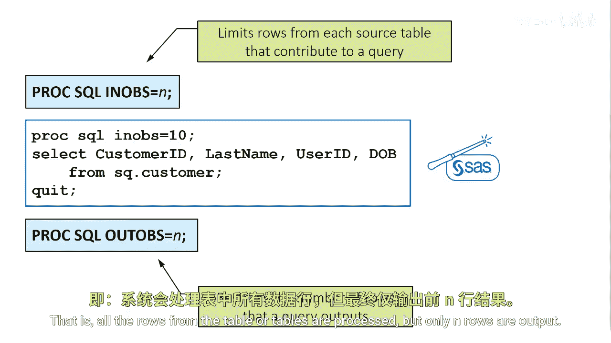

# 008：SQL选项控制

在本节课中，我们将学习如何在PROC SQL过程中使用选项来控制数据处理和结果输出的方式。掌握这些选项能帮助你更精确地管理查询过程，优化性能，并定制输出结果的外观。

## 使用INOBS和OUTOBS选项限制处理行数

上一节我们介绍了PROC SQL的基本查询，本节中我们来看看如何控制查询处理的行数。你可以使用`INOBS`和`OUTOBS`选项来限制参与处理或最终输出的数据行。

*   **INOBS选项**：此选项用于限制从每个源表中读取并参与查询处理的行数。其作用类似于DATA步中的`OBS=`数据集选项。
    *   **代码示例**：`PROC SQL INOBS=50;` 此语句将限制查询只读取每个输入表的前50行进行处理。

*   **OUTOBS选项**：此选项用于限制查询最终输出的行数。所有数据行都会被处理（除非同时使用了INOBS），但只有指定数量的结果行会被输出。
    *   **代码示例**：`PROC SQL OUTOBS=100;` 此语句将确保查询结果只输出前100行。

## 使用NUMBER选项控制输出显示

除了控制数据量，我们还可以控制输出结果的显示格式。`NUMBER`选项用于在查询结果中显示行号。

*   **NUMBER选项**：在PROC SQL语句中使用`NUMBER`选项，可以控制是否将行号作为第一列显示在查询结果中。
    *   **代码示例**：`PROC SQL NUMBER;` 执行此语句后，输出的结果表格最左侧将增加一列显示行号。

本节课中我们一起学习了PROC SQL中几个实用的选项：通过`INOBS`和`OUTOBS`选项，我们可以分别限制查询处理的行数和最终输出的行数，这在处理大数据集或进行初步测试时非常有用；通过`NUMBER`选项，我们可以为输出结果添加行号列，使结果更易于阅读和核对。合理运用这些选项，能够提升你编写SAS SQL程序的效率和灵活性。