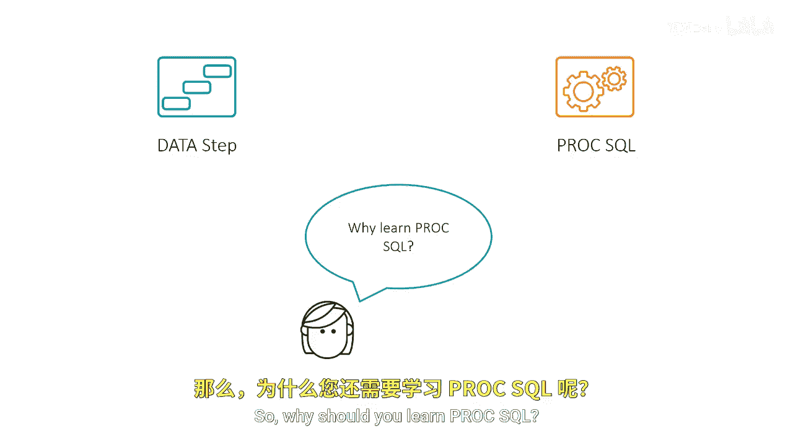
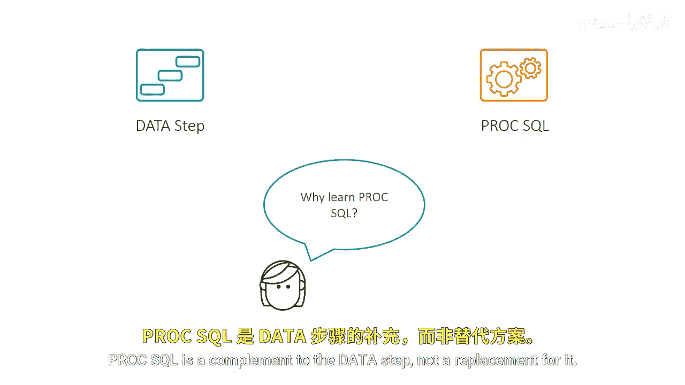
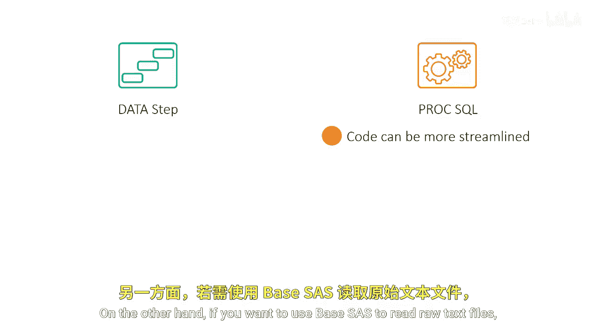
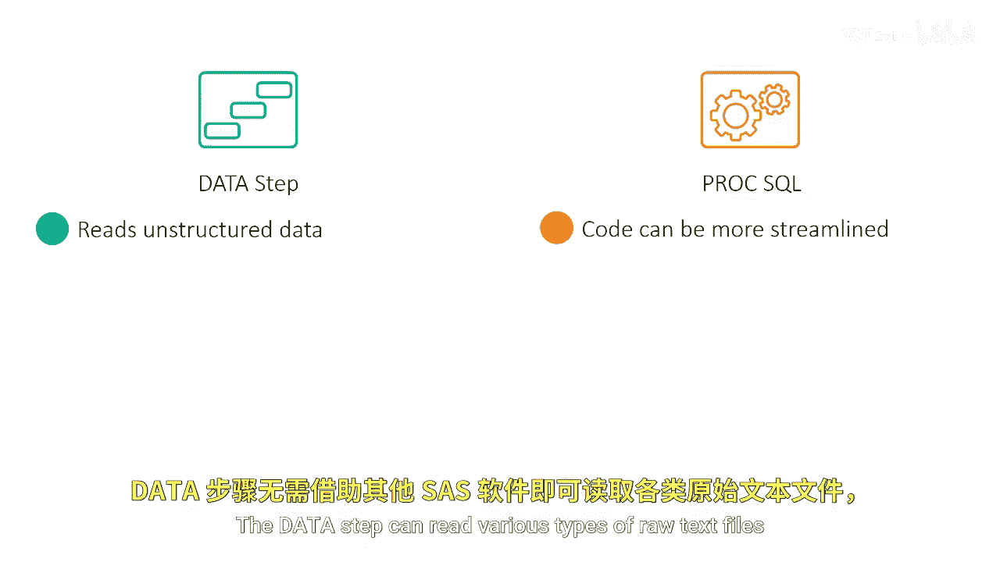
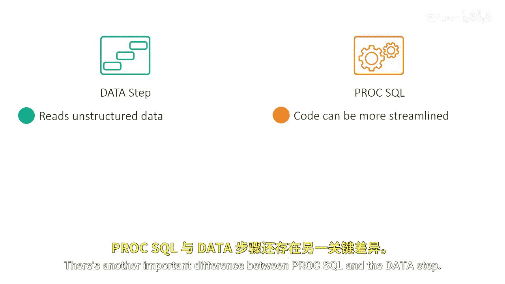
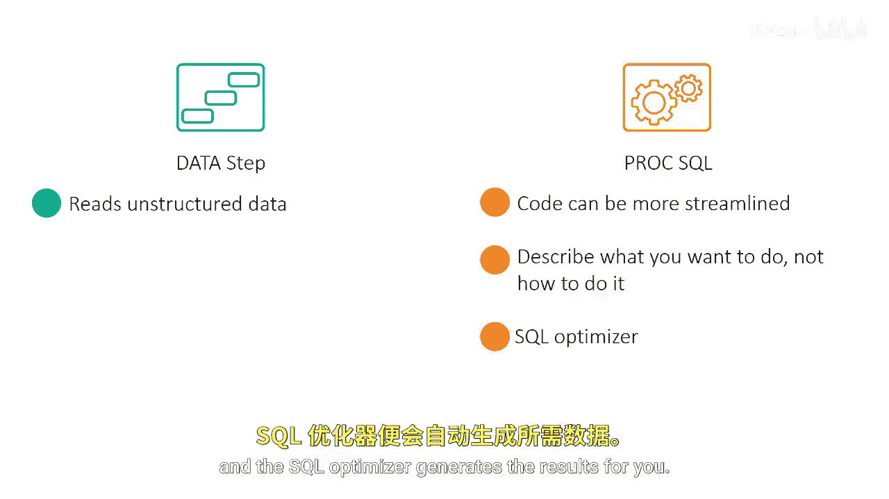
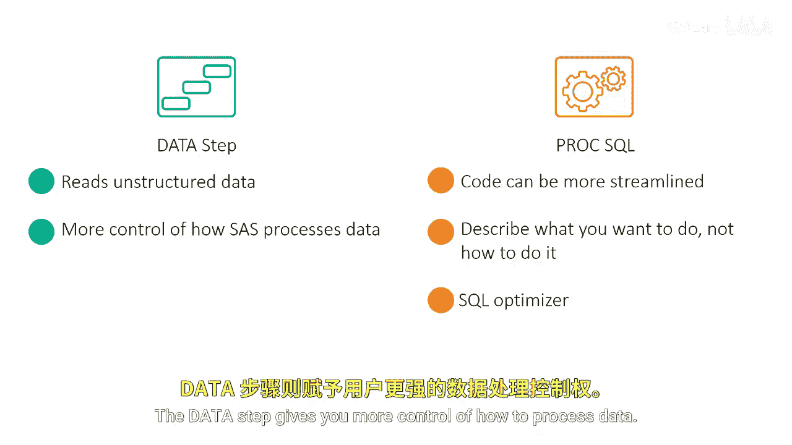
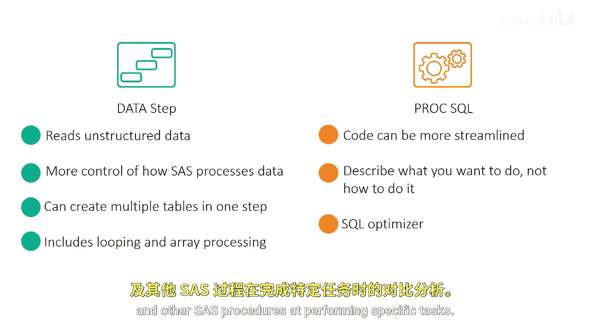

SAS高级程序员专项课程：P9：比较SQL与DATA步 🔄

在本节课中，我们将要学习PROC SQL与DATA步之间的核心区别与联系。理解它们各自的优势和适用场景，有助于我们在实际工作中选择最合适的工具来处理数据。

---

DATA步能够执行许多与PROC SQL相同的任务。

那么，为什么还需要学习PROC SQL呢？

PROC SQL是DATA步的补充，而非替代品。

有时PROC SQL是最佳工具，但在其他情况下，使用DATA步可能更合适。

PROC SQL的一个优势在于它可以减少所需的编码量。

一个单独的PROC SQL查询通常可以产生与多个DATA步及其他PROC步骤相同的结果。

另一方面，如果你想使用SAS读取原始文本文件，则必须使用DATA步。

DATA步可以在不使用其他SAS软件的情况下读取各种类型的原始文本文件，而PROC SQL则不能。

PROC SQL与DATA步之间还存在另一个重要区别。在使用SQL时，你只需描述期望的结果，SQL优化器会为你生成结果。

DATA步则让你对数据处理方式有更多控制权。它允许你在一个步骤中创建多个表格，并包含循环和数组处理功能。

在本课程中，你将不时看到PROC SQL与DATA步以及其他SAS过程在执行特定任务时的比较。

---

本节课中，我们一起学习了PROC SQL与DATA步的核心差异。PROC SQL擅长通过声明式查询高效地汇总和合并数据，而DATA步则在读取原始数据、精细控制处理流程以及执行复杂迭代操作方面更具优势。理解它们是互补工具，将帮助你在SAS编程中做出更明智的选择。