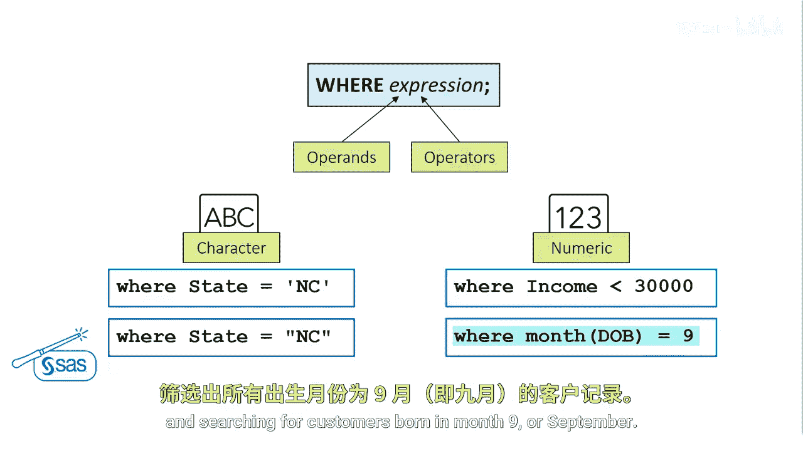
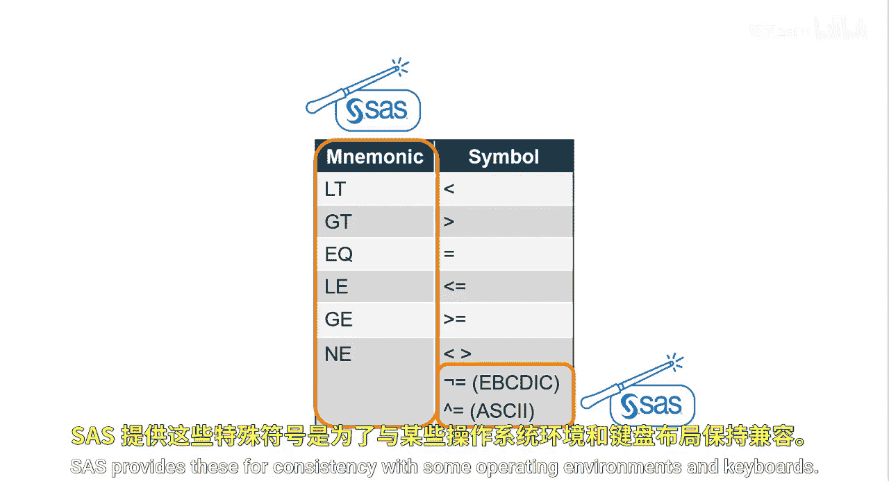
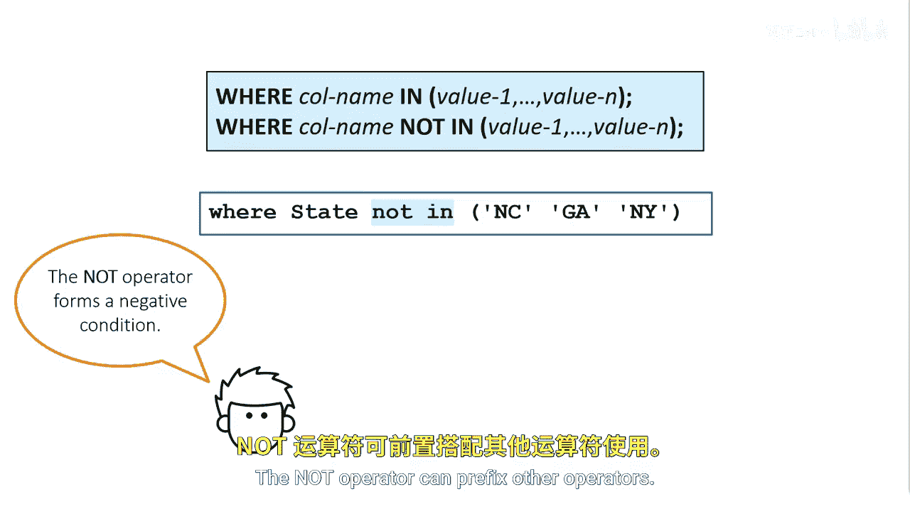

# 011：使用WHERE子句筛选行 🎯

在本节课中，我们将要学习如何在SAS的PROC SQL过程中使用`WHERE`子句来筛选数据行。`WHERE`子句是数据查询的核心工具之一，它允许你根据指定的条件，从数据集中精确地提取出你需要的行，而不是处理整个数据集。

## 概述：什么是WHERE子句？


假设你需要从客户表中生成一些简单的报告，但你并不希望看到表中的所有行。例如，在第一个报告中，你只想查看信用评分大于700、没有银行ID且收入排名前10的客户。或者，你可能想要一份出生于1940年12月31日之前且目前在职的客户报告。

这时，你就可以使用`WHERE`子句来过滤你的数据。`WHERE`子句必须位于`SELECT`和`FROM`子句之后，其结构由关键字`WHERE`后跟一个或多个表达式组成。

## WHERE子句的基本结构


一个表达式会测试一个或多个列的值，以判断其是否符合你指定的条件。例如，在表达式 `WHERE state = ‘NC’` 中，我们选择所有居住在NC州（北卡罗来纳州）的客户。如果表达式为真，则该行将被包含在结果集中。

### 表达式的构成
一个表达式由**操作数**和**运算符**组成。
*   **操作数**可以是列名、常量或SAS函数。
*   `WHERE`子句可以包含表中的任何列，即使这些列并未在`SELECT`子句中被选中。
*   **运算符**是用于指定比较、算术计算或逻辑操作的符号或助记符。

以下是使用`WHERE`子句的基本代码结构：
```sql
PROC SQL;
    SELECT column1, column2
    FROM table_name
    WHERE condition;
QUIT;
```

## 处理不同类型的数据

在使用`WHERE`子句时，需要注意不同类型数据的处理方式。

### 字符型数据
字符值区分大小写，并且必须用双引号或单引号括起来。双引号是SAS的增强功能，许多数据库系统只使用单引号来括住字符串字面量。
在子句 `WHERE state = ‘NC’` 中，我们使用等号比较运算符来选择所有`state`等于‘NC’的行。字符比较区分大小写，因此你必须使用与存储值相同的大小写来指定字符常量。

### 数值型数据
数值不需要用引号括起来，并且必须是标准数值。不能在数值中包含逗号或美元符号等特殊符号。
在子句 `WHERE income < 30000` 中，我们保留所有`income`小于常量30000的行。

### 使用SAS函数
你还可以在`WHERE`子句中使用SAS函数。
在子句 `WHERE MONTH(DOB) = 9` 中，我们使用`MONTH`函数提取`DOB`列的数值月份值，并查找在9月（即九月）出生的客户。



## 比较运算符详解

比较运算符可以出现在任何有效的SAS表达式中以及SAS代码的任何位置，而不仅仅是在`WHERE`子句和PROC SQL中。所有这些比较运算符都可以使用助记符或符号。

| 含义 | 助记符 | 符号 |
| :--- | :--- | :--- |
| 等于 | `EQ` | `=` |
| 不等于 | `NE` | `^=` 或 `~=` 或 `¬=` |
| 小于 | `LT` | `<` |
| 小于等于 | `LE` | `<=` |
| 大于 | `GT` | `>` |
| 大于等于 | `GE` | `>=` |

助记符是SAS的增强功能，它们不符合ANSI SQL标准。而大多数比较运算符符号都符合ANSI标准。最后两个“不等于”运算符的符号（`~=` 和 `¬=`）是SAS的增强功能，SAS提供这些是为了与某些操作系统环境和键盘保持一致。



## 组合多个条件：逻辑运算符

上一节我们介绍了单一条件的筛选，本节中我们来看看如何组合多个表达式。你可以使用逻辑运算符`OR`和`AND`来组合多个表达式，以检索满足多个条件或表达式的行。
*   `OR`运算符指定**任一**条件为真即可。
*   `AND`运算符指定**所有**条件都必须为真。


以下是使用逻辑运算符的示例：
```sql
/* 使用OR：选择来自NY、NC或CA的客户 */
WHERE state = ‘NY’ OR state = ‘NC’ OR state = ‘CA’;

/* 使用AND：选择收入大于30000且来自NC州的客户 */
WHERE income > 30000 AND state = ‘NC’;
```
在第一个例子中，我们使用三个表达式和`OR`运算符来选择所有来自NY、NC或CA的客户。只要其中任何一个条件为真，我们就选择该行。在第二个例子中，我们使用两个表达式和`AND`运算符，只选择收入值大于30,000**并且**`state`等于‘NC’的客户。在这种情况下，两个条件都必须为真，该行才会被选中。

**重要提示**：如果你同时使用`OR`和`AND`，请务必用括号将表达式分组，以明确运算的优先级。

## 使用IN和NOT运算符简化条件


除了`OR`和`AND`，还有两个非常实用的运算符可以简化条件编写。

### IN运算符
`IN`运算符用于测试值是否与列表中的某一个值匹配，其效果类似于使用多个`OR`表达式。`IN`运算符中的值列表必须用括号括起来，并用逗号或空格分隔。字符值必须用引号（单引号或双引号）括起来。

假设你想搜索客户位于NC、GA或NY的所有行。
*   **一种方法**是使用`OR`运算符和三个表达式：`state = ‘NC’ OR state = ‘GA’ OR state = ‘NY’`。
*   **更简洁的方法**是使用`IN`运算符：`WHERE state IN (‘NC’, ‘GA’, ‘NY’)`。

### NOT运算符
你也可以使用`NOT`运算符来构成否定条件。在`WHERE`子句 `WHERE state NOT IN (‘NC’, ‘GA’, ‘NY’)` 中，`NOT`运算符会搜索所有不在NC、GA和NY州的客户。`NOT`运算符可以前缀于其他运算符之前，例如 `WHERE income NOT > 30000`。

## 总结



本节课中我们一起学习了`WHERE`子句的强大功能。我们了解了其基本语法，学习了如何处理字符型和数值型数据，并掌握了各种比较运算符（如`=`、`<`、`>`）和逻辑运算符（`AND`、`OR`）的用法。最后，我们还探讨了如何使用`IN`和`NOT`运算符来更简洁、高效地编写筛选条件。通过灵活运用`WHERE`子句，你可以从庞大的数据集中精准地提取出所需的信息，这是进行有效数据分析的关键一步。