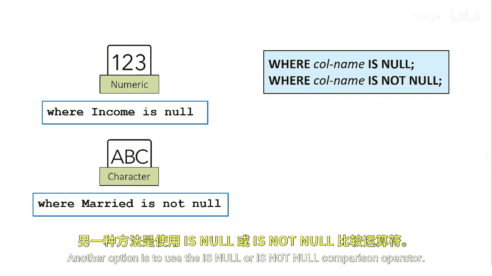
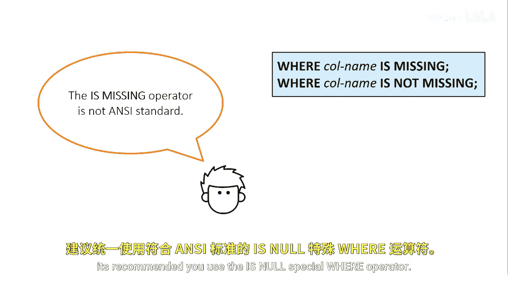

# 012：特殊WHERE运算符之缺失值处理 🔍

在本节课中，我们将学习如何在SAS中使用WHERE语句来筛选数据中的缺失值。我们将介绍几种不同的方法，包括直接比较和使用特殊的运算符。

假设您需要在SAS中根据缺失值来筛选数据。

一种方法是编写一个表达式，让数值型缺失值等于一个句点（`.`），或者让字符型缺失值等于一个引号包围的空格（`‘ ’`）。

另一种选择是使用 **`IS NULL`** 或 **`IS NOT NULL`** 比较运算符。

这些比较运算符可以同时用于数值型或字符型的缺失值。

如果您的数据来自一个能区分“缺失值”和“空值”的数据库管理系统环境，那么 **`IS NULL`** 运算符是ANSI标准。

您可能还会遇到 **`IS MISSING`** 运算符。在SAS中，**`IS MISSING`** 这个特殊的WHERE运算符与 **`IS NULL`** 运算符是相同且可以互换的，但 **`IS MISSING`** 运算符不是ANSI标准。

为了在SAS和数据库环境中保持一致性，建议使用 **`IS NULL`** 这个特殊的WHERE运算符。

本节课中，我们一起学习了在SAS中筛选缺失值的几种方法。我们了解到可以直接与句点或空字符串比较，也可以使用 **`IS NULL`** 或 **`IS MISSING`** 运算符。其中，**`IS NULL`** 是ANSI标准，在与数据库交互时更具通用性，因此是推荐的做法。