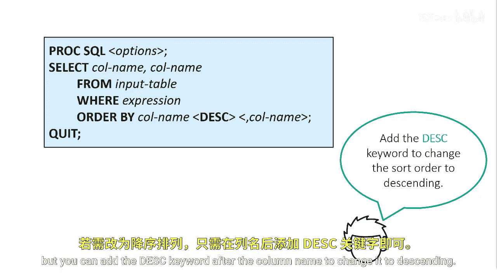
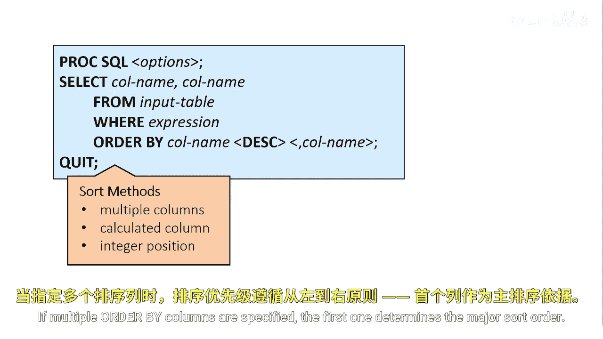

# 014：使用ORDER BY子句排序输出 📊

在本节课中，我们将要学习如何使用`ORDER BY`子句来控制查询结果的排序方式。掌握排序是数据呈现和分析的基础，能让你的报表更加清晰、有序。

## 控制输出顺序

上一节我们介绍了如何筛选和计算数据，本节中我们来看看如何对查询结果进行排序。你可以通过添加`ORDER BY`子句来指定结果集中行的排列顺序。


```sql
SELECT column1, column2
FROM table_name
ORDER BY column1;
```

默认情况下，`ORDER BY`子句会按照指定列的升序进行排序。

## 指定排序方向

默认的排序顺序是升序，但你可以在列名后添加`DESC`关键字，将其更改为降序排列。



```sql
SELECT column1, column2
FROM table_name
ORDER BY column1 DESC;
```

## 多列排序与列的选择

你可以根据多个列进行排序，并且可以使用表中的任何列，包括未被选择的列或计算得出的列。

以下是多列排序的要点：
*   如果指定了多个排序列，**第一个列**决定了主要的排序顺序。
*   当主要排序列的值相同时，系统会按照后续指定的列进行次级排序。

---



本节课中我们一起学习了`ORDER BY`子句的使用。我们了解到，它可以指定结果的排序顺序，默认是升序，使用`DESC`可改为降序。同时，排序可以基于多列，并且不限于选择列表中的列。合理使用排序功能，能让你的数据输出更具可读性和分析价值。