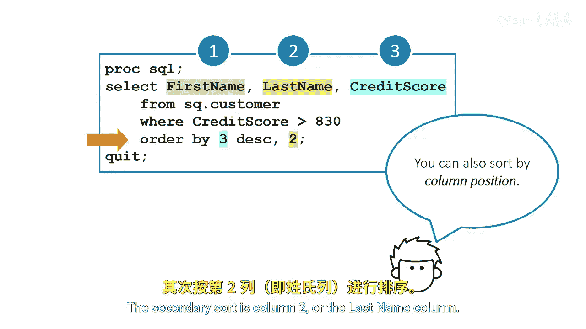
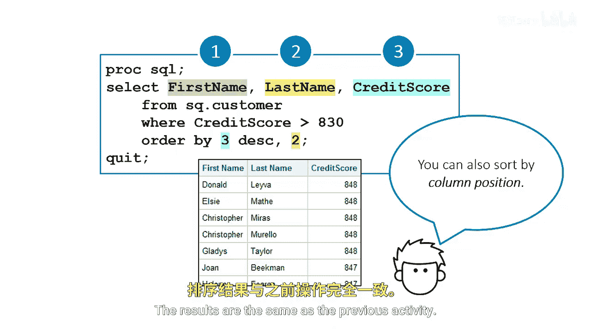

# 015：按列位置排序 📊

在本节课中，我们将学习在SAS中使用**列位置编号**进行数据排序的方法。这是一种替代使用变量名的排序方式，在某些情况下更为便捷。

上一节我们介绍了使用变量名进行排序，本节中我们来看看如何使用列的位置编号来实现相同的排序效果。


## 按列位置排序

您可以使用列的位置编号进行排序。

以下示例首先按第3列降序排序，该列是信用评分列。

```sas
proc sort data=cert.creditscores;
    by descending col3;
run;
```


## 多级排序


其次，按第2列（即姓氏列）进行次级排序。



以下是实现代码：

```sas
proc sort data=cert.creditscores;
    by descending col3 col2;
run;
```


## 结果对比

排序结果与之前使用变量名进行排序的活动结果完全相同。




本节课中我们一起学习了如何使用**列位置编号**在SAS的`PROC SORT`过程中对数据进行排序。您掌握了通过`descending colX`的语法格式进行单列或多列排序，并了解到这种方法与使用变量名排序能得到一致的结果。