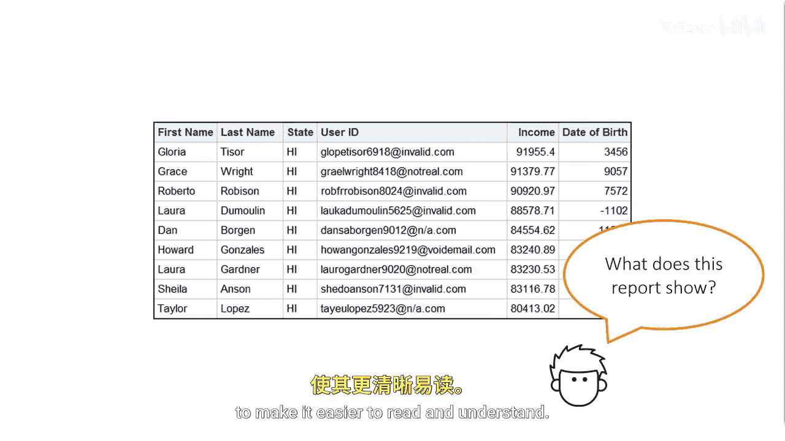
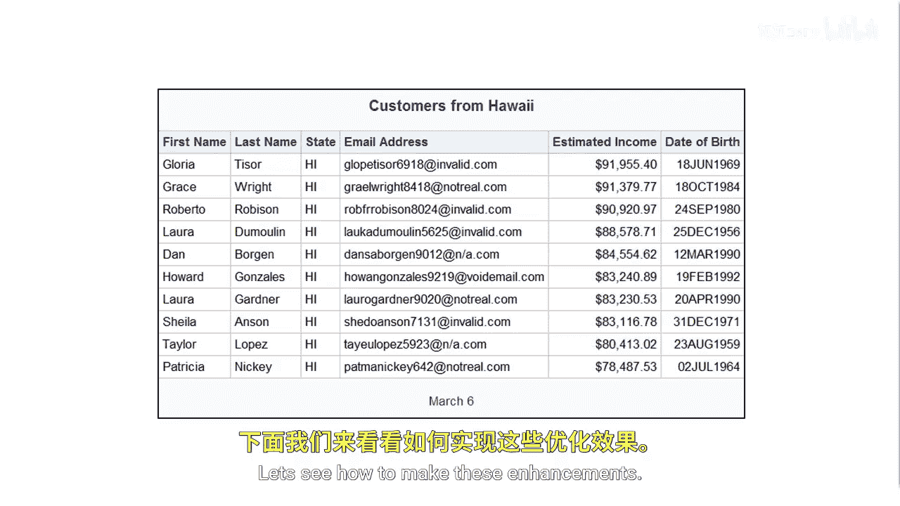
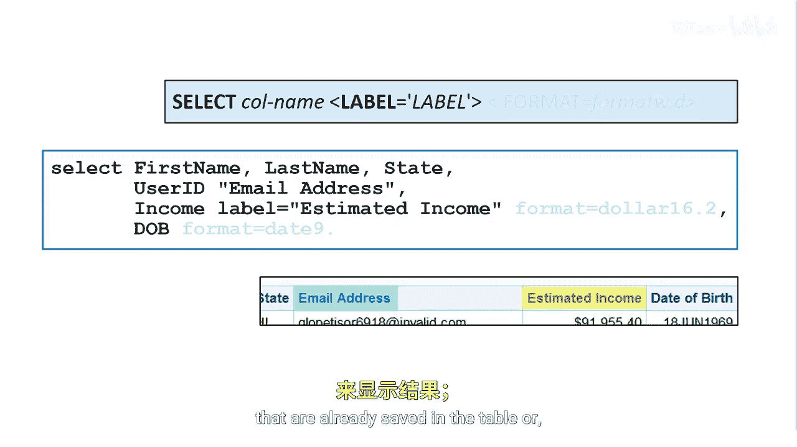
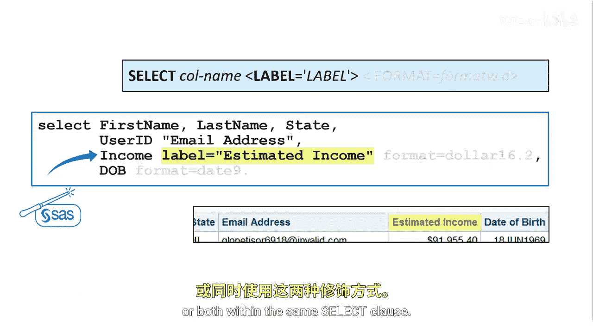
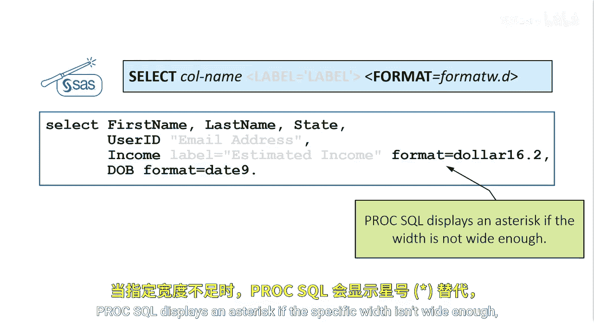

# 016：增强报告 📊

在本节课中，我们将要学习如何通过添加标题、脚注、列标签以及应用格式来增强SAS报告的可读性和专业性。这些技巧能让你的报告更清晰、更易于理解。



---

## 聚焦报告

让我们将焦点转移到报告上。这份报告中的数据行代表的是客户还是员工？是全部数据行还是一个子集？收入单位是美元吗？报告是何时运行的？如何让生日日期变得可读？你可以做很多事情来增强报告的外观，使其更易于阅读和理解。




---

## 添加标题与脚注

你可以添加标题和脚注来说明报告内容及其创建时间。

标题是一个全局语句，用于为SAS会话中创建的所有报告建立一个永久性标题。其语法是关键字 `title` 后跟标题文本和闭合引号。

以下是关于标题和脚注的关键点：
*   你最多可以设置10个标题。在关键字 `title` 后指定数字1到10来表示行号，`title` 和 `title1` 是等效的。
*   你也可以使用 `footnote` 语句为任何报告添加脚注。适用于标题的规则同样适用于脚注。
*   请记住，标题和脚注是全局语句，只要你的SAS会话处于活动状态，它们就保持有效。
*   如果你想清除标题和脚注，可以提交没有文本的相应 `title` 和 `footnote` 语句，这些称为空语句，它们会清除所有标题和脚注。在程序末尾这样做是一个好习惯。
*   像SAS Studio这样的客户端应用程序会在你的代码末尾为你提交一个空的 `title` 语句，但养成自己提交该语句的习惯是很好的。


---


## 使用列标签

上一节我们介绍了如何添加全局的标题和脚注，本节中我们来看看如何为数据列提供更清晰的描述。


列名必须遵守特定的命名约定，但这有时意味着名称可能有点难以理解，尤其对于不熟悉数据的人来说。


标签是一种为报告添加更具描述性列标题的简单方法。标签可以是任何最多256个字符的文本字符串，包括空格和特殊字符。

默认情况下，Proc SQL使用表中已保存的永久列属性来显示结果；如果没有，则使用列名。以下是两种指定列标签的方法：



1.  **ANSI标准列修饰符**：你可以在 `SELECT` 子句中的任何列名或表达式后，使用 `AS` 关键字指定引号内的文本作为列标签。
    ```sql
    SELECT userid AS “Email Address”， income AS “Estimated Income”
    ```


2.  **SAS增强的列修饰符**：你可以利用SAS增强功能，如 `LABEL=` 列修饰符。在 `SELECT` 子句中指定的任何列名或表达式后，指定 `LABEL=`，然后在引号内输入你想要在结果中显示的文本。
    ```sql
    SELECT userid LABEL=“Email Address”， income LABEL=“Estimated Income”
    ```

通常，使用SAS方法使你的代码更易于阅读和遵循；但是，你可以在同一个 `SELECT` 子句中同时使用 `LABEL=` 列修饰符或 `AS` 列修饰符，或两者都用。


---



## 应用格式以美化数据

为了控制数值在报告中的显示方式，你可以应用SAS格式。`FORMAT=` 列修饰符是一个SAS增强功能，可以更轻松地创建更有用、更专业的报告。

你可以在 `SELECT` 子句中指定的任何列名或表达式后指定 `FORMAT=`，后跟格式名称。然后指定总格式宽度，包括小数位和特殊字符。句点是必需的分隔符，对于数字格式，句点后可以跟小数位数。

以下是应用格式的要点：
*   你可以指定任何SAS或用户定义的格式。
*   如果你指定的格式宽度不足以容纳一个值，SAS会自动调整以尽可能多地显示存储的值。
*   在下面的例子中，我们将宽度为16、带两位小数的美元格式应用到 `income` 列。对于 `DOB` 列，我们应用 `date9.` 格式，它指定了两位数的日、三个字符的月份和四位数的年。
*   Proc SQL 在指定宽度不够时会显示星号，但不会在日志中发出警告。

```sql
SELECT income FORMAT=dollar16.2， DOB FORMAT=date9.
```


需要记住的是，在 `SELECT` 子句中指定的格式仅影响数据值在结果中的显示方式，而不影响表中存储的实际数据值。




---


## 总结


本节课中我们一起学习了如何增强SAS报告。我们介绍了如何通过 `TITLE` 和 `FOOTNOTE` 语句添加标题和脚注来说明报告信息；如何使用 `LABEL=` 或 `AS` 为列提供更具描述性的标题；以及如何应用 `FORMAT=` 来美化数值（如货币和日期）的显示，使报告更专业、更易于理解。记住在程序结束时使用空语句清除全局的标题和脚注是一个好习惯。