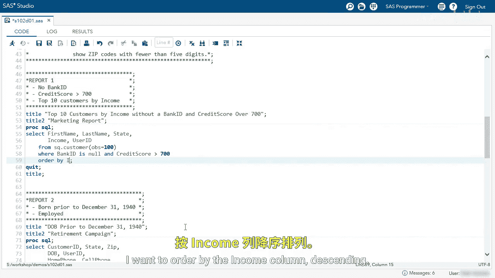
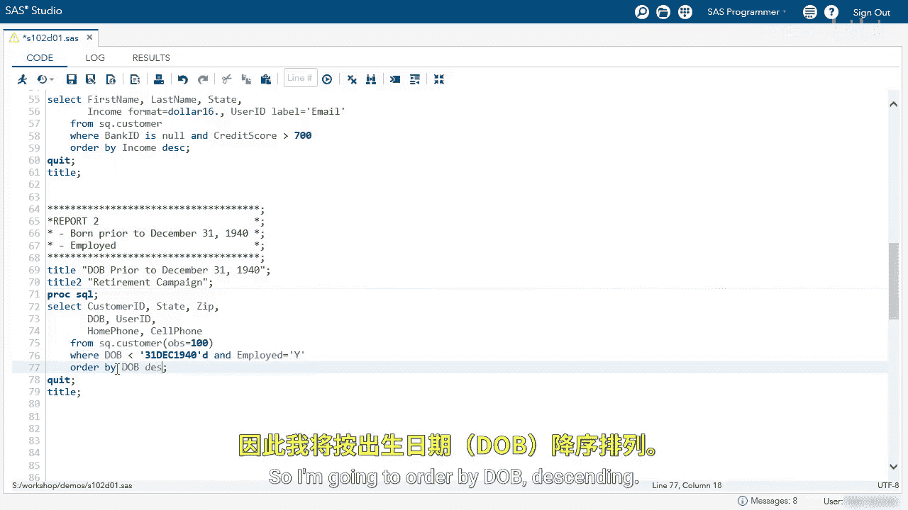
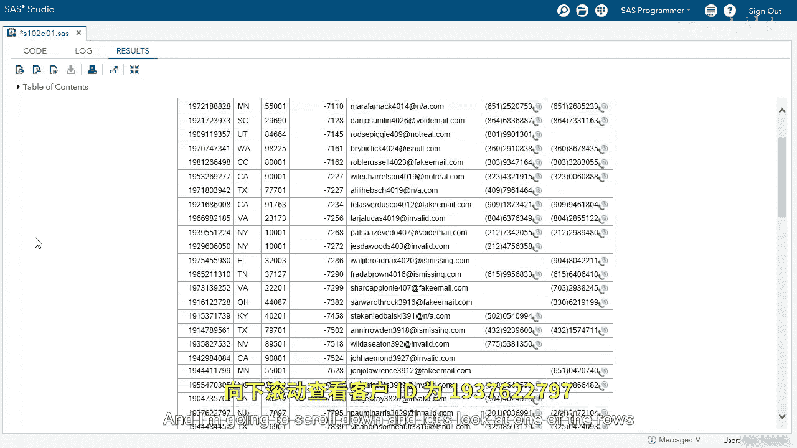
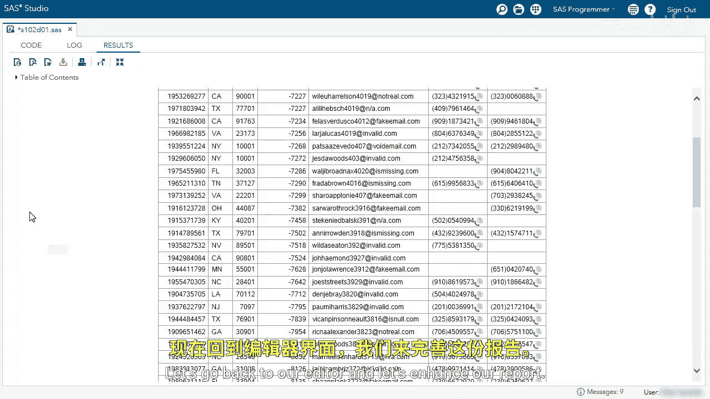
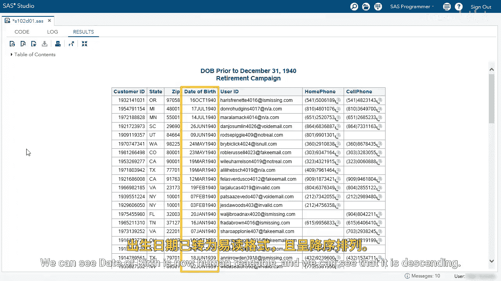
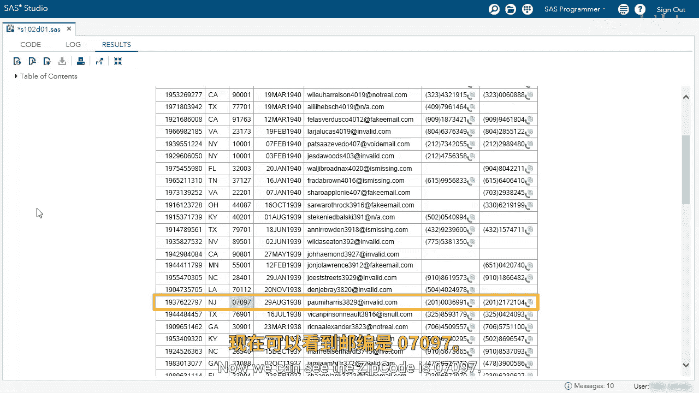

# 017：使用PROC SQL创建简单报告 📊

在本节课中，我们将学习如何使用PROC SQL过程步来创建简单的数据报告。我们将通过两个具体的例子，演示如何筛选数据、排序结果、格式化输出以及修改列标题，从而生成清晰、易读的报告。

## 概述：创建第一个报告

首先，我们将创建一个报告，目标是找出所有没有银行ID、信用评分大于700，并且按收入排名的前10位客户。



上一节我们介绍了报告的目标，本节中我们来看看具体的实现步骤。


以下是创建第一个报告的SQL代码核心部分：

```sas
PROC SQL;
    TITLE '高收入客户报告';
    TITLE2 '条件：无银行ID，信用评分>700';
    SELECT FirstName, LastName, State, Income, UserID
    FROM CUSTOMER_TABLE
    WHERE BankID IS NULL AND CreditScore > 700
    ORDER BY Income DESC;
QUIT;
```

我们首先使用`WHERE`子句来筛选数据，条件是`BankID`为空且`CreditScore`大于700。然后使用`ORDER BY`子句按`Income`列降序排列结果。

运行初始代码后，结果符合预期。接下来，我们需要完善报告，使其只显示前10名客户，并对收入和列名进行格式化。

以下是完善报告的具体修改步骤：
1.  添加`OUTOBS=10`选项，将输出限制为10行。
2.  使用`FORMAT=`列修饰符为`Income`列应用美元格式`DOLLAR11.0`，使其显示为货币且不带小数。
3.  使用`LABEL=`列修饰符将`UserID`列的标签改为“Email”。
4.  移除开发时使用的`OBS=100`选项，让查询处理全部数据。

修改后的完整代码如下：

```sas
PROC SQL OUTOBS=10;
    TITLE '高收入客户报告';
    TITLE2 '条件：无银行ID，信用评分>700';
    SELECT FirstName,
           LastName,
           State,
           Income FORMAT=DOLLAR11.0,
           UserID LABEL='Email'
    FROM CUSTOMER_TABLE
    WHERE BankID IS NULL AND CreditScore > 700
    ORDER BY Income DESC;
QUIT;
```

运行最终代码后，报告成功显示了前10名客户，收入列已格式化为美元，并且`UserID`列标题已更改为“Email”。

## 过渡：创建第二个报告

在成功创建了第一个客户报告后，接下来我们处理第二个需求：找出所有在1940年12月31日之前出生且目前在职的客户。

以下是第二个报告的初始SQL代码框架：



```sas
PROC SQL;
    TITLE '1940年前出生且在职业客户报告';
    SELECT CustomerID, State, Zip, DOB, UserID, HomePhone, CellPhone
    FROM CUSTOMER_TABLE
    WHERE DOB < '31DEC1940'D AND Employed IN ('Yes', 'Y')
    ORDER BY DOB DESC;
QUIT;
```


我们使用`WHERE`子句设置两个条件：出生日期早于`‘31DEC1940’D`，并且就业状态为“Yes”或“Y”。`ORDER BY`子句确保结果按出生日期降序排列。




运行代码后，数据筛选和排序逻辑正确，但`DOB`和`Zip`列的显示格式需要优化，以便于阅读。

以下是优化报告显示格式的步骤：
1.  为`DOB`列应用`DATE9.`格式，使日期以“DDMMMYYYY”的形式清晰显示。
2.  为`Zip`列应用`Z5.`格式，为不足5位的邮政编码自动添加前导零。



应用格式后的完整代码如下：

```sas
PROC SQL;
    TITLE '1940年前出生且在职业客户报告';
    SELECT CustomerID,
           State,
           Zip FORMAT=Z5.,
           DOB FORMAT=DATE9.,
           UserID,
           HomePhone,
           CellPhone
    FROM CUSTOMER_TABLE
    WHERE DOB < '31DEC1940'D AND Employed IN ('Yes', 'Y')
    ORDER BY DOB DESC;
QUIT;
```

运行最终代码，报告中的出生日期已变得易读，并且所有邮政编码都正确显示为5位数字。



## 总结 🎯



本节课中我们一起学习了使用PROC SQL创建简单报告的核心技巧。
我们通过两个实例，实践了如何使用`WHERE`子句筛选数据、使用`ORDER BY`子句排序结果。
更重要的是，我们掌握了如何使用`FORMAT=`选项格式化数值（如货币、日期、邮政编码），以及使用`LABEL=`选项修改列标题，从而生成专业、清晰的数据报告。