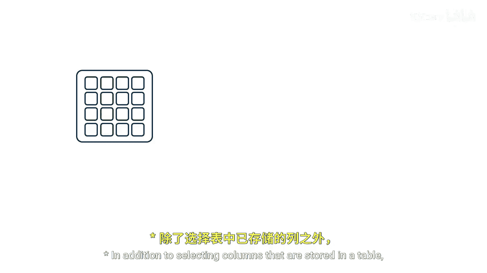
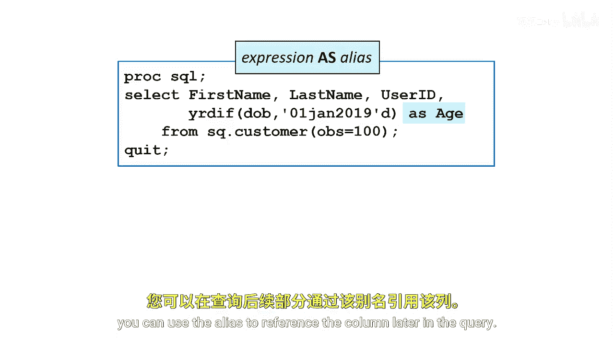

# 018：创建新列 📊



在本节课中，我们将学习如何在PROC SQL查询中创建新的计算列。除了选择表中已存在的列，你还可以在查询过程中动态生成包含文本或计算结果的列。这些新列在查询期间有效，并且PROC SQL会像处理原始表中的列一样处理它们。

## 创建新列的基本语法

上一节我们介绍了选择列的基础知识，本节中我们来看看如何通过计算来创建新列。

在`SELECT`语句中，你可以通过一个表达式（文本或计算字符串）来定义一个新列，并使用关键字`AS`为其指定一个列名。


其基本语法结构如下：
```sql
SELECT column_expression AS new_column_name
FROM table_name;
```

## 计算年龄的实例

以下是一个具体的应用实例。假设我们需要找出所有年龄在70岁及以上的客户。

为了实现这个目标，我们首先需要创建一个名为`Age`的新列。这里使用了一个SAS函数`YRDIF`来计算年龄。

`YRDIF`函数用于计算两个日期之间的年份差。在本例中，它计算的是每个人的出生日期与一个固定日期（2019年1月1日）之间的年份差，从而得到该人员在2019年1月1日的年龄。

如果你想使报告更具动态性，可以使用`TODAY()`函数来获取当前日期进行计算。为了保持示例的一致性，我们这里使用了一个日期常量。

在函数之后，我们使用`AS`关键字为这个计算结果指定了列别名`Age`。

以下是实现此功能的代码示例：
```sql
PROC SQL;
    SELECT Name,
           YRDIF(BirthDate, '01JAN2019'd) AS Age
    FROM Customers
    WHERE calculated Age >= 70;
QUIT;
```

## 关于列别名的要点

在PROC SQL查询中，你可以为任何列（无论是原有的还是新创建的）分配一个新的名称，即别名。

以下是关于使用别名的一些重要规则和说明：
*   新的列名必须遵循SAS的命名规则。
*   该别名仅在该次查询中有效。
*   当你使用别名命名一个列后，你可以在查询的后续部分（例如`WHERE`子句或`ORDER BY`子句中）使用这个别名来引用该列。注意，在`WHERE`子句中引用计算列时，通常需要加上`CALCULATED`关键字，如上面的示例所示。

## 输出结果



PROC SQL会将你定义的别名作为输出报表中的列标题。


本节课中我们一起学习了如何在PROC SQL中创建计算列。关键点包括：使用`SELECT`语句中的表达式和`AS`关键字来定义新列，利用SAS函数（如`YRDIF`）进行计算，以及为列设置别名以便于引用和输出。掌握创建新列的方法能极大地增强你从数据中提取和呈现信息的能力。