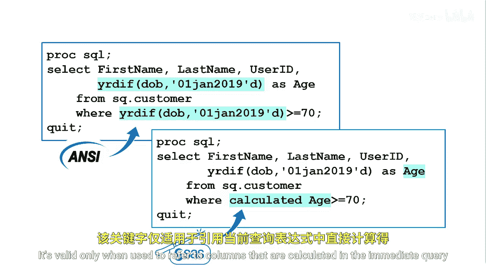

# 019：筛选计算值

在本节课中，我们将学习如何在SAS的SQL过程中，对查询结果中的计算列进行筛选。核心挑战在于，`WHERE`子句无法直接引用`SELECT`子句中定义的计算列别名。我们将探讨两种解决此问题的方法。

## 标准方法：重复计算表达式


上一节我们提到了`WHERE`子句的限制。为了确保筛选条件有效，最直接的方法是**在`WHERE`子句中重复一遍`SELECT`子句中的计算表达式**。

这种方法符合ANSI SQL标准，适用于所有遵循该标准的数据库系统。

**示例：**
```sql
proc sql;
    select Name,
           Salary,
           Salary * 0.1 as Bonus
    from sashelp.class
    where Salary * 0.1 > 1000; /* 此处重复了Bonus的计算逻辑 */
quit;
```

以下是使用此方法时需要注意的几点：
*   它确保了`WHERE`子句中引用的列确实存在于`FROM`子句指定的表中（尽管是动态计算的）。
*   当计算表达式简单时，这种方法清晰易懂。
*   当表达式复杂冗长，或需要基于多个计算值进行筛选时，重复书写会显得繁琐且容易出错。

## 便捷方法：使用`CALCULATED`关键字


为了解决重复计算的问题，SAS SQL提供了一个增强关键字：`CALCULATED`。它允许你在同一查询的`WHERE`子句或`SELECT`子句中，引用本层查询中已定义的计算列。

**语法：**
```sql
WHERE condition using CALCULATED column-alias
```

**示例：**
```sql
proc sql;
    select Name,
           Salary,
           Salary * 0.1 as Bonus
    from sashelp.class
    where calculated Bonus > 1000; /* 直接使用计算列的别名 */
quit;
```

以下是关于`CALCULATED`关键字的关键说明：
*   `CALCULATED`是SAS对SQL语言的扩展，并非所有数据库系统都支持。
*   它只能用于引用**同一层**`SELECT`子句中定义的计算列。
*   它不能用于引用来自子查询或表连接中的计算列。
*   使用它可以使代码更简洁，尤其是当计算逻辑复杂时。

## 方法对比与总结

本节课中我们一起学习了在SAS SQL中筛选计算列的两种方法。

*   **重复表达式法**：优点是符合ANSI标准，通用性强。缺点是代码可能冗余，维护不便。
*   **`CALCULATED`关键字法**：优点是代码简洁直观，避免了重复。缺点是它是SAS的扩展语法，可移植性相对较弱。



在实际编程中，你可以根据代码的复杂度和对可移植性的要求来选择合适的方法。对于简单的查询，两种方法皆可；对于涉及复杂表达式筛选的情况，使用`CALCULATED`关键字通常能显著提升代码的可读性和可维护性。