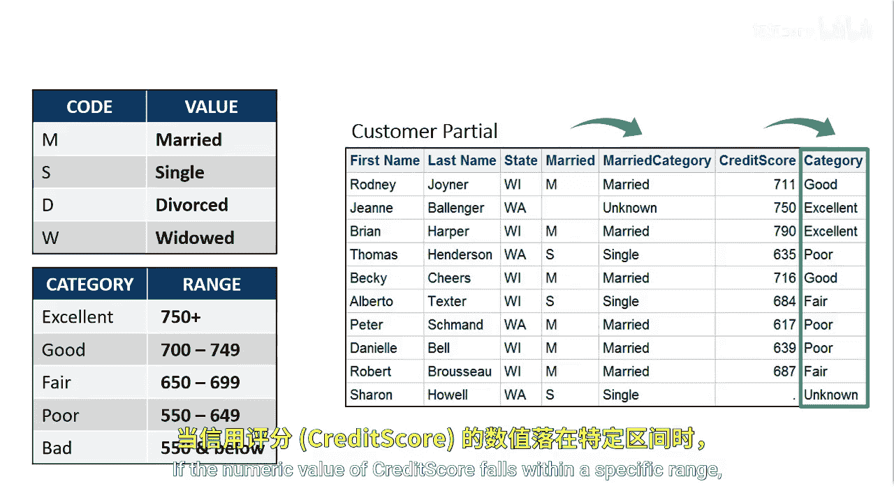
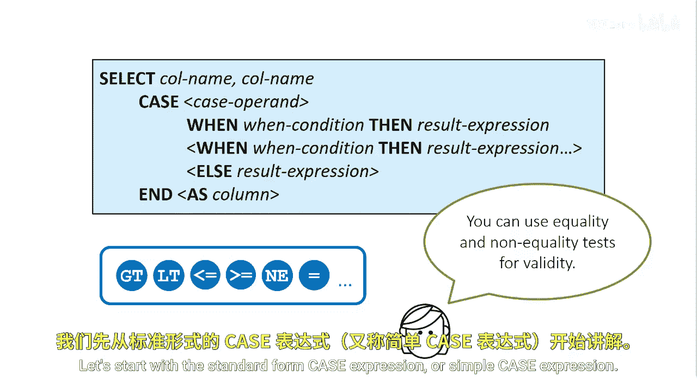
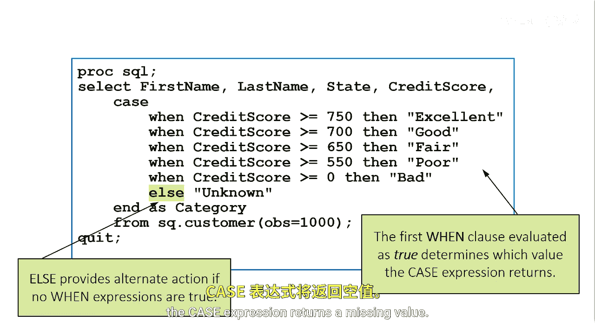
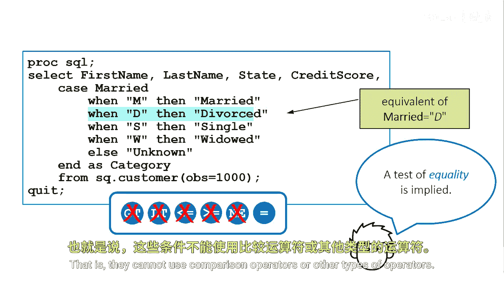

# 020：使用CASE表达式按条件赋值 🧮

在本节课中，我们将学习如何在SAS查询中使用CASE表达式，根据特定条件为数据创建新的列或对现有值进行重新分类。这是一种强大的条件逻辑工具。

假设我们想基于婚姻状态创建一个新的“婚姻类别”列。其中，`M`代表已婚，`S`代表单身，`D`代表离异，`W`代表丧偶，其他任何值则归类为未知。同时，我们还想基于信用评分值的范围创建另一个“信用类别”列。如果信用评分的数值落在特定区间内，新列将包含对应的类别值。



## 理解CASE表达式


你可以在查询中使用条件逻辑，方法是在SELECT子句中使用CASE表达式来有条件地赋值。基本上，你可以在任何可以使用列名的地方使用CASE表达式。



## 标准形式（简单CASE表达式）


上一节我们介绍了CASE表达式的基本概念，本节中我们来看看它的第一种形式：标准形式或简单CASE表达式。使用这种语法，你可以进行相等性测试。

以下是其基本语法结构：
```sql
CASE column_name
    WHEN value1 THEN result1
    WHEN value2 THEN result2
    ...
    ELSE default_result
END
```

在这个例子中，CASE表达式根据`customer`表中`credit_score`列的值，为每位客户确定信用类别。

```sql
SELECT customer_id,
       credit_score,
       CASE
           WHEN credit_score >= 750 THEN 'Excellent'
           WHEN credit_score >= 700 THEN 'Good'
           WHEN credit_score >= 650 THEN 'Fair'
           ELSE 'Poor'
       END AS category
FROM customer;
```

在第一个`WHEN...THEN`子句中，当信用评分大于或等于750时，类别值将为“Excellent”。关键字`END`用于结束CASE表达式，并可选择地为该列分配一个别名（如`category`）。第一个评估为真的`WHEN`子句将决定CASE表达式返回哪个值，后续的`WHEN`子句将不再被评估。可选的`ELSE`表达式提供了当所有`WHEN`条件都不为真时的备用操作。如果没有`ELSE`表达式，且每个`WHEN`条件都为假，则CASE表达式返回一个缺失值。



## 搜索形式（CASE操作数形式）

除了标准形式，你还可以使用搜索形式（或称CASE操作数形式）来构建CASE表达式。这种形式更为灵活。

以下是其语法结构：
```sql
CASE
    WHEN condition1 THEN result1
    WHEN condition2 THEN result2
    ...
    ELSE default_result
END
```

你可以在`CASE`关键字后直接指定一系列`WHEN...THEN`子句，每个子句包含一个完整的条件。这里我们选择`married`列，并根据其值将它们分配到指定的类别。

```sql
SELECT customer_id,
       married,
       CASE married
           WHEN 'M' THEN 'Married'
           WHEN 'S' THEN 'Single'
           WHEN 'D' THEN 'Divorced'
           WHEN 'W' THEN 'Widowed'
           ELSE 'Unknown'
       END AS married_category
FROM customer;
```


需要注意的是，当你使用CASE操作数形式（即`CASE column_name`）时，所有条件都必须是相等性测试，也就是说，它们不能使用比较运算符（如`>=`, `<`）或其他类型的运算符。而搜索形式（`CASE WHEN condition`）则允许使用任何返回布尔值的条件表达式。



## 应用场景与选择

以下是两种形式的主要区别和应用场景：

*   **简单CASE表达式**：适用于将一个列的值与一系列固定的常量进行精确匹配的场景。语法更简洁。
*   **搜索CASE表达式**：适用于条件更复杂的场景，例如基于数值范围（如信用评分）、组合条件（使用`AND`/`OR`）或涉及多个列的逻辑判断。功能更强大。

## 总结


本节课中我们一起学习了SAS中CASE表达式的两种主要形式。简单CASE表达式适用于基于单列值的直接匹配，而搜索CASE表达式则提供了处理复杂条件逻辑的灵活性。通过掌握这两种形式，你可以在数据查询中有效地实现条件赋值和数据分类，从而更深入地分析和呈现数据。