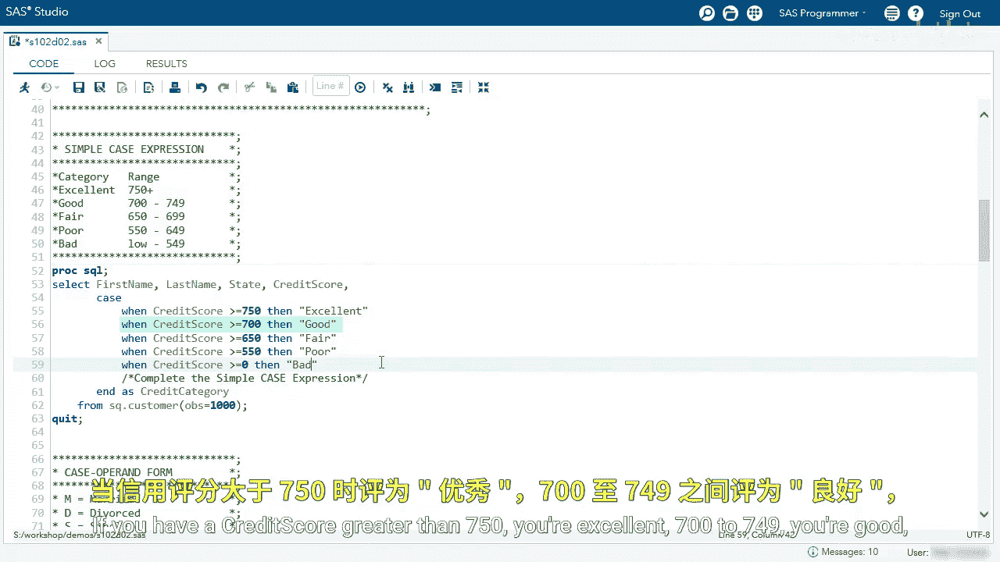
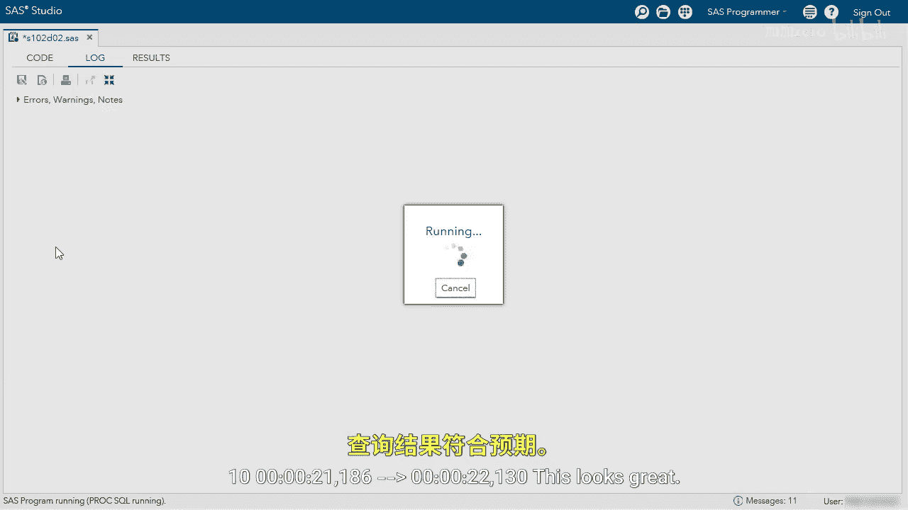
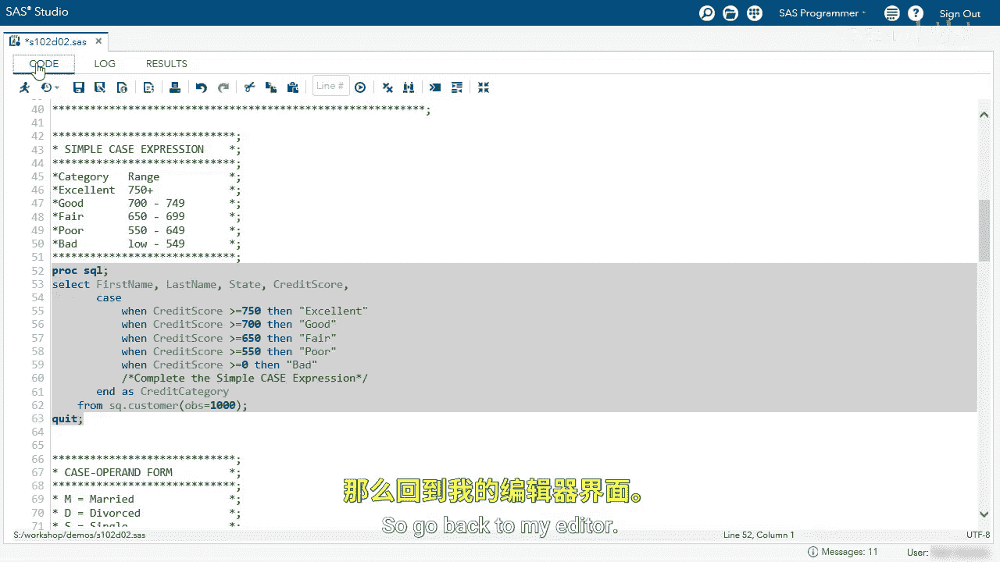

# 021：按条件赋值 🎯

在本节课中，我们将学习如何使用 `CASE` 表达式，根据特定条件为数据创建新的列。这是一种非常强大的数据转换技术。

## 概述

我们将通过两个查询示例来演示 `CASE` 表达式的用法。首先，我们会根据信用评分创建一个分类列。然后，我们将根据婚姻状态代码创建一个描述性列。过程中，我们会学习如何处理缺失值以及如何对计算出的新列进行筛选。

---

## 使用简单CASE表达式





首先，我们来看一个使用简单 `CASE` 表达式的查询。我们的目标是根据客户的信用评分，为其分配一个评级类别。

以下是查询的核心逻辑：
```sql
SELECT
    first_name,
    last_name,
    state,
    credit_score,
    CASE credit_score
        WHEN > 750 THEN 'Excellent'
        WHEN BETWEEN 700 AND 749 THEN 'Good'
        -- 其他条件...
        ELSE 'Unknown'
    END AS credit_category
FROM customer_data;
```

运行这个查询后，我们得到了包含姓名、州、信用评分和新列 `credit_category` 的结果集。可以看到，评分被成功地分类为“Excellent”、“Good”等。


---

## 处理缺失值

然而，观察数据时我们发现，当 `credit_score` 列为空（缺失值）时，对应的 `credit_category` 列也是空的。这通常不是我们想要的结果。


我们希望明确指定：如果信用评分缺失，则类别应显示为“Unknown”。为了实现这一点，我们需要修改 `CASE` 表达式，添加一个 `ELSE` 子句来处理所有未在 `WHEN` 中明确列出的情况，包括缺失值。



修改后的逻辑如下：
```sql
CASE
    WHEN credit_score > 750 THEN 'Excellent'
    WHEN credit_score BETWEEN 700 AND 749 THEN 'Good'
    -- 其他条件...
    ELSE 'Unknown' -- 处理所有其他情况，包括缺失值
END
```

再次运行查询，现在当信用评分为空时，类别会清晰地显示为“Unknown”。


---

## 筛选计算列

上一节我们创建了 `credit_category` 列，现在假设我们只想查看评级为“Excellent”的客户。这涉及到对计算出的新列进行筛选。

在SQL中，我们不能在 `WHERE` 子句中直接使用列的别名。这时，可以使用 `CALCULATED` 关键字来引用前面计算出的列。我们在 `FROM` 子句后添加 `WHERE` 子句：

```sql
WHERE CALCULATED credit_category = 'Excellent'
```

运行这个带筛选条件的查询，结果集就只包含信用评级为“Excellent”的记录了。

---

## 使用CASE搜索表达式

接下来，我们看看 `CASE` 表达式的另一种形式：搜索表达式。这次，我们将根据“已婚”状态代码（一个字母代码）来创建一个描述性列。

查询开始部分选择姓名、州、信用评分和已婚状态列。然后，我们使用 `CASE` 表达式对 `married` 列的值进行判断和转换。

以下是具体的转换逻辑：
```sql
CASE married
    WHEN 'D' THEN 'Divorced'
    WHEN 'S' THEN 'Single'
    WHEN 'W' THEN 'Widowed'
    ELSE 'Unknown' -- 处理代码‘M’或其他未列出的值
END AS married_category
```

运行查询后，我们可以看到新的 `married_category` 列，其中的值已从简单的代码转换为了清晰的描述。


---

## 总结

本节课我们一起学习了 `CASE` 表达式的强大功能。我们掌握了：
1.  使用**简单 `CASE` 表达式**根据一个列的值创建新列。
2.  使用 **`ELSE` 子句** 处理缺失值和未预见的情况，确保数据的完整性。
3.  使用 **`CALCULATED` 关键字** 在 `WHERE` 子句中筛选计算出的新列。
4.  使用 **`CASE` 搜索表达式** 实现更灵活的条件判断。


`CASE` 表达式是进行数据清理、转换和创建衍生变量的核心工具，能够基于特定的值或条件逻辑有效地生成新的数据列。