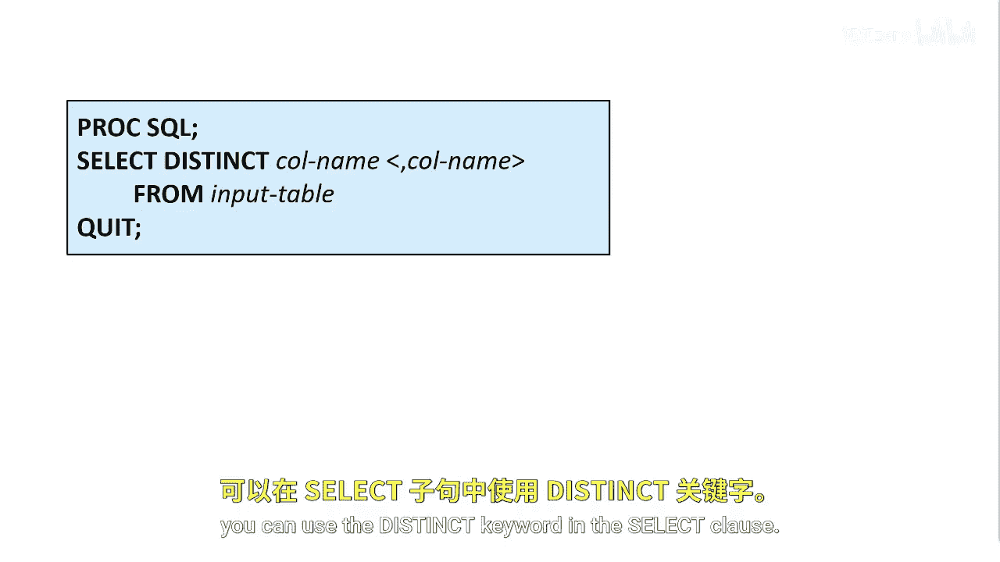
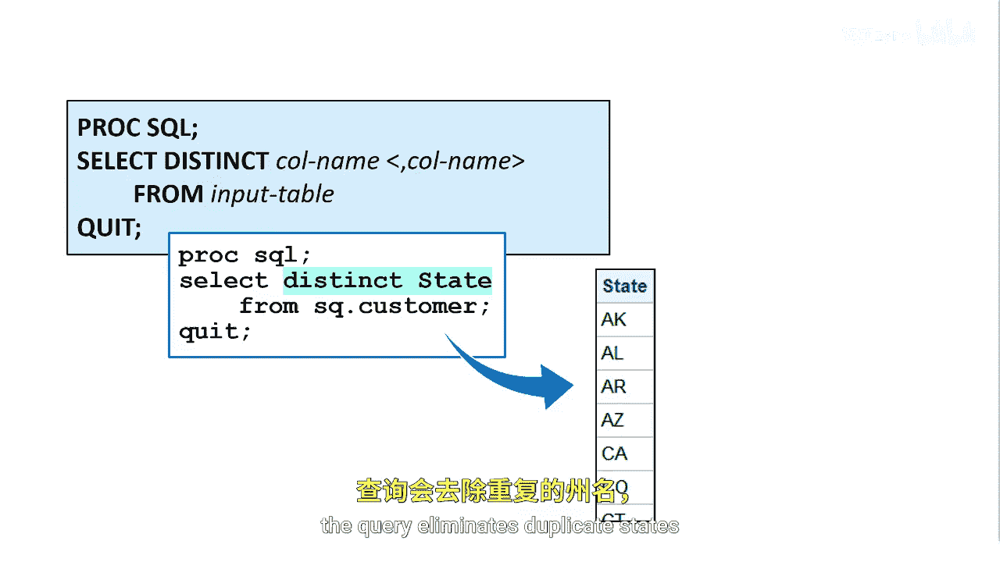

# 022：使用 DISTINCT 关键字消除重复行 🎯

在本节课中，我们将要学习如何在SAS的PROC SQL过程中使用`DISTINCT`关键字，从查询结果中筛选出唯一的、不重复的值。

## 概述

在某些情况下，我们可能只需要获取数据列中的唯一值。例如，假设我们的客户表中有超过10万名客户，而我们想要确定这些客户具体分布在哪些州。我们需要的不是一个包含所有客户记录的列表，而仅仅是一个不重复的州名列表，以便分析客户是否来自所有州，还是仅来自特定的几十个州。

## 使用 DISTINCT 关键字


为了从查询结果中消除重复的行，可以在`SELECT`子句中使用`DISTINCT`关键字。这个关键字会作用于`SELECT`语句中列出的所有列。

**基本语法：**
```sql
PROC SQL;
    SELECT DISTINCT column_name
    FROM table_name;
QUIT;
```



## DISTINCT 的工作原理

PROC SQL会消除结果中所有列的值都完全匹配的重复行。因此，对于每一个唯一的数值组合，结果中只会显示一行。


上一节我们介绍了`DISTINCT`关键字的基本用法，本节中我们来看看它的具体效果。当我们对“州”这一列使用`DISTINCT`关键字时，查询将消除重复的州名，最终给出一个汇总了我们客户所在州的唯一列表。

## 总结



本节课中我们一起学习了`DISTINCT`关键字的核心功能。通过将其应用于`SELECT`语句，我们可以轻松地从数据中提取出不重复的唯一值，这对于数据汇总和初步分析非常有用。记住，`DISTINCT`会基于所选列的组合值来去重。