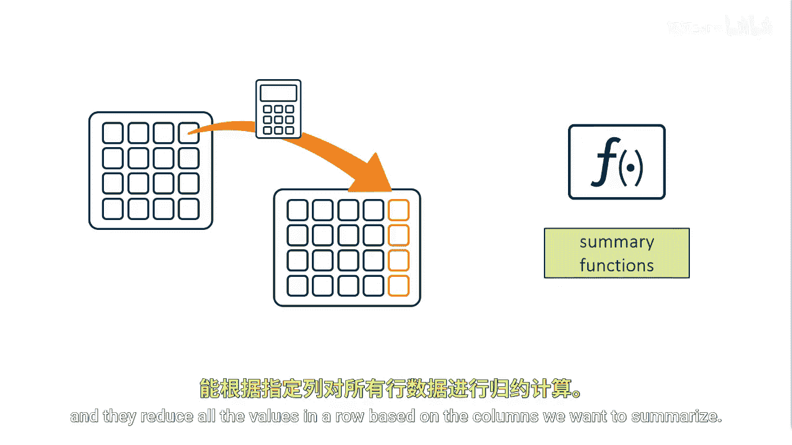
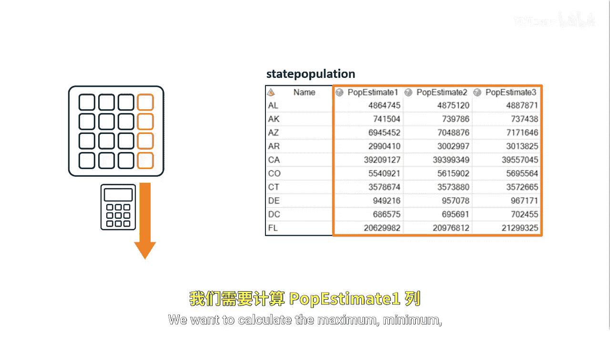
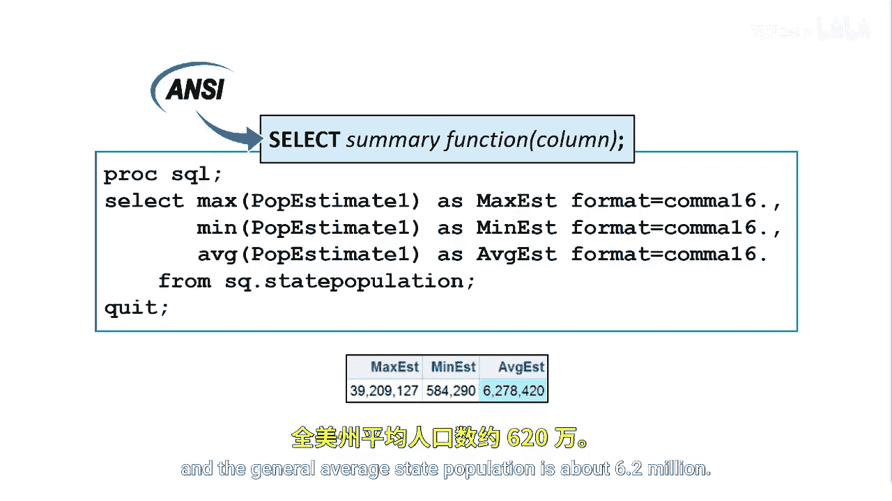
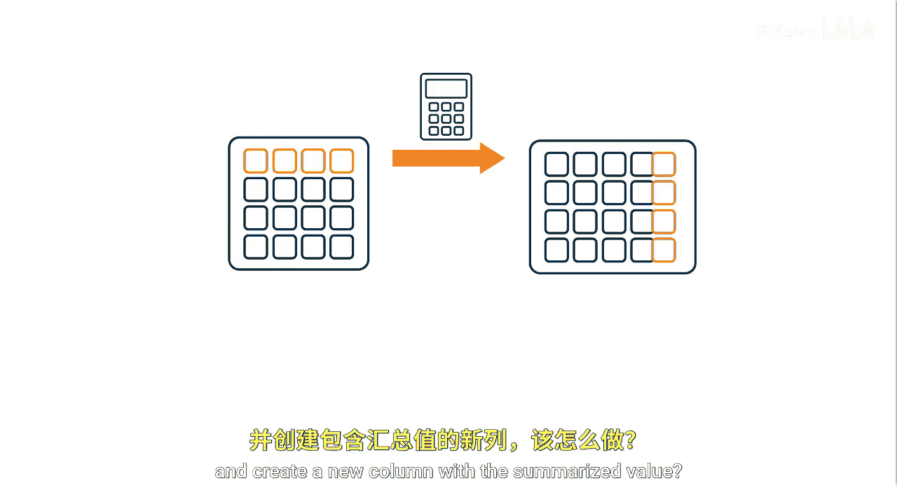
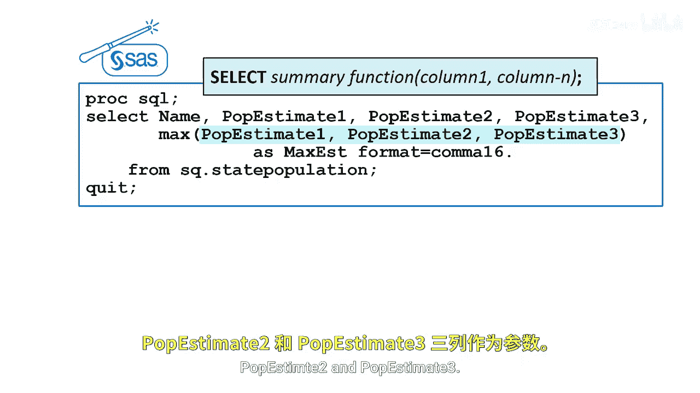

# 023：数据汇总

在本节课中，我们将要学习如何在SAS SQL查询中使用汇总函数。汇总函数能够对数据进行聚合计算，无论是纵向聚合整列数据，还是横向聚合单行内的多个值。理解其工作原理是进行数据分析的关键步骤。

## 汇总函数简介



上一节我们介绍了在SELECT子句中使用SAS函数创建计算列。本节中我们来看看如何使用汇总函数。

汇总函数，也称为聚合函数，其作用是根据我们想要汇总的列，对行中的所有值进行聚合计算。

## 纵向汇总单列数据



假设我们想要汇总一列数据。例如，`state_population`表包含了每个州未来三年的人口估计值。我们想要计算`P_Estimate1`列（即下一年度的估计值）的最大值、最小值和平均值。

为此，我们使用单参数的汇总函数。根据ANSI标准，单参数汇总函数会对一列中的非缺失值进行纵向聚合计算。

以下是计算示例：
```sql
SELECT
    MAX(P_Estimate1) AS max_population,
    MIN(P_Estimate1) AS min_population,
    MEAN(P_Estimate1) AS avg_population
FROM state_population;
```
对于下一年度的人口估计，最大州人口估计值略高于3920万，最小州人口估计值约为58.5万，平均州人口约为620万。

## 横向汇总单行数据



如果我们想要横向汇总一行数据，并创建一个包含汇总值的新列，该如何操作？



在SQL中，汇总函数的工作方式取决于参数列表中指定的列数。如果汇总函数指定了多个列，则函数将使用所列列中的值为每一行计算统计量。

在本例中，我们希望确定每个州未来三年估计人口的最大值。为此，我们使用`MAX`汇总函数，并指定每一列：`P_Estimate1`、`P_Estimate2`和`P_Estimate3`。

以下是计算示例：
```sql
SELECT
    State,
    MAX(P_Estimate1, P_Estimate2, P_Estimate3) AS max_estimate_across_years
FROM state_population;
```
当使用多参数汇总函数时，非缺失值将在行内进行横向汇总。

## 处理缺失值



如果存在缺失值，汇总函数会忽略它。

---


本节课中我们一起学习了SAS SQL中汇总函数的应用。我们掌握了如何使用单参数函数对列数据进行纵向聚合，以及如何使用多参数函数对行数据进行横向聚合。同时，我们了解到汇总函数会自动忽略缺失值，这在进行数据统计时非常重要。