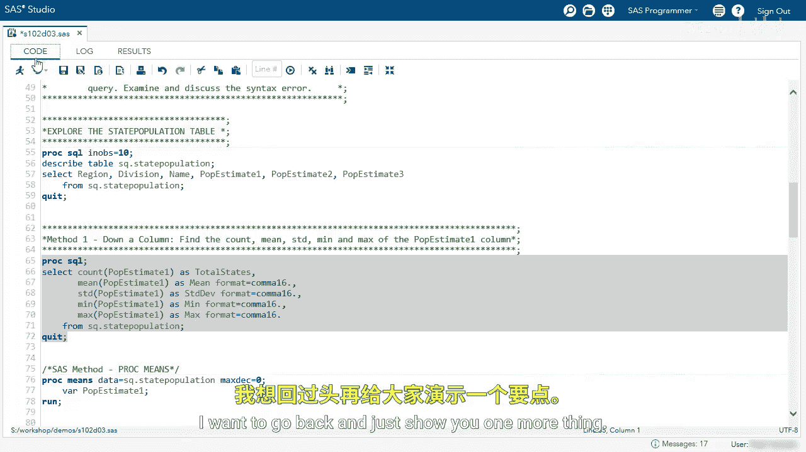
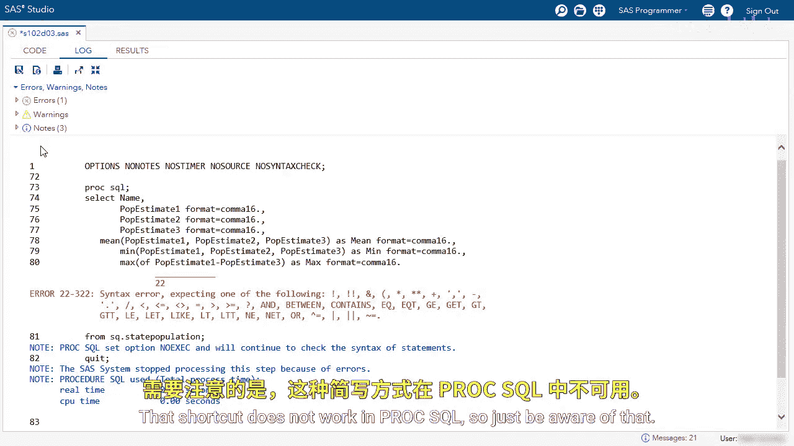

# 024：使用汇总函数分析表格 📊

在本节课中，我们将学习如何使用SAS中的汇总函数来分析表格数据。我们将通过一个具体的例子，探索如何计算一列数据的统计量，以及如何跨行进行计算。


## 概述

我们将使用一个名为`state_population`的表格，其中包含地区、州名以及人口估计值等列。我们的目标是计算人口估计列的各种描述性统计量，例如计数、平均值、标准差、最小值和最大值。

## 探索数据表

首先，我们来查看一下`state_population`表的结构。该表包含以下几列：`region`、`division`、`state_name`以及人口估计列`P_estimate1`。我们的分析将主要围绕`P_estimate1`列展开。

## 计算单列的汇总统计量

以下是如何使用`PROC SQL`中的汇总函数来计算`P_estimate1`列的统计信息。

我们使用`COUNT`函数来计算总州数，使用`MEAN`函数来计算平均值，并使用`FORMAT`语句来格式化输出。

```sql
PROC SQL;
    SELECT
        COUNT(P_estimate1) AS total_states,
        MEAN(P_estimate1) AS mean FORMAT=comma16.
    FROM state_population;
QUIT;
```

运行此查询后，我们得到一行输出。`total_states`的结果是52（包括华盛顿特区和波多黎各），`mean`的结果大约是620万。

接下来，我们扩展查询，以包含更多统计量。

以下是计算标准差、最小值和最大值的完整查询：

```sql
PROC SQL;
    SELECT
        COUNT(P_estimate1) AS total_states,
        MEAN(P_estimate1) AS mean FORMAT=comma16.,
        STD(P_estimate1) AS std_dev FORMAT=comma16.,
        MIN(P_estimate1) AS minimum FORMAT=comma16.,
        MAX(P_estimate1) AS maximum FORMAT=comma16.
    FROM state_population;
QUIT;
```

现在，我们可以在结果中看到所有描述性统计量。



## 使用 PROC MEANS 的替代方法

在SAS中，除了`PROC SQL`，还可以使用`PROC MEANS`过程来获得相同的结果。这种方法有时更为简洁。

```sas
PROC MEANS DATA=state_population N MEAN STD MIN MAX MAXDEC=0;
    VAR P_estimate1;
RUN;
```


运行此代码将产生与之前SQL查询相同的统计结果。这为数据分析提供了另一种有效的方法。

## 跨行计算汇总统计量

上一节我们介绍了如何汇总单列数据。本节中我们来看看如何对一行中的多个列进行计算。

假设我们想计算每个州在`P_estimate1`、`P_estimate2`、`P_estimate3`这三列上的人口估计最小值、平均值和最大值。

以下是相应的SQL查询。注意，在SAS的`PROC SQL`中，计算平均值应使用`MEAN`函数，而不是ANSI标准的`AVG`函数。

```sql
PROC SQL;
    SELECT
        state_name,
        MIN(P_estimate1, P_estimate2, P_estimate3) AS min_estimate FORMAT=comma16.,
        MEAN(P_estimate1, P_estimate2, P_estimate3) AS mean_estimate FORMAT=comma16.,
        MAX(P_estimate1, P_estimate2, P_estimate3) AS max_estimate FORMAT=comma16.
    FROM state_population;
QUIT;
```

当在汇总函数中指定多个参数时，SAS会跨这些列进行计算。结果将显示每个州在这三个估计值中的最小值、平均值和最大值。


## 关于列列表快捷方式的注意事项

对于熟悉SAS数据步的程序员，可能会想使用`P_estimate1 - P_estimate3`这样的快捷方式来指代一系列列。

```sql
/* 注意：此写法在 PROC SQL 中无效 */
SELECT MEAN(P_estimate1 - P_estimate3) ...
```

需要明确的是，这种快捷方式在`PROC SQL`中**无法**正常工作。在SQL过程中，必须明确列出每一列的名称。

## 总结

本节课中我们一起学习了在SAS中使用汇总函数分析表格。
*   我们使用`COUNT`、`MEAN`、`STD`、`MIN`、`MAX`等函数计算了单列的描述性统计量。
*   我们了解了使用`PROC MEANS`作为`PROC SQL`的替代方法。
*   我们探索了如何通过向汇总函数传入多个参数，来实现跨行的计算。
*   我们明确了SAS数据步中的列列表快捷方式（如 `var1-var3`）不适用于`PROC SQL`环境。



掌握这些汇总函数的使用，是进行数据摘要和分析的基础。