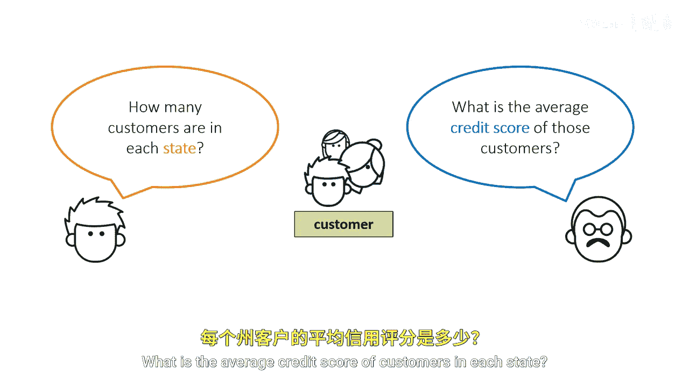
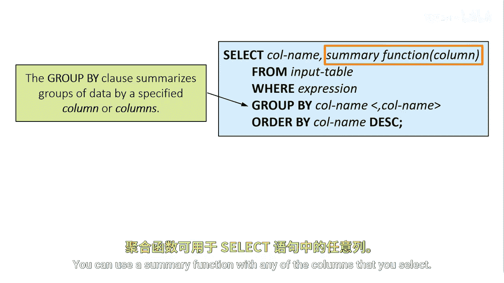
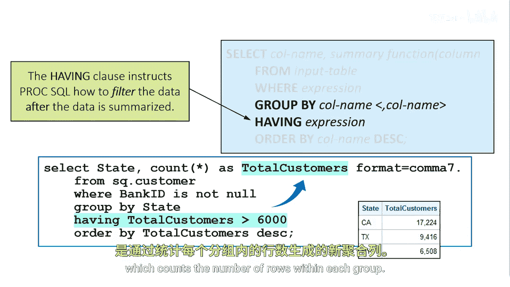

# 026：数据分组 📊

在本节课中，我们将学习如何使用SQL中的`GROUP BY`子句对数据进行分组，并配合聚合函数来汇总信息。我们将探讨如何计算每个组内的行数、平均值等统计量，以及如何使用`HAVING`子句对分组后的结果进行筛选。



## 概述

我们被要求调查客户表，并根据分组来汇总信息。具体问题包括：每个州有多少客户？每个州客户的平均信用评分是多少？

为了在SQL中回答这些问题，我们需要使用`GROUP BY`子句。



## 使用GROUP BY子句

`GROUP BY`子句根据一个或多个列的值将数据分类成组。`SELECT`子句中的聚合函数则为每个分组列的唯一值计算统计量。你可以在选择的任何列上使用聚合函数。

例如，要找出每个州的客户数量，我们可以使用包含`COUNT`函数的查询，该函数计算每个州的总客户数或行数。

以下是查询示例：
```sql
SELECT State, COUNT(*) AS TotalCustomers
FROM CustomerTable
GROUP BY State
ORDER BY TotalCustomers DESC;
```
`GROUP BY`子句对州进行分组，`ORDER BY`子句将总客户数按降序排列。运行此代码后，结果将显示每个州的客户数量。由于查询按总客户数降序排序，我们可以看出大多数客户在加利福尼亚州，其次是德克萨斯州和纽约州。

**核心概念**：必须将聚合函数与`GROUP BY`子句结合使用。如果不这样做，SAS会将`GROUP BY`子句转换为`ORDER BY`子句。


## WHERE子句与分组

SAS在行可用于处理之前评估`WHERE`子句，并确定哪些单独的行可用于分组。因此，你不能使用`WHERE`子句通过引用计算出的汇总列（如`TotalCustomers`）来筛选分组行。


## 使用HAVING子句筛选分组

必须将`HAVING`子句与`GROUP BY`子句结合使用，以筛选汇总后的行。`HAVING`子句影响分组的方式类似于`WHERE`子句影响单独行的方式。当你使用`HAVING`子句时，PROC SQL只显示满足`HAVING`表达式的分组。

PROC SQL在分组数据并应用聚合函数后应用`HAVING`条件。可以将`HAVING`子句视为汇总后过滤。

例如，`HAVING TotalCustomers > 6000`将分组限制为仅包含美国客户数超过6000的州。结果将显示三个州：CA、TX和NY。

以下是包含`HAVING`子句的查询示例：
```sql
SELECT State, COUNT(*) AS TotalCustomers
FROM CustomerTable
GROUP BY State
HAVING TotalCustomers > 6000
ORDER BY TotalCustomers DESC;
```
`HAVING`表达式包含新列`TotalCustomers`的值，该列计算每个组内的行数。

## 总结



本节课中，我们一起学习了如何使用`GROUP BY`子句对数据进行分组，以及如何结合聚合函数（如`COUNT`）计算分组统计量。我们了解了`WHERE`子句在分组前的过滤作用，以及`HAVING`子句在分组后对汇总结果进行筛选的重要性。通过实际示例，我们掌握了如何查询每个州的客户数量，并筛选出客户数超过特定值的州。