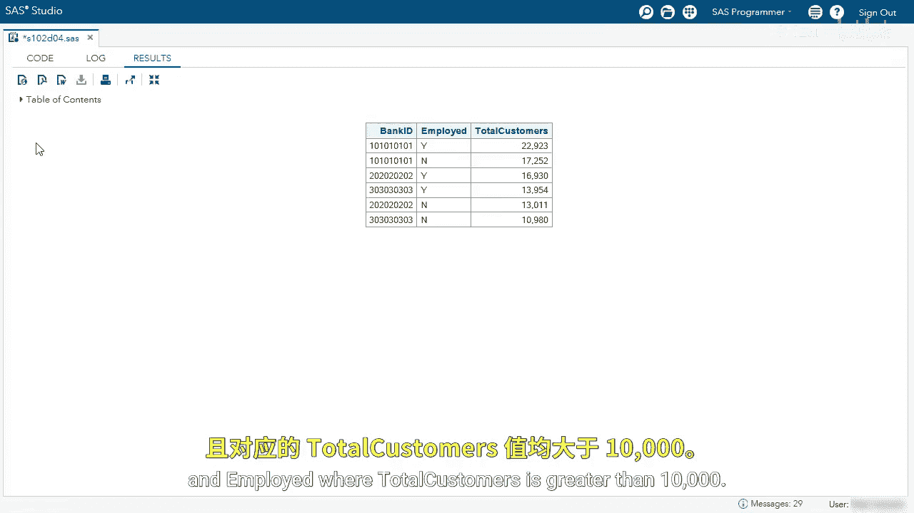

# 027：使用GROUP BY子句分析数据分组 🧮

在本节课中，我们将学习如何使用SQL中的`GROUP BY`子句对数据进行分组，并为每个分组生成汇总统计信息。这是数据分析中聚合数据的关键技术。

## 概述

我们将从一个简单的查询开始，逐步添加分组、聚合函数和筛选条件，最终实现对客户数据按不同维度（如州、银行ID、就业状态）进行分组统计，并筛选出满足特定条件的组。

## 数据分组基础

上一节我们介绍了基本的SQL查询结构。本节中，我们来看看如何使用`GROUP BY`子句对数据进行分组。

首先，我们从`customer`表中选择`state`列，并限制返回10行以便于代码开发。同时，我们使用`GROUP BY state`进行分组。

```sql
SELECT state
FROM customer
OBS=10
GROUP BY state;
```

运行此查询后，虽然结果看起来正常，但日志中会出现一个警告。该警告指出，由于未使用汇总函数，`GROUP BY`子句已被转换为`ORDER BY`子句。这意味着分组并未实际生效。

## 使用聚合函数计数

我们的目标是统计每个州的客户数量。为此，我们需要在`SELECT`子句中使用`COUNT`聚合函数。

以下是修改后的查询。我们使用`COUNT(*)`来计算行数，并将结果列命名为`totalCustomer`，同时使用`COMMA7.`格式进行美化。

```sql
SELECT state,
       COUNT(*) AS totalCustomer FORMAT=COMMA7.
FROM customer
OBS=1000
GROUP BY state;
```

运行此查询，我们现在可以看到每个州对应的客户数量。在代码开发阶段，我们使用`OBS=1000`限制结果。当对代码有信心后，可以移除该限制以查看完整数据。

```sql
SELECT state,
       COUNT(*) AS totalCustomer FORMAT=COMMA7.
FROM customer
GROUP BY state;
```

## 对结果进行排序

为了更清晰地查看哪个州的客户最多，我们可以使用`ORDER BY`子句对`totalCustomer`列进行降序排序。

```sql
SELECT state,
       COUNT(*) AS totalCustomer FORMAT=COMMA7.
FROM customer
GROUP BY state
ORDER BY totalCustomer DESC;
```

## 按其他维度分组

我们刚刚统计了按州分组的客户数。现在，如果我们想按`bankID`来统计客户数量呢？

只需将`SELECT`和`GROUP BY`子句中的`state`列替换为`bankID`列即可。

```sql
SELECT bankID,
       COUNT(*) AS totalCustomer FORMAT=COMMA7.
FROM customer
GROUP BY bankID
ORDER BY totalCustomer DESC;
```

从结果中可以看到，银行ID为`101010`的客户最多。同时，我们注意到`GROUP BY`子句会包含缺失值（NULL），结果显示约有4900名客户没有银行ID。

## 多列分组

接下来，我们进行更深入的分析。我想同时按`bankID`和`employed`（就业状态）来统计客户数量。

这很简单，只需在`SELECT`和`GROUP BY`子句中同时添加`employed`列。

```sql
SELECT bankID,
       employed,
       COUNT(*) AS totalCustomer FORMAT=COMMA7.
FROM customer
GROUP BY bankID, employed
ORDER BY totalCustomer DESC;
```

运行后，结果将显示`bankID`和`employed`每个唯一组合对应的客户总数。

## 使用HAVING子句筛选分组

目前的结果集包含了所有分组。但有时我们只关心客户总数超过特定阈值（例如10,000）的分组。这时不能使用`WHERE`子句，因为它用于筛选行，而不是分组。

初学者可能会尝试以下错误写法：

```sql
SELECT bankID,
       employed,
       COUNT(*) AS totalCustomer FORMAT=COMMA7.
FROM customer
WHERE CALCULATED totalCustomer > 10000 /* 错误！ */
GROUP BY bankID, employed;
```

运行上述代码会产生错误，提示“摘要函数仅限于SELECT和HAVING子句”。这意味着对聚合结果的筛选必须使用`HAVING`子句。

正确的做法是：将筛选条件移到`GROUP BY`之后，并将`WHERE`改为`HAVING`。

```sql
SELECT bankID,
       employed,
       COUNT(*) AS totalCustomer FORMAT=COMMA7.
FROM customer
GROUP BY bankID, employed
HAVING CALCULATED totalCustomer > 10000
ORDER BY totalCustomer DESC;
```

虽然在此例中不使用`CALCULATED`关键字也可能得到正确结果，但最佳实践是使用它来明确引用计算列，以确保查询结果的确定性，避免在其他复杂查询中出现意外情况。

运行正确的查询后，我们将只看到客户总数大于10,000的`bankID`和`employed`组合。





## 总结

本节课中我们一起学习了`GROUP BY`子句的核心用法：
1.  **基础分组**：使用`GROUP BY`对一列或多列进行分组。
2.  **聚合函数**：必须与`COUNT`、`SUM`、`AVG`等聚合函数结合使用，才能为每个组生成汇总值。
3.  **结果排序**：使用`ORDER BY`对聚合结果进行排序。
4.  **分组筛选**：使用`HAVING`子句（而非`WHERE`子句）来筛选基于聚合结果的分组。
5.  **明确引用**：使用`CALCULATED`关键字引用计算列是良好的编程习惯。


通过掌握这些概念，你已经能够对数据进行有效的分组和汇总分析，这是生成业务报告和进行数据洞察的基础。