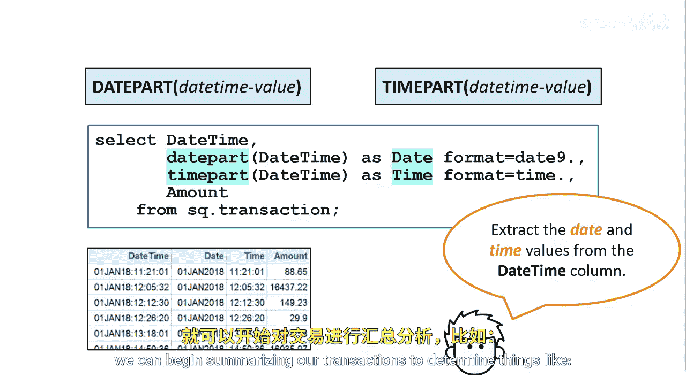
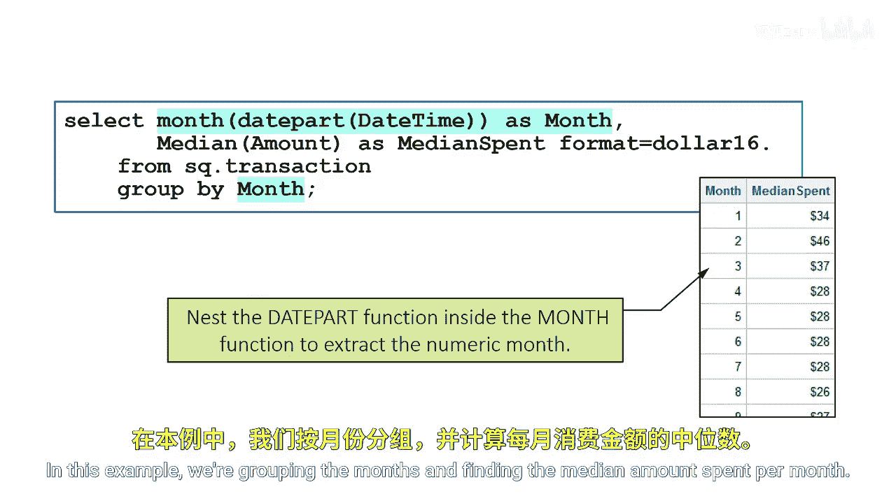

# 028：日期和时间数据汇总 📅⏰

在本节课中，我们将学习如何在SAS中对日期和时间数据进行汇总分析。你将掌握如何从日期时间值中提取日期或时间部分，并利用这些提取出的信息进行分组和统计。

## 概述

当在SAS中汇总日期或时间数据时，你可以使用特定的SAS日期或时间函数。要使用这些函数，你的数据不能是日期时间值。数据必须是日期值（用于汇总月份、年份、天数等信息）或时间值（用于汇总小时、分钟、秒等信息）。这可以通过`DATEPART`或`TIMEPART`函数轻松实现。

## 提取日期与时间部分

上一节我们介绍了汇总日期时间数据的基本前提。本节中我们来看看如何从日期时间值中分离出日期和时间。

`DATEPART`和`TIMEPART`函数唯一的必需参数是日期时间值。假设交易表`transaction`包含一个合并了日期和时间的`datetime`列。

通过使用`DATEPART`和`TIMEPART`函数，我们可以分别提取日期值和时间值，并创建两个新列：`date`和`time`。这些函数返回原始的SAS日期和SAS时间数值，随后我们可以对其进行格式化以改善显示效果。

以下是实现此操作的代码示例：
```sas
data work.transaction_extracted;
    set sashelp.transaction;
    date = datepart(datetime);
    time = timepart(datetime);
    format date date9. time time8.;
run;
```

## 基于提取信息进行数据汇总

现在我们有了`date`和`time`列，就可以开始汇总交易数据，以分析诸如“客户在哪个月份或哪个季度消费最多？”等问题。

以下是可以进行的汇总分析步骤：
1.  使用`MONTH`、`QTR`、`YEAR`等函数从`date`列提取更具体的时间单位。
2.  使用`GROUP BY`语句按这些时间单位对数据进行分组。
3.  结合`SUM`、`MEAN`、`MEDIAN`等汇总函数计算关键指标。

## 嵌套函数的高级应用

我们也可以将`DATEPART`函数嵌套在`MONTH`函数内部，直接提取数字月份。



创建新值后，你可以将列命名为`month`，然后在`GROUP BY`子句中使用该列配合汇总函数。

在这个例子中，我们按月份分组，并找出每个月的消费金额中位数。

以下是相应的代码和结果示意图：
```sas
proc sql;
    create table work.monthly_median as
    select month(datepart(datetime)) as month,
           median(amount) as median_amount
    from sashelp.transaction
    group by calculated month;
quit;
```



## 总结


本节课中我们一起学习了SAS中日期时间数据汇总的核心技巧。关键点包括：使用`DATEPART`和`TIMEPART`函数分离日期与时间成分，利用提取出的日期或时间部分进行分组，以及通过嵌套函数（如`MONTH(DATEPART(datetime))`）直接获取所需的时间维度进行聚合分析。掌握这些方法能帮助你更有效地从时间序列数据中提取商业洞察。