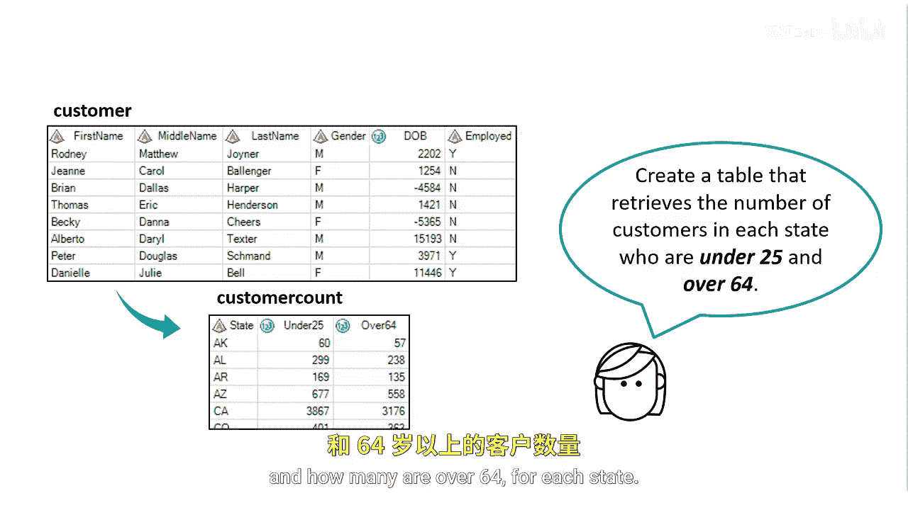
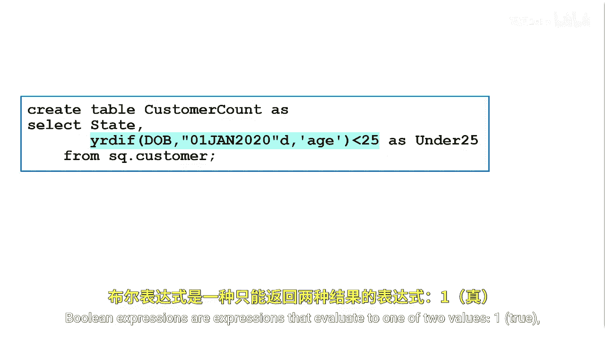
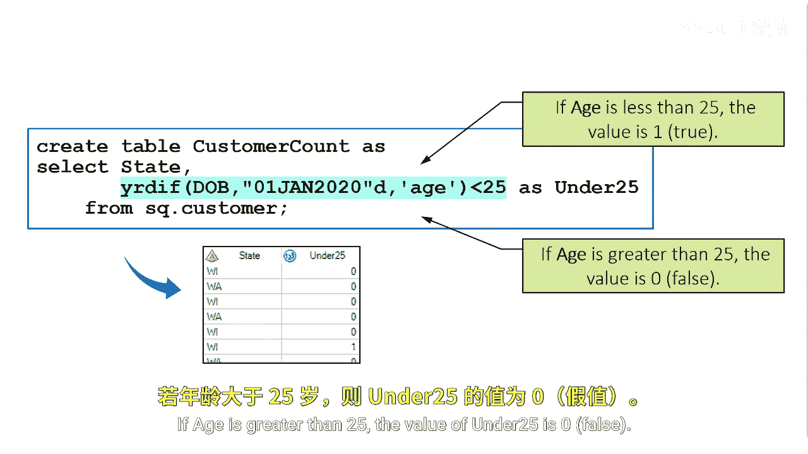

# 029：使用布尔表达式统计行数

在本节课中，我们将学习如何使用布尔表达式，在按州汇总客户数据时，统计特定年龄段的客户数量。

## 概述

上一节我们介绍了基本的数据汇总方法。本节中，我们来看看一个更具体的场景：如何统计每个州内年龄小于25岁和大于64岁的客户人数。为了实现这个目标，我们将使用一种称为“布尔表达式”的技术。

## 理解布尔表达式



布尔表达式是一种计算结果为两个值之一的表达式：1（代表“真”）或0（代表“假”）。

例如，我们可以创建一个表达式来判断客户的年龄是否小于25岁。如果条件成立，表达式的值就是1；如果不成立，值就是0。

**核心概念公式**：
```
under_25 = (age < 25) // 若年龄小于25，值为1（真）；否则为0（假）
over_64 = (age > 64) // 若年龄大于64，值为1（真）；否则为0（假）
```

## 应用布尔表达式进行统计

在SAS的`PROC SQL`或`PROC SUMMARY`等过程中，我们可以直接将这些布尔表达式用于统计。系统会对每一行数据计算表达式的值（1或0），然后在分组汇总时，对这些1和0进行求和。由于只有满足条件的行贡献1，求和结果自然就是满足条件的行数，即客户数量。



以下是实现此目标的关键步骤思路：

1.  **创建布尔表达式列**：在查询或数据步中，定义两个新列，例如`under_25`和`over_64`，其值由上述的布尔表达式决定。
2.  **按州分组**：指定分组依据为`state`。
3.  **汇总求和**：对每个州，将`under_25`和`over_64`列的值分别求和。每个和就代表了该州对应年龄段的客户总数。

**示例代码思路（PROC SQL）**：
```sql
PROC SQL;
    SELECT
        state,
        SUM( (age < 25) ) AS count_under_25,
        SUM( (age > 64) ) AS count_over_64
    FROM
        customer_table
    GROUP BY
        state;
QUIT;
```

## 总结



本节课中我们一起学习了如何利用布尔表达式来统计满足特定条件的数据行数。关键点在于理解布尔表达式会为每一行返回1（真）或0（假），通过对这些值进行求和，就能轻松得到符合条件的记录总数。这种方法简洁高效，是进行条件计数的强大工具。