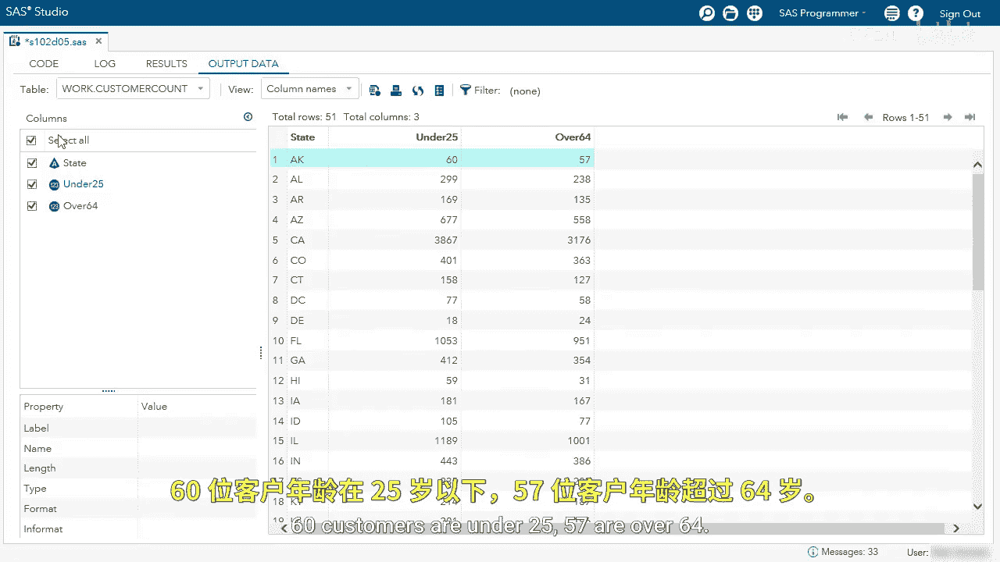

SAS高级程序员专项课程：P30：使用布尔表达式汇总数据演示

在本节课中，我们将学习如何在汇总函数中使用布尔表达式来对数据进行分类和统计。我们将创建一个查询，计算每个州年龄在25岁以下和64岁以上的客户数量。

我们将通过一个查询来创建名为 `Custom_account` 的表。查询从选择 `state` 列开始，并使用 `year diff` 函数创建一个名为 `age` 的新列。

运行查询并查看结果。我们得到了新表，其中包含州名和年龄值。

现在，我们希望汇总年龄在25岁以下和64岁以上的客户数据。让我们回到编辑器。

我们将使用年龄值，指定小于25岁的条件为“under 25”。这里我们使用了布尔表达式，如果年龄小于25岁，则结果为1，否则为0。

我们可以看到新列“under 25”中显示了一系列0和1。其中0代表假，1代表真。例如，第6行的值为1，表示该客户年龄在25岁以下。

接下来，我们继续找出所有年龄大于64岁的客户。复制之前的函数，添加一个逗号，然后粘贴。将条件改为大于64，并将此列命名为“over 64”。

运行查询以确保一切正常。现在，我们有了第三列“over 64”，其中也包含0和1。

我希望按州来汇总这些数据，即查看每个州有多少客户年龄在25岁以下和64岁以上。因此，我们将使用 `sum` 函数来对值为1的项进行求和。

这将分别对两列进行求和。然后，我们添加 `GROUP BY` 子句，按州进行分组。我将移除 `NOs equals` 选项，因为我对代码有信心，可以在生产环境中移除它。

我们得到了新表 `Custom_count`，其中包含州名以及对应的计数。例如，在阿肯色州，有60名客户年龄在25岁以下，57名客户年龄在64岁以上。我们可以查看每个州、华盛顿特区和波多黎各的相应数据。

在本节课中，我们一起学习了如何利用布尔表达式在SQL查询中创建条件列，并使用 `SUM` 函数配合 `GROUP BY` 子句，轻松地按类别对数据进行汇总统计。这种方法非常适用于生成清晰的分组计数报告。