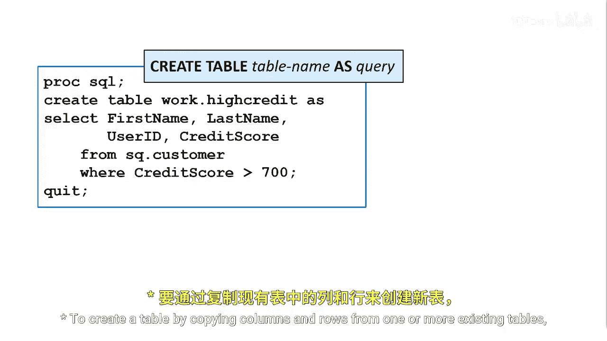
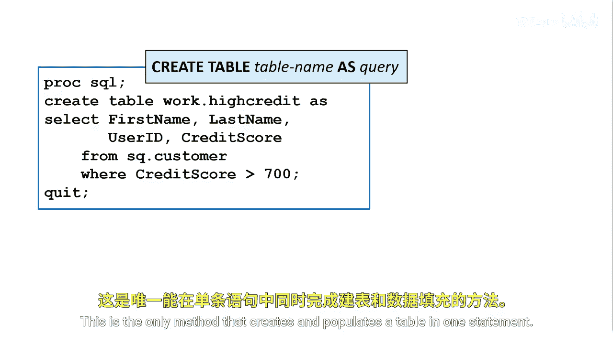
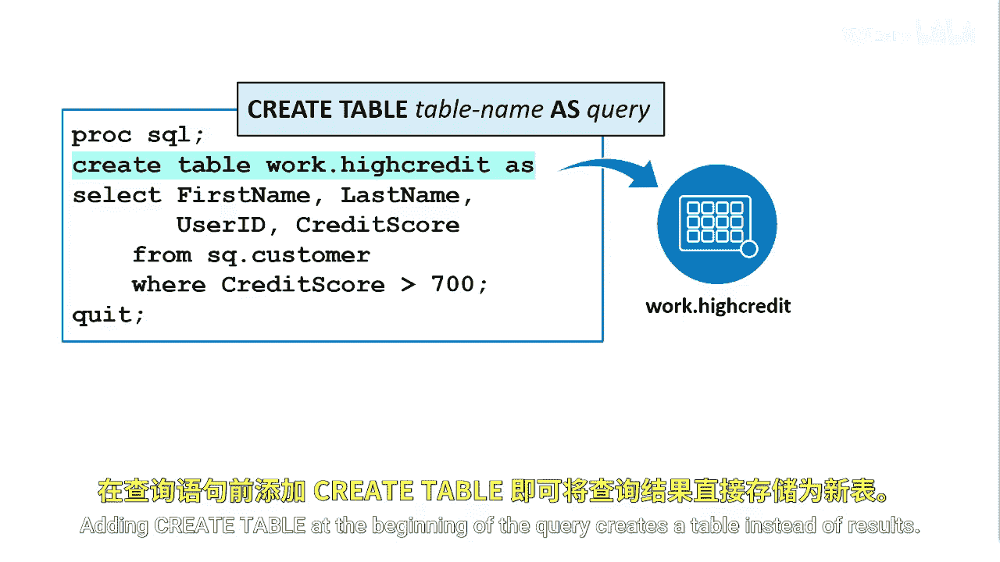
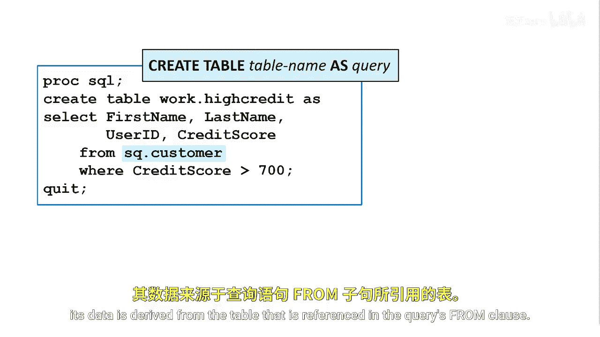
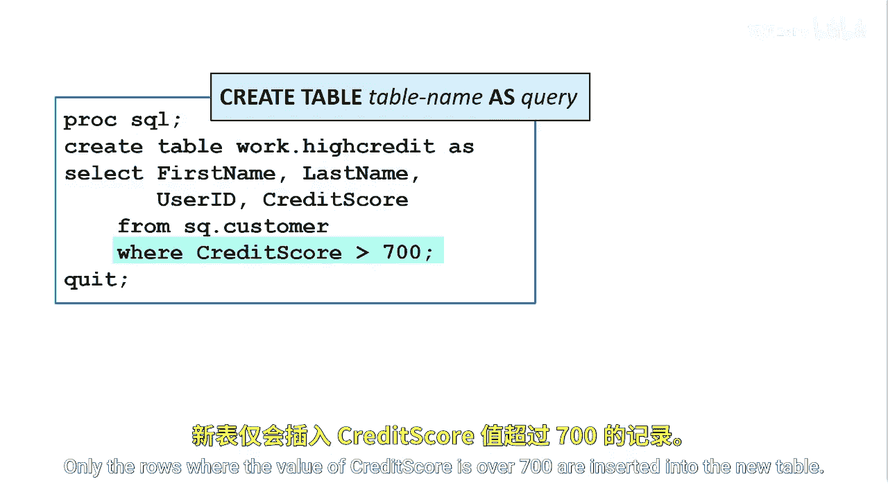

# 032：从查询创建表 📊

在本节课中，我们将学习如何使用SQL查询来创建新的数据表。这种方法的核心是通过复制一个或多个现有表中的列和行来生成新表。



## 概述

通过查询创建表，是使用`CREATE TABLE`语句配合查询来实现的。这种方法最常用于创建现有表的子集或超集。它是唯一一种能在单个语句中同时完成表的创建和数据填充的方法。



## 从查询结果创建表

要从查询结果创建表，可以使用`CREATE TABLE`语句，指定新表名，后跟`AS`关键字和查询语句。


**基本语法：**
```sql
CREATE TABLE 新表名 AS
SELECT 列1, 列2, ...
FROM 源表名
WHERE 条件;
```

在查询的开头添加`CREATE TABLE`，会指示SAS创建一个物理表，而不是仅仅输出查询结果。



## 新表的属性

需要注意的是，以这种方式创建的表，其数据来源于查询`FROM`子句所引用的表。



新表的列名由查询`SELECT`子句中的列表指定。列的属性（如类型、长度、输入格式、输出格式和扩展属性）与所选的源列相同，除非查询中包含了列修饰符（如使用`AS`重命名或计算新列）。

## 示例解析

我们通过一个具体例子来理解这个过程。


**示例代码：**
```sql
CREATE TABLE work.high_credit AS
SELECT customer_id, credit_score, income
FROM sashelp.credit_data
WHERE credit_score > 700;
```


在这个例子中，`CREATE TABLE`语句通过查询创建了一个名为`high_credit`的新表。只有`credit_score`值大于700的行才会被插入到这个新表中。

## 重要注意事项



新创建的表不会自动显示在SAS输出窗口中，除非你后续对这个表执行查询操作。


以下是使用此方法时需要记住的几个关键点：
*   使用SQL时，一个查询只能创建一个表。
*   如果你需要在一个步骤中创建多个表，可以考虑使用DATA步来实现。


## 总结

本节课我们一起学习了如何使用SQL的`CREATE TABLE ... AS SELECT ...`语句从查询结果创建新表。我们了解了其语法结构、新表属性的继承规则，并通过示例看到了如何创建满足特定条件的数据子集。这是数据准备和子集化中一个非常高效且常用的技巧。