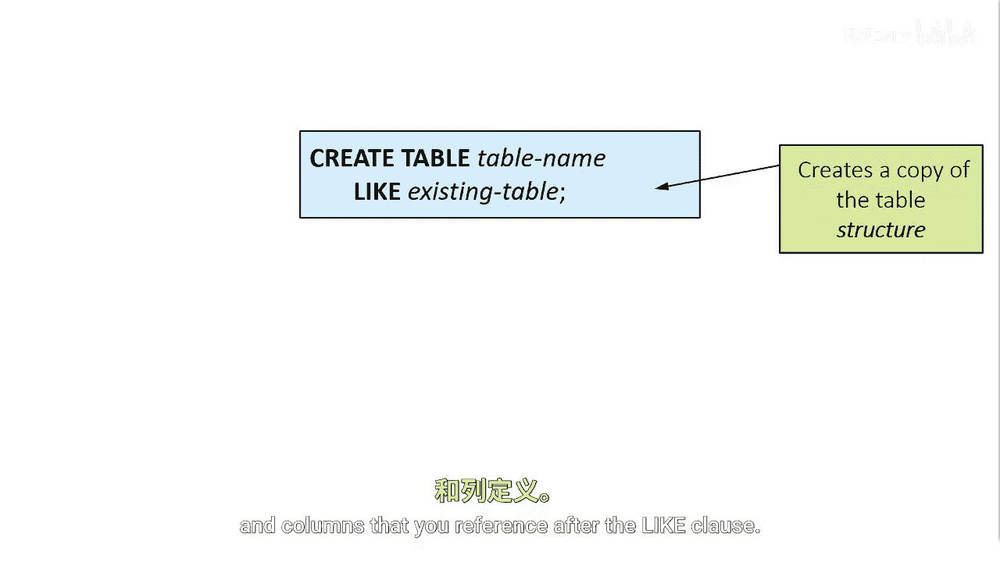
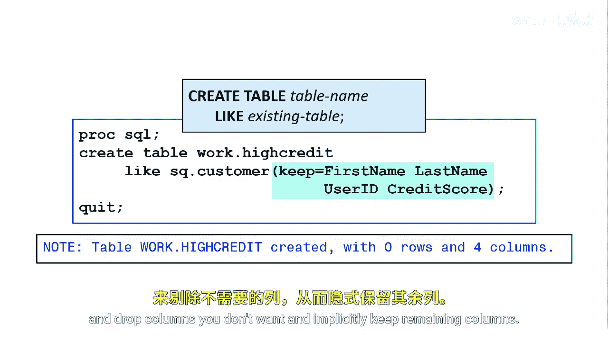
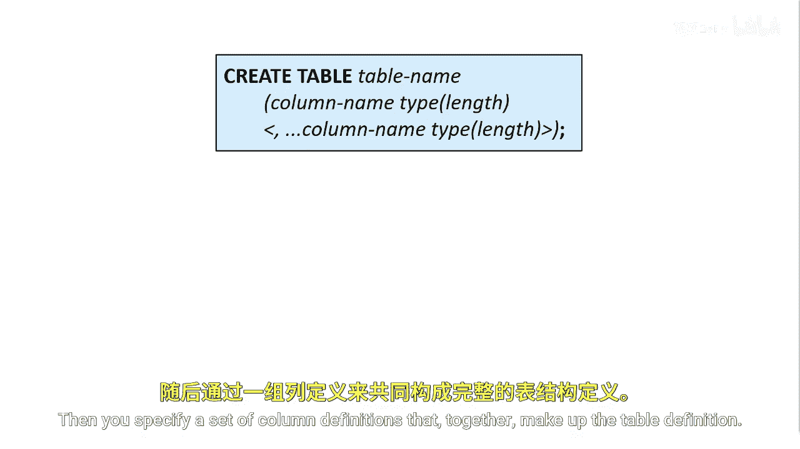

SAS高级程序员专项课程：P33：使用PROC SQL创建表结构 🗂️

在本节课中，我们将学习如何使用PROC SQL过程来创建表结构。我们将重点介绍两种主要方法：一种是基于现有表结构创建新表，另一种是定义全新的空表。

---

### 使用LIKE子句复制现有表结构

上一节我们介绍了PROC SQL的基本概念，本节中我们来看看如何基于现有表快速创建新表结构。第一种方法是使用CREATE TABLE语句中的LIKE子句。此方法会复制您在LIKE子句后引用的表的列结构。



**核心语法**：
```sql
CREATE TABLE 新表名 LIKE 原表名;
```

例如，我们想创建一个名为`high_credit`的新表，它仅包含`SQ.cuser`表中的`first_name`、`last_name`、`user_id`和`credit_score`这几列。

最简便的方法是结合使用CREATE TABLE的LIKE方法和SAS数据集选项。您可以在CREATE TABLE语句中，使用`KEEP=`数据集选项来指定需要保留的列。

**示例代码**：
```sql
CREATE TABLE work.high_credit LIKE SQ.cuser (KEEP=first_name last_name user_id credit_score);
```

您也可以使用`DROP=`数据集选项来删除不需要的列，从而隐式地保留其余列。

**示例代码**：
```sql
CREATE TABLE work.high_credit LIKE SQ.cuser (DROP=address phone_number);
```

---



### 定义全新的空表

除了复制现有结构，您还可以从头开始定义一个全新的空表。这需要在CREATE TABLE语句中明确定义每一列。

以下是定义列时需要指定的组成部分：
*   **列名**：为每一列指定一个唯一的名称。
*   **数据类型**：定义列中数据的类型，例如字符型（CHAR）或数值型（NUM）。
*   **长度**：对于字符型列，指定其最大长度。
*   **格式**：为列指定一个输出格式，例如日期格式。



例如，以下CREATE TABLE语句将创建一个包含四列的`employee`表：

**示例代码**：
```sql
CREATE TABLE work.employee (
    first_name CHAR(20),
    last_name CHAR(20),
    DOB NUM FORMAT=MMDDYY10.,
    MID NUM FORMAT=Z6.
);
```

这段代码创建了`employee`表，其中包含：
*   两个长度为20的字符型列：`first_name`和`last_name`。
*   一个使用`MMDDYY10.`格式的日期列`DOB`。
*   一个使用`Z6.`格式的数值型列`MID`。

---


本节课中我们一起学习了使用PROC SQL创建表结构的两种核心方法。您学会了如何使用LIKE子句基于现有表快速复制结构，也掌握了如何通过定义列名、数据类型和格式来创建一个全新的空表。这些技能是构建和管理SAS数据集的基础。