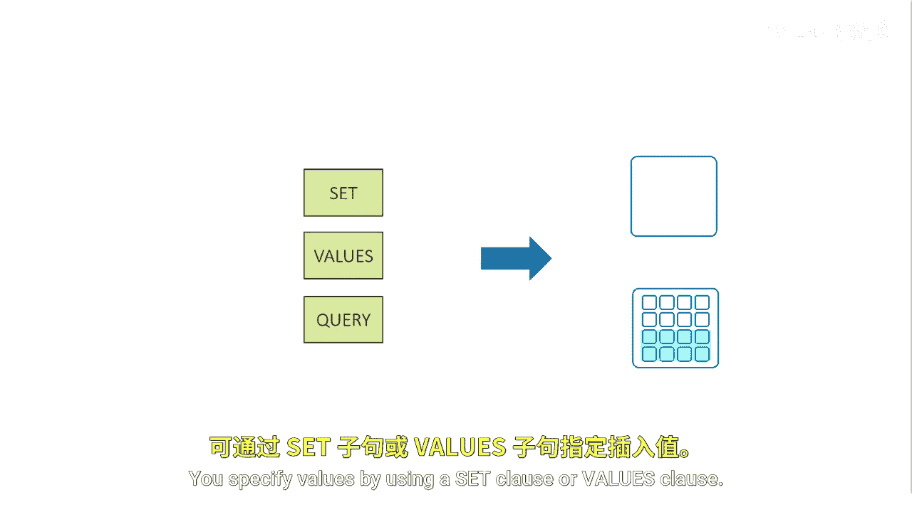
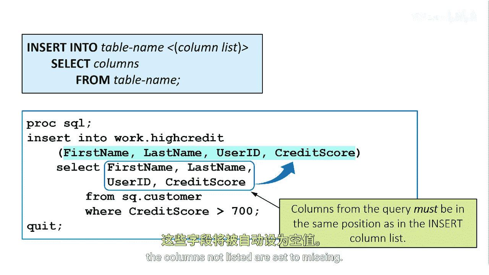
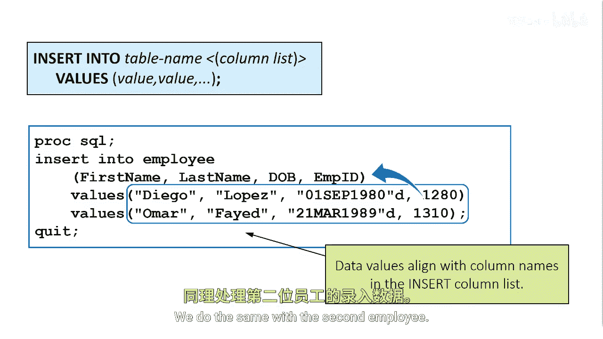
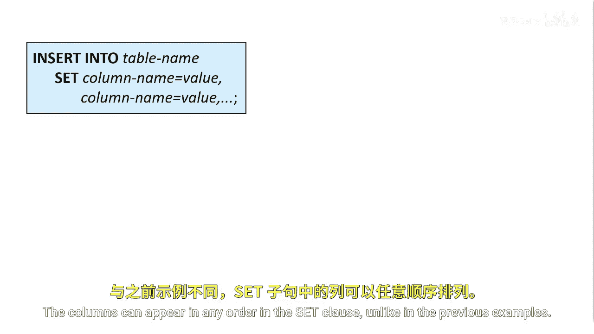
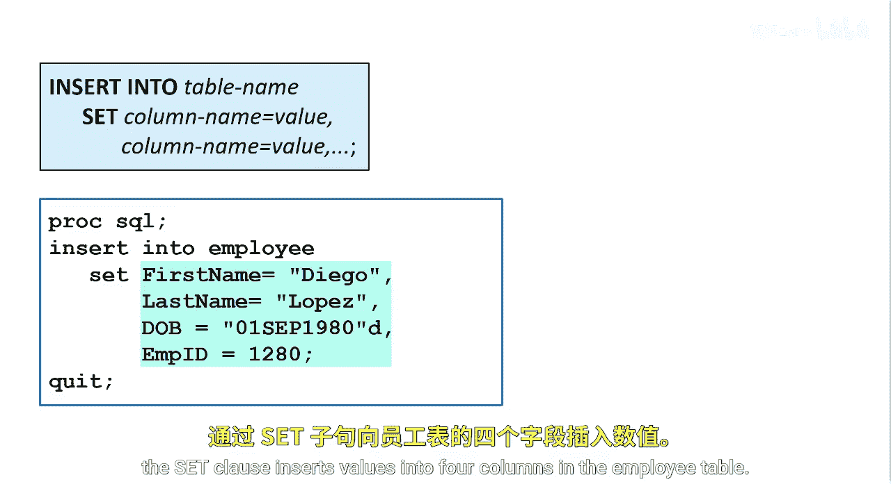

# 034：向表中插入行 📝

在本节课中，我们将学习如何使用 `INSERT` 语句向SAS数据表中添加新的数据行。无论表是空的还是已有数据，`INSERT` 语句都能帮助我们高效地插入数据。

## 概述



创建表之后，可以使用 `INSERT` 语句向表中插入数据值。该语句适用于空表或已包含数据的表。`INSERT` 语句首先向现有表添加一个新行，然后将指定的值插入该行。指定值的方式有两种：使用 `SET` 子句或 `VALUES` 子句。

## 使用查询结果插入行

为了将数据从一个现有表添加到另一个表，可以在 `INSERT` 语句中指定一个查询。例如，以下 `INSERT` 语句使用查询将数据行添加到 `high_credit` 表中。查询返回的行将被插入到表中。如果表中已有行，新行将被追加到末尾。

默认情况下，`SELECT` 子句为目标表中的每一列指定值，并且值的顺序必须与目标表中列的顺序匹配。


以下是使用查询插入行的基本语法：

```sql
INSERT INTO 目标表名
SELECT 列1, 列2, ...
FROM 源表名
WHERE 条件;
```

在这个例子中，`SELECT` 子句为 `high_credit` 表中的四列指定值：`first_name`、`last_name`、`user_id` 和 `credit_score`。并非所有列都是必需的。如果表中的列数多于列出的列，则未列出的列将被设置为缺失值。



## 使用 VALUES 子句插入行

可以使用带有 `VALUES` 子句的 `INSERT` 语句向单行中的列添加值。要向表中添加多行值，可以指定多个 `VALUES` 子句。


以下是使用 `VALUES` 子句插入多行数据的基本语法：

```sql
INSERT INTO 表名 (列1, 列2, 列3, ...)
VALUES (值1a, 值2a, 值3a, ...),
       (值1b, 值2b, 值3b, ...);
```

在这个例子中，我们希望向 `employee` 表中插入两行数据，因为我们有了新员工。我们首先指定 `INSERT INTO` 语句，后跟表名和要插入的列：`first_name`、`last_name`、`dob` 和 `mpid`。在表名后指定列时，位置很重要。同样，并非所有列都是必需的。如果表中的列数多于列出的列，则未列出的列将被设置为缺失值。

`VALUES` 子句指定我们要插入的值。指定值时，顺序必须与括号内关键字后指定的列的位置匹配。我们指定新员工 Diego Lopez 的名字、姓氏、生日和员工ID号。对第二个员工也进行同样的操作。

## 使用 SET 子句插入行

也可以使用 `SET` 子句来指定或更改行中一个或多个列的值。`SET` 子句包含一个或多个列名和值对。在每一对中，列名和值由等号连接。



与前面的例子不同，列可以以任何顺序出现在 `SET` 子句中。在这个 `INSERT` 语句中，`SET` 子句将值插入到 `employee` 表的四个列中。

以下是使用 `SET` 子句插入数据的基本语法：

```sql
INSERT INTO 表名
SET 列1 = 值1,
    列2 = 值2,
    列3 = 值3;
```

需要注意的是，这些列必须已经存在于表中。





## 总结


本节课中，我们一起学习了如何使用 `INSERT` 语句向SAS数据表添加新行。我们探讨了三种主要方法：使用查询结果插入多行数据、使用 `VALUES` 子句插入单行或多行数据，以及使用 `SET` 子句以键值对形式插入数据。理解这些方法将帮助您灵活高效地管理和填充数据表。