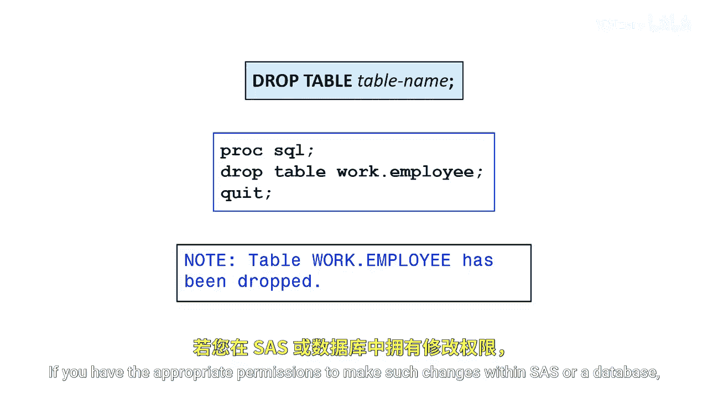
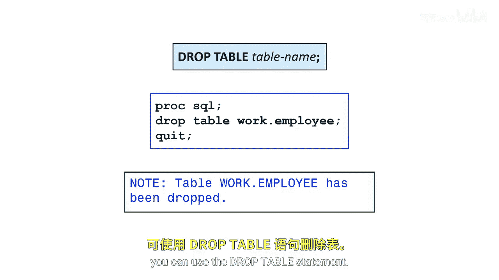

# 035：在 PROC SQL 中删除表

在本节课中，我们将学习如何在 PROC SQL 过程中使用 `DROP TABLE` 语句来删除数据表。这是管理数据环境、清理临时表或移除不再需要的数据集的重要操作。

## 概述


有时，在 SAS 或数据库中，如果你拥有适当的权限，可能需要删除（或称为“丢弃”）一个表。`DROP TABLE` 语句就是用于执行此操作的 SQL 命令。

## 使用 DROP TABLE 语句

上一节我们介绍了删除表的需求，本节中我们来看看具体的操作方法。`DROP TABLE` 语句的基本语法非常简单。

其核心语法公式如下：
```sql
DROP TABLE table-name;
```

在这个语句中，`table-name` 是你希望从当前库或数据库中永久移除的表的名称。执行此操作后，该表及其所有数据将被删除，且通常无法撤销，因此使用前需谨慎确认。

## 操作步骤与注意事项

以下是使用 `DROP TABLE` 语句时需要遵循的步骤和关键点：



1.  **确认权限**：确保你在 SAS 库或连接的数据库中拥有删除表的权限。
2.  **确认表名**：准确指定要删除的表的名称。如果表存在于非默认库中，需要使用**两级名称**，格式为 `library-name.table-name`。
3.  **执行语句**：在 `PROC SQL` 过程步中提交 `DROP TABLE` 语句。
4.  **验证结果**：删除操作完成后，可以尝试查询该表或查看库内容来确认表已被成功移除。

**重要提示**：`DROP TABLE` 操作是永久性的。被删除的表无法通过 SAS 的撤销功能恢复。建议在执行删除前对重要数据进行备份。



## 总结

本节课中我们一起学习了如何在 PROC SQL 中使用 `DROP TABLE` 语句。我们了解了其基本语法 `DROP TABLE table-name;`，并强调了在执行删除操作前确认权限和表名的重要性，因为该操作会永久移除表及其所有数据。掌握此语句有助于你有效地管理 SAS 数据环境。