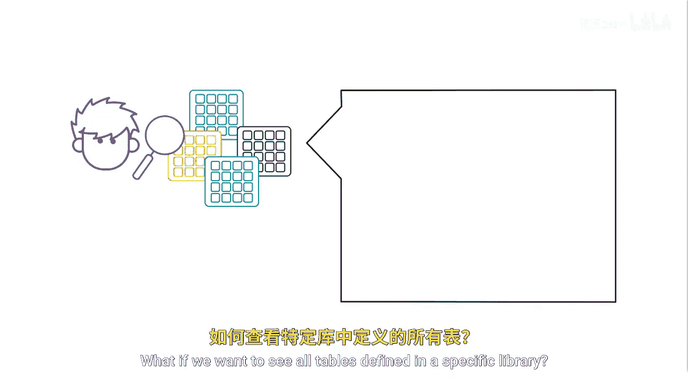
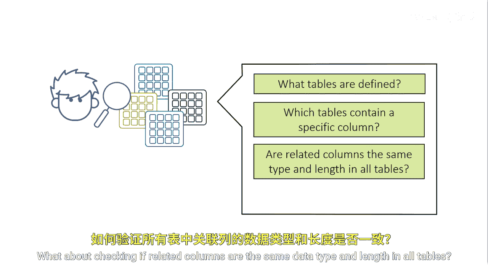
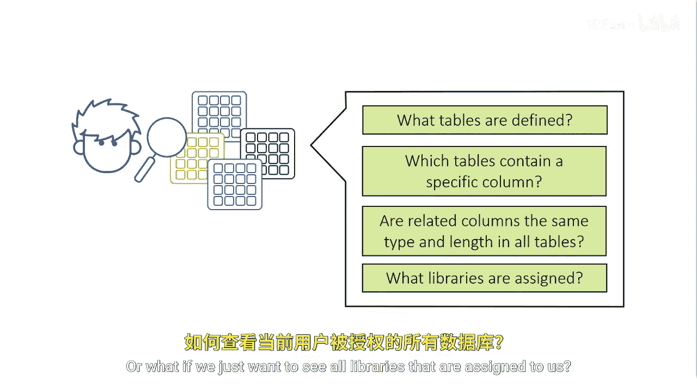
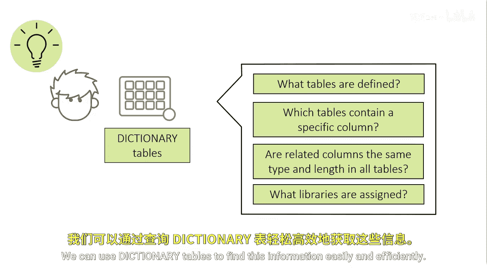

SAS高级程序员专项课程：P36：使用字典表探索数据环境 🔍

在本节课中，我们将学习如何使用SAS的字典表来高效地探索数据环境。当您接手多个不同的数据表并希望快速了解其内容时，字典表是强大的工具。

假设我们继承了许多不同的数据表，并希望熟悉其内容。我们如何才能高效地开始探索这些表和库？如果我们想查看特定库中定义的所有表，或者查看哪些表包含特定的列，该怎么办？

此外，我们可能还需要检查相关列在所有表中是否具有相同的数据类型和长度。或者，我们可能想查看所有已分配给我们的库。

我们可以使用字典表来轻松、高效地查找这些信息。

---

### 什么是字典表？📚

上一节我们提出了探索数据环境的需求，本节中我们来看看能满足这一需求的工具——字典表。字典表是SAS系统提供的一组只读的特殊表，它们包含了关于当前SAS会话中所有库、数据表、列、格式等元数据信息。您可以像查询普通SAS数据集一样查询它们。

### 如何访问字典表？🔧

访问字典表主要有两种方式：
1.  通过 `DICTIONARY` 库：例如 `DICTIONARY.TABLES`。
2.  通过 `SASHELP` 视图：例如 `SASHELP.VTABLE`。`SASHELP` 视图是 `DICTIONARY` 表的易用接口。

以下是几个最常用的字典表及其用途：

*   **`DICTIONARY.TABLES` / `SASHELP.VTABLE`**：包含所有SAS数据表（数据集）的信息。
*   **`DICTIONARY.COLUMNS` / `SASHELP.VCOLUMN`**：包含所有SAS数据表中列的信息。
*   **`DICTIONARY.LIBNAMES` / `SASHELP.VLIBNAM`**：包含所有已分配库的信息。



### 实践应用示例 💻

了解了核心的字典表后，我们通过几个具体场景来看看如何应用它们。


**场景一：查看指定库中的所有表**

假设我们想查看 `WORK` 库中的所有表。

```sas
proc sql;
    select memname /* 表名 */, nobs /* 观测数 */, nvar /* 变量数 */
    from dictionary.tables
    where libname = ‘WORK‘; /* 指定库名，注意必须大写 */
quit;
```

**场景二：查找包含特定列的所有表**

如果我们想找出所有包含名为 `CustomerID` 的列的表。



```sas
proc sql;
    select libname, memname, name as column_name, type, length
    from dictionary.columns
    where upcase(name) = ‘CUSTOMERID‘; /* 使用upcase避免大小写问题 */
quit;
```

**场景三：检查列的一致性**

要检查不同表中名为 `Sales` 的列的数据类型和长度是否一致。

```sas
proc sql;
    select libname, memname, name, type, length
    from dictionary.columns
    where upcase(name) = ‘SALES‘
    order by type, length;
quit;
```
通过这个查询结果，您可以快速对比 `Sales` 列在不同表中的定义。



**场景四：查看所有已分配的库**

最后，如果我们想了解当前会话中有哪些库可用。

```sas
proc sql;
    select libname, path, engine
    from dictionary.libnames;
quit;
```

---



### 总结 🎯

本节课中，我们一起学习了SAS字典表的强大功能。我们了解到，字典表是存储SAS环境元数据的特殊表，通过 `DICTIONARY` 库或 `SASHELP` 视图可以访问它们。我们重点掌握了四个核心应用：查看库中的表、查找包含特定列的表、检查列属性的一致性以及列出所有已分配的库。利用字典表进行探索，能让我们在面对陌生或复杂的数据环境时，迅速掌握全局信息，为后续的数据处理和分析打下坚实基础。