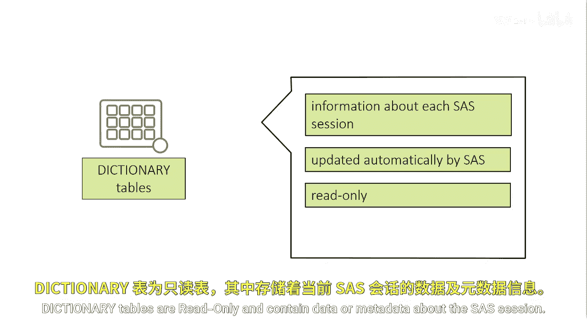
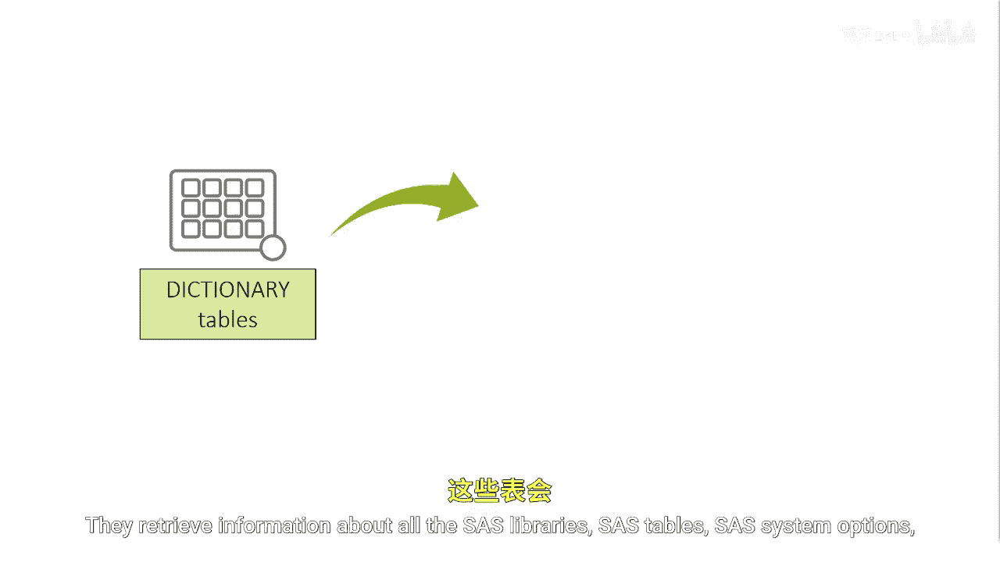
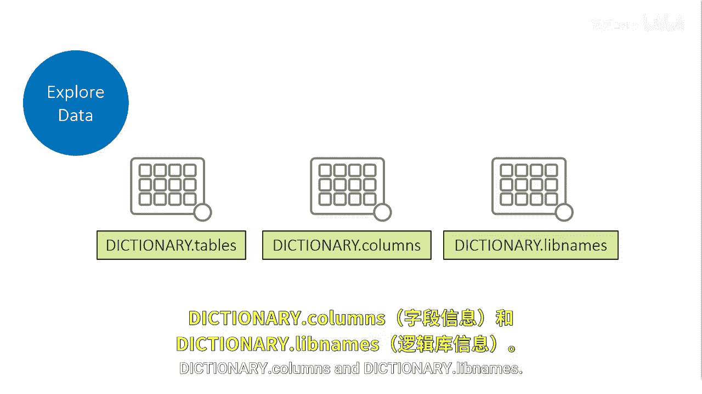

# 037：字典表 📚

在本节课中，我们将要学习SAS字典表。字典表是SAS会话中一组特殊的只读表，它们包含了关于当前SAS环境、数据、库和系统设置的元数据信息。理解并掌握如何使用字典表，对于监控和管理SAS会话至关重要。

## 什么是字典表？

上一节我们介绍了SAS会话的基本概念，本节中我们来看看字典表。字典表包含了关于每个SAS会话或批处理作业的信息。

这些特殊的表在SAS会话初始化后立即可用，并且在整个会话期间由SAS自动更新。

字典表是只读的，包含了关于SAS会话的数据或元数据。

它们检索与当前SAS会话相关的所有SAS库、SAS表、SAS系统选项以及外部文件的信息。

## 如何访问字典表？

SAS自动将一个名为`DICTIONARY`的特殊保留库分配给字典表，该库只能在`PROC SQL`过程中访问。

然而，SAS提供了基于字典表的`PROC SQL`视图，这些视图可以在其他SAS过程步以及数据步中使用。

这些视图存储在`SASHELP`库中，通常被称为`SASHELP`视图。

字典表常用于监控和管理SAS会话，因为相比其他来源（如`PROC DATASETS`）的输出，其数据更容易被操作。

你可以像查询任何其他表一样查询字典表，包括使用`WHERE`子句进行子集筛选、对结果排序以及创建`PROC SQL`视图。

请注意，字典表中的许多字符值都以全大写形式存储，因此在设计查询时应相应处理。

## 核心字典表介绍

虽然字典表有很多，但我们将重点介绍三个核心表：`DICTIONARY.TABLES`、`DICTIONARY.COLUMNS`和`DICTIONARY.LIBNAMES`。

以下是这三个核心表的功能简介：

*   **`DICTIONARY.TABLES`**：包含所有SAS库中所有数据集的元数据信息，例如表名、库名、观测数、变量数等。
*   **`DICTIONARY.COLUMNS`**：包含所有SAS数据集中所有变量的详细信息，如变量名、类型（字符或数值）、长度、格式、标签等。
*   **`DICTIONARY.LIBNAMES`**：包含当前SAS会话中定义的所有库的引用信息。

理解这些表非常重要。

## 总结

本节课中我们一起学习了SAS字典表。我们了解到字典表是存储SAS会话元数据的特殊只读表，可以通过`PROC SQL`直接访问，或通过`SASHELP`视图在其他地方使用。我们重点介绍了三个核心字典表：`DICTIONARY.TABLES`、`DICTIONARY.COLUMNS`和`DICTIONARY.LIBNAMES`，它们是管理和探索SAS环境的有力工具。