# 038：使用字典表示例 🔍

在本节课中，我们将学习如何使用SAS的字典表来查询元数据信息。我们将重点探索三个核心的字典表：`DICTIONARY.TABLES`、`DICTIONARY.COLUMNS`和`DICTIONARY.LIBNAMES`，并了解它们在SASHELP视图中的等价物。通过实际查询示例，你将掌握如何获取关于库、表和列的详细信息。

---

## 探索 DICTIONARY.TABLES 表

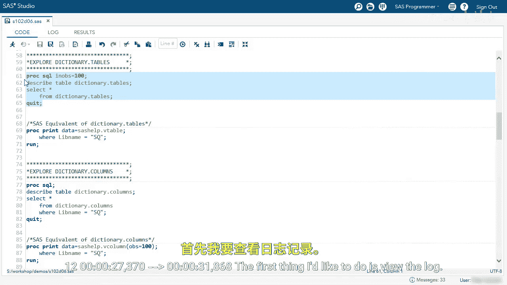

首先，我们从探索 `DICTIONARY.TABLES` 表开始。这个表位于SAS的字典库中，包含了所有可用表的信息。


为了限制输出行数，我们使用 `NOBS=100` 选项。以下是查询该表结构的代码：

```sas
DESCRIBE TABLE dictionary.tables;
```

运行上述代码后，我们可以在日志中查看结果。`DESCRIBE TABLE` 语句会显示列名、列类型以及相关的标签信息。了解实际的列名非常重要。

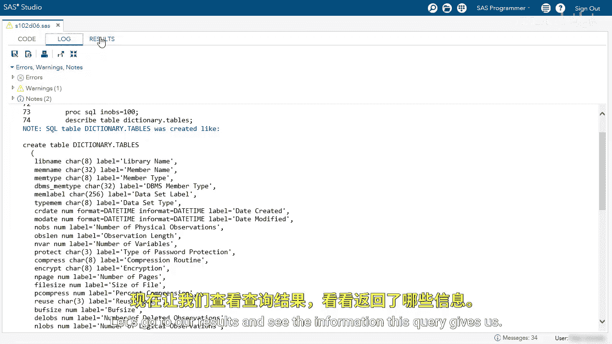

接下来，我们执行一个查询来查看表中的具体数据：

```sas
PROC SQL NOBS=100;
    SELECT * FROM dictionary.tables;
QUIT;
```

在结果中，我们可以看到诸如库名（如WORK、SQ，均为大写）、成员名（即表名，也是大写）、成员类型，以及其他各种信息，例如创建或修改日期、物理观测数、长度、变量（列）数量等。

---


## 筛选特定库中的表

如果我们只想关注特定的库，例如SQ库，该怎么办呢？我们可以使用 `WHERE` 子句来筛选。

以下是查询SQ库中所有表的代码：


```sas
PROC SQL;
    SELECT * FROM dictionary.tables
    WHERE libname = ‘SQ‘;
QUIT;
```


注意，库名 `‘SQ‘` 必须使用大写。运行此查询后，我们将看到SQ库中的每一个表及其详细信息，总计大约有27个表。

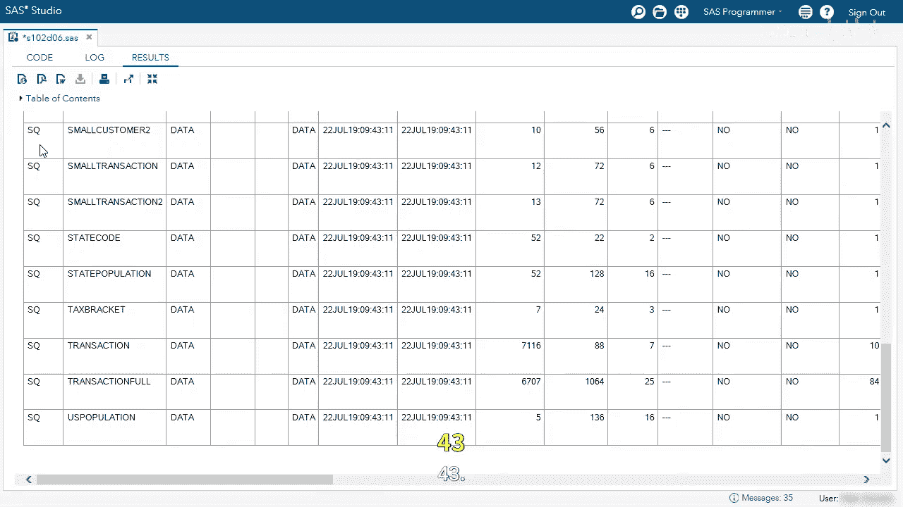

在SAS中，`DICTIONARY.TABLES` 的等价视图是 `SASHELP.VTABLE`。我们可以通过以下方式获得相同的信息：

```sas
PROC PRINT DATA=sashelp.vtable;
    WHERE libname = ‘SQ‘;
RUN;
```

默认情况下，`PROC PRINT` 不使用列标签，而是显示实际的列名。了解字典表和SASHELP视图的这两种用法，取决于你的具体使用场景。


---

## 探索 DICTIONARY.COLUMNS 表

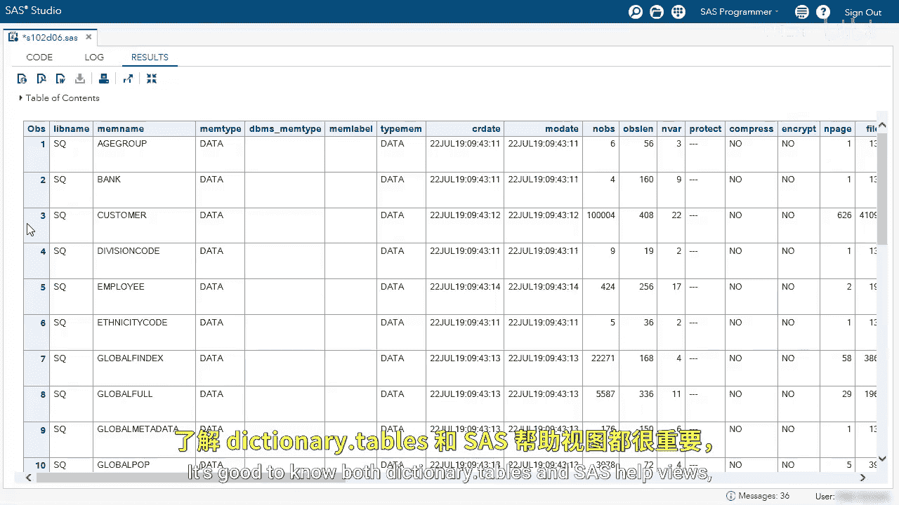

上一节我们介绍了如何查询表信息，本节中我们来看看如何获取表中列的详细信息。我们将使用 `DICTIONARY.COLUMNS` 表。

首先，查看该表的结构：

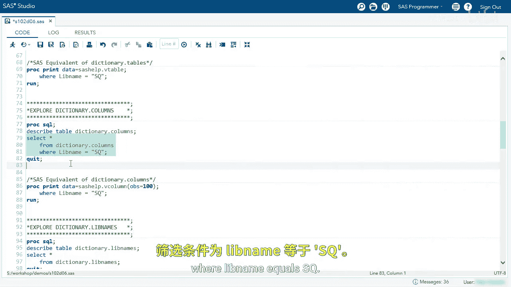

```sas
DESCRIBE TABLE dictionary.columns;
```

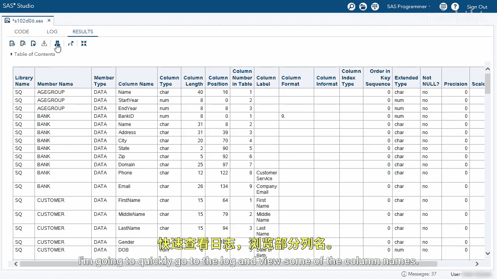

查看日志，可以看到列名与 `DICTIONARY.TABLES` 类似，但包含的是关于列的不同信息。接着，我们查询SQ库中所有表的列信息：

```sas
PROC SQL;
    SELECT * FROM dictionary.columns
    WHERE libname = ‘SQ‘;
QUIT;
```

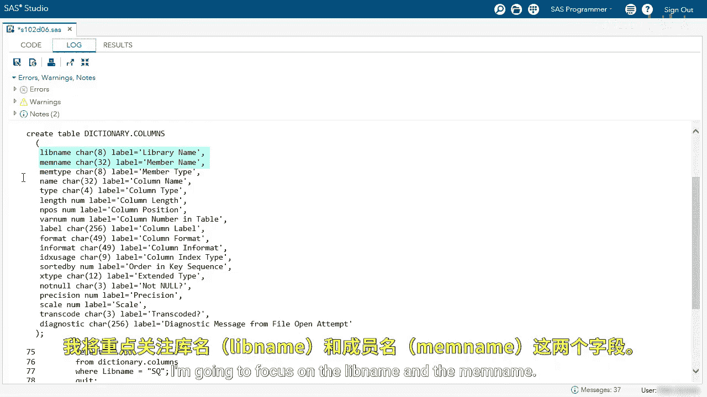

在结果中，我们可以看到库名（仅为SQ）、成员名（表名），以及每个表中每一列的详细信息，包括列名、类型、长度、位置等。这是比较不同表中同名列的属性（如类型、长度和格式）是否一致的绝佳方法。

`DICTIONARY.COLUMNS` 在SASHELP中的等价视图是 `SASHELP.VCOLUMN`。以下是示例代码：

```sas
PROC PRINT DATA=sashelp.vcolumn (OBS=100);
RUN;
```

同样，我们可以看到相同的信息。使用 `PROC PRINT` 过程时，默认不显示列标签。

---

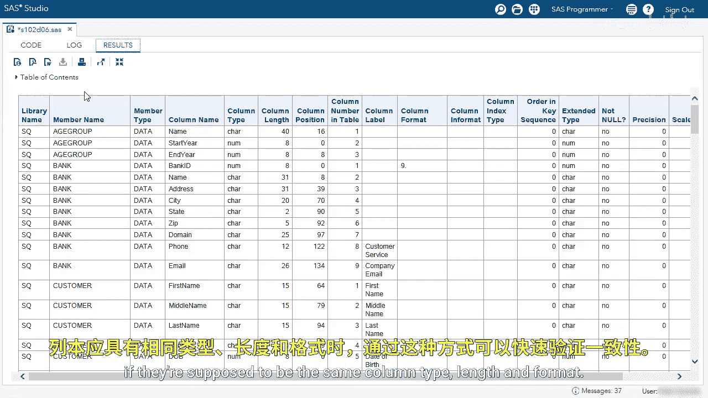

## 探索 DICTIONARY.LIBNAMES 表

最后，我们来探索 `DICTIONARY.LIBNAMES` 表，它包含了已定义库的信息。

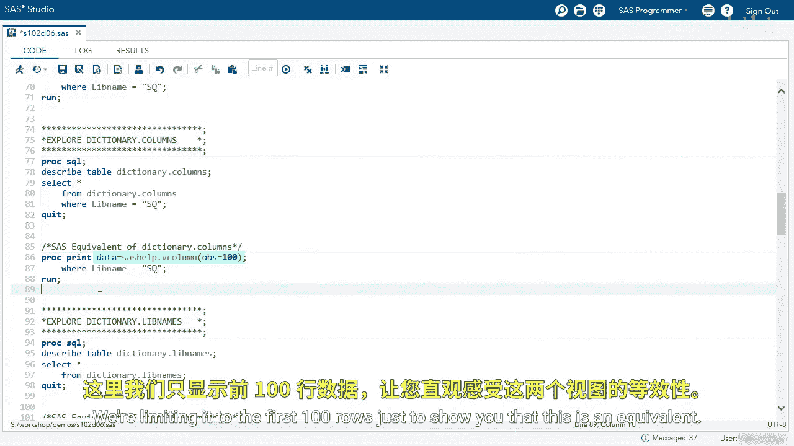

首先，查看其结构：

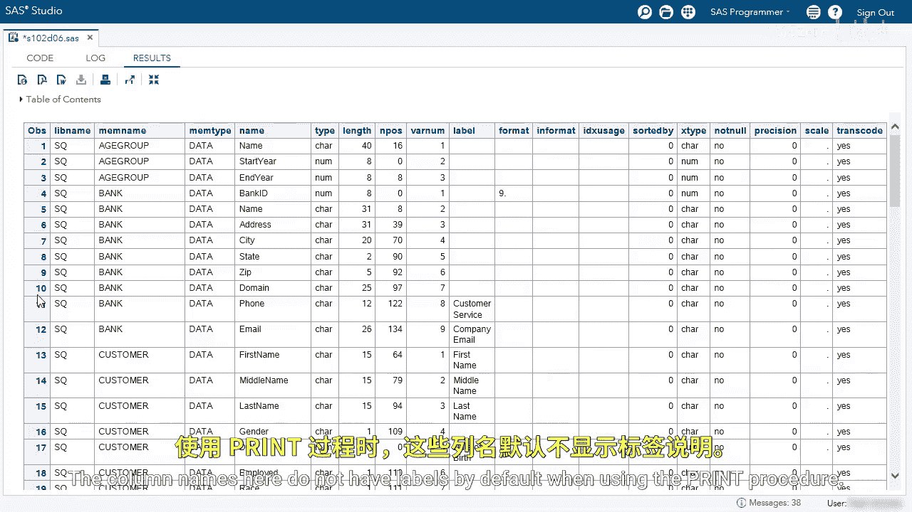

```sas
DESCRIBE TABLE dictionary.libnames;
```

查看日志，可以看到列数较少，但包含了库名、引擎、库路径等信息。接着，查询所有库的信息：

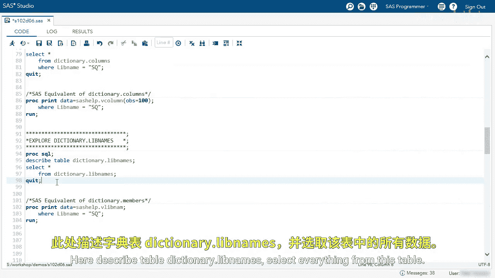

```sas
PROC SQL;
    SELECT * FROM dictionary.libnames;
QUIT;
```

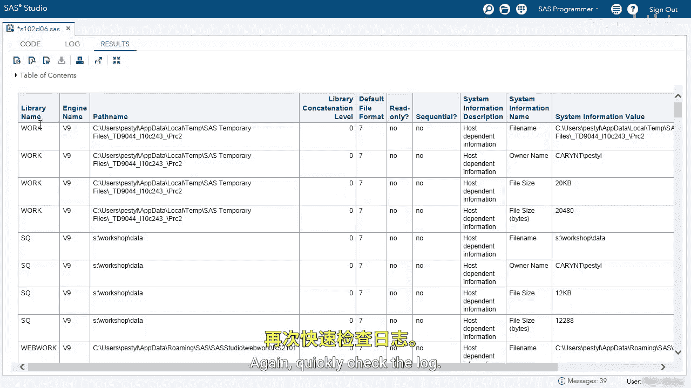

结果中显示了每个库的名称、使用的引擎、库的物理路径等信息。如果我们只想查看SQ库，可以添加 `WHERE` 子句：

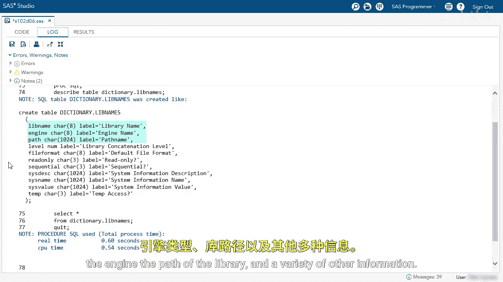

```sas
PROC SQL;
    SELECT * FROM dictionary.libnames
    WHERE libname = ‘SQ‘;
QUIT;
```

一个有用的功能是，你可以查看当前连接的所有不重复的库。以下是查询代码：

```sas
PROC SQL;
    SELECT DISTINCT libname FROM dictionary.libnames;
QUIT;
```

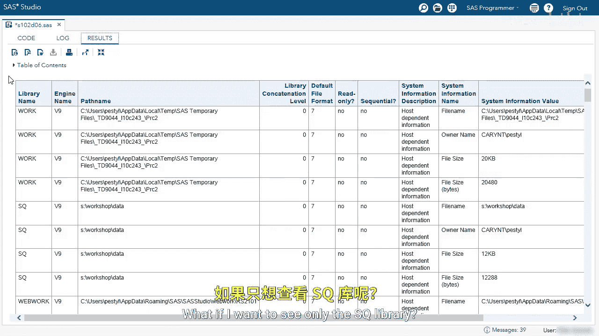

运行后，将列出所有已连接的库（你的列表可能略有不同）。这是检查所有可用库的一个好方法。


同样，在SAS编程（如DATA步或PROC步）中，也可以使用等价视图 `SASHELP.VLIBNAM`：

```sas
PROC PRINT DATA=sashelp.vlibnam;
RUN;
```

运行此过程，我们将看到所有库的相同信息，其中也包括SQ库。

---

## 总结

本节课中，我们一起学习了如何使用SAS字典表来查询元数据。

*   我们首先探索了 **`DICTIONARY.TABLES`**，用于获取所有表的信息。
*   接着，我们学习了如何使用 **`DICTIONARY.COLUMNS`** 来查看表中每一列的详细属性。
*   最后，我们了解了 **`DICTIONARY.LIBNAMES`**，用于查询已定义库的信息。

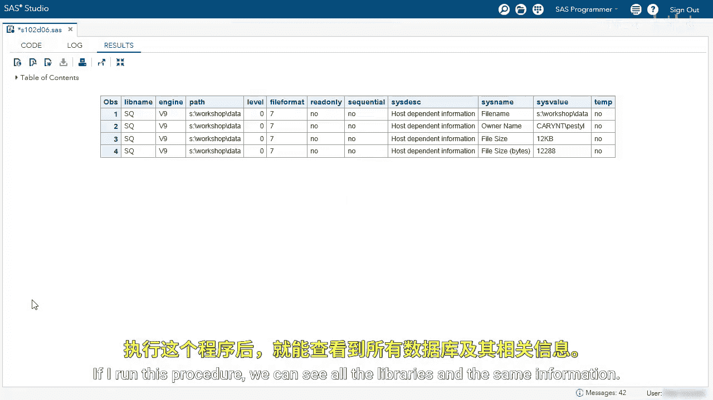

我们还介绍了这些字典表在 `SASHELP` 视图（如 `VTABLE`、`VCOLUMN`、`VLIBNAM`）中的等价物。掌握查询这些元数据表的方法，能帮助你更高效地管理和理解SAS环境中的数据。