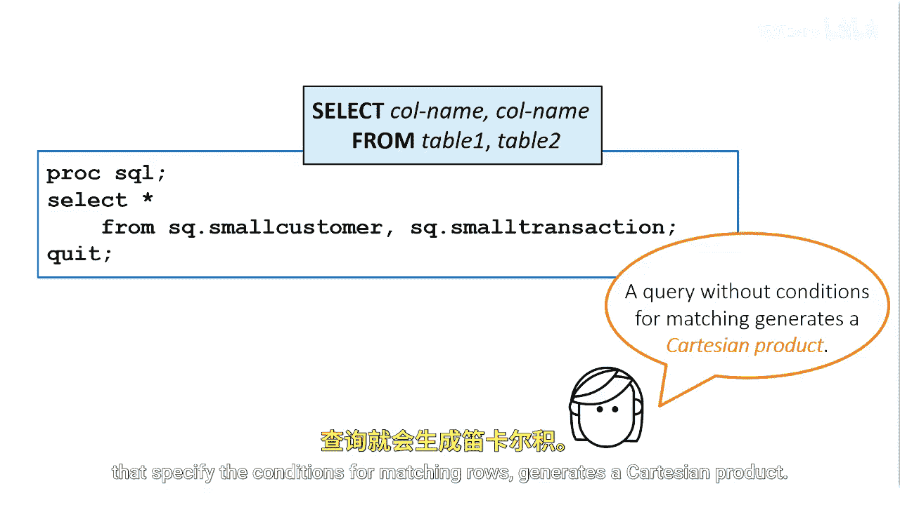

# 040：连接表

在本节课中，我们将学习如何使用SQL的JOIN操作，将多个表中的数据水平合并，以创建包含更完整信息的报告或输出表。

## 理解连接的概念

上一节我们介绍了SQL的基本查询，本节中我们来看看如何组合多个表的数据。

假设你需要创建一个报告，其中包含来自`small_customer`表的客户人口统计信息，并结合来自`small_transaction`表的客户交易信息。你希望每一行都包含同一客户的所有信息。

SQL使用**连接**来水平合并表。请求连接涉及将一个表中的一行数据与第二个表中的对应行进行匹配。匹配通常基于两个表中的一个或多个列进行。

## 主键与外键

以下是理解连接的基础概念。

*   **主键**：在一个表中，其值能唯一标识每一行的列。在`small_customer`表中，`account_id`是主键。
*   **外键**：一个表中的列，它引用另一个表中的主键。在`small_transaction`表中，`account_id`是外键。

你可以通过使用主键`account_id`在PROC SQL中组合或连接这些表。连接将来自多个源表的数据水平合并，以生成报告或输出表，而源表本身保持完整且不被修改。

## 笛卡尔积（交叉连接）

要理解SQL如何处理连接，首先需要了解笛卡尔积或交叉连接的概念。

最基本的连接类型是简单地在SELECT语句的FROM子句中列出多个表，并用逗号分隔。例如，一个连接了8行的`small_customer`表和12行的`small_transaction`表的查询。

一个在FROM子句中列出多个表但没有指定行匹配条件的附加子句的查询，会生成一个**笛卡尔积**。笛卡尔积中的行数是参与连接的各表行数的乘积。

**公式：总行数 = 表1行数 × 表2行数**

第一表中的每一行都与第二表中的每一行相结合。运行此查询时，笛卡尔积会创建一个包含96行（8 × 12）的报告。

在处理大型表时，笛卡尔积很少是你想要的结果，因为它可能创建不必要的大型报告或表，甚至拖慢系统资源。

---

本节课中我们一起学习了SQL连接的基本概念，包括主键、外键的作用，以及最基础的连接类型——笛卡尔积（交叉连接）的原理与影响。理解这些是掌握后续各种具体连接方式（如内连接、外连接）的基础。