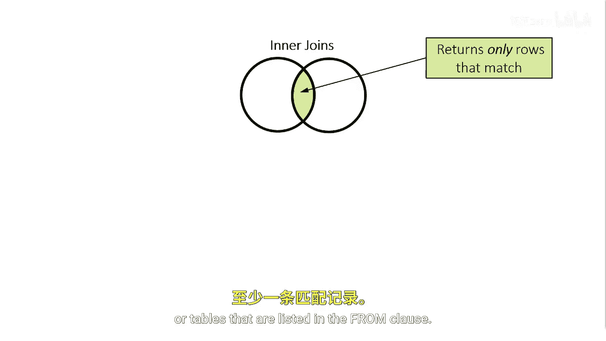
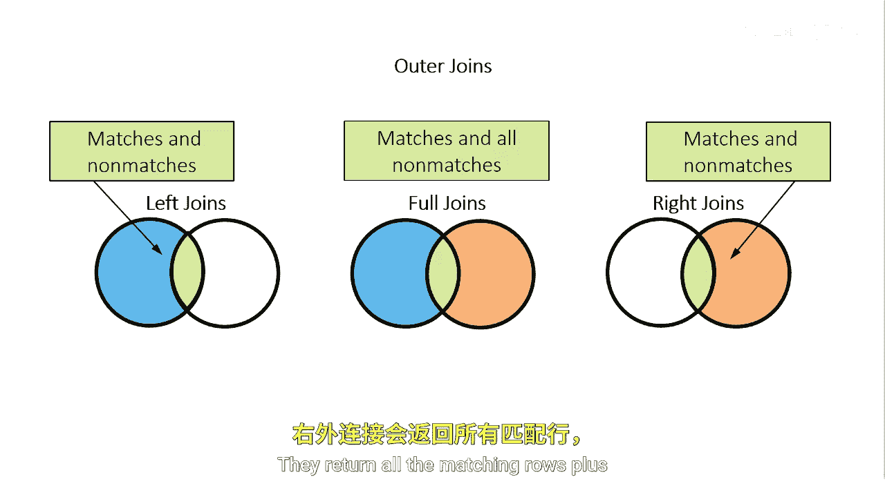

# 041：连接类型

在本节课中，我们将学习SQL中的连接类型。连接是组合两个或多个表中数据的关键操作。我们将重点介绍内连接和外连接，并通过简单的图示和示例来解释它们的工作原理。

## 概述

通常，我们需要的不是两个表所有可能的组合（笛卡尔积），而是其一个子集。因此，我们需要更具体地声明连接类型以及希望在表之间关联的信息片段。SQL支持两种主要连接类型：内连接和外连接。为了解释每种类型的结果，我们将使用简化的维恩图，将两个表表示为圆圈。

## 内连接


上一节我们介绍了连接的基本概念，本节中我们来看看第一种连接类型——内连接。

内连接在维恩图中代表两个圆圈的重叠区域。它返回一个结果集，其中包含第一个表中所有在第二个表（或`FROM`子句中列出的其他表）中有一个或多个匹配行的行。




**核心概念**：内连接只返回两个表中都满足连接条件的行。其基本语法如下：
```sql
SELECT 列名
FROM 表A
INNER JOIN 表B
ON 表A.关联列 = 表B.关联列;
```

## 外连接

理解了内连接后，我们接下来探讨外连接。外连接比内连接更全面。

所有外连接都返回满足`ON`或`WHERE`子句中描述条件的结果，**加上**那些不满足条件的行。外连接有三种类型。

以下是三种外连接的详细说明：

*   **完全外连接**：在维恩图中代表所有区域。它返回所有匹配的行，加上两个表中所有不匹配的行。
*   **左外连接**：代表维恩图中的左圆和重叠区域。它返回所有匹配的行，加上第一个（左）表中所有不匹配的行。
*   **右外连接**：代表维恩图中的右圆和重叠区域。它返回所有匹配的行，加上第二个（右）表中所有不匹配的行。



**核心概念**：外连接会保留至少一个表中的所有行，即使它们在另一个表中没有匹配项。常用语法示例：
```sql
-- 左外连接
SELECT 列名 FROM 表A LEFT JOIN 表B ON 关联条件;
-- 右外连接
SELECT 列名 FROM 表A RIGHT JOIN 表B ON 关联条件;
-- 完全外连接
SELECT 列名 FROM 表A FULL JOIN 表B ON 关联条件;
```

## 总结


本节课中我们一起学习了SQL的两种主要连接类型。**内连接**仅返回两个表中有匹配的行，适用于需要精确关联数据的场景。**外连接**（包括左外、右外和完全外连接）则能保留一个或两个表中的所有行，即使没有匹配项，这对于需要包含所有基础数据（如所有客户或所有产品）的分析至关重要。理解这些连接类型的区别是进行有效数据合并和分析的基础。