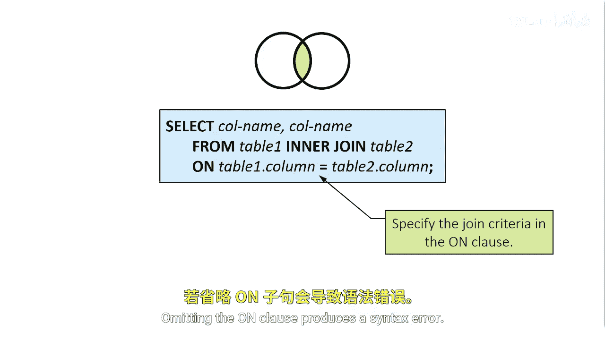
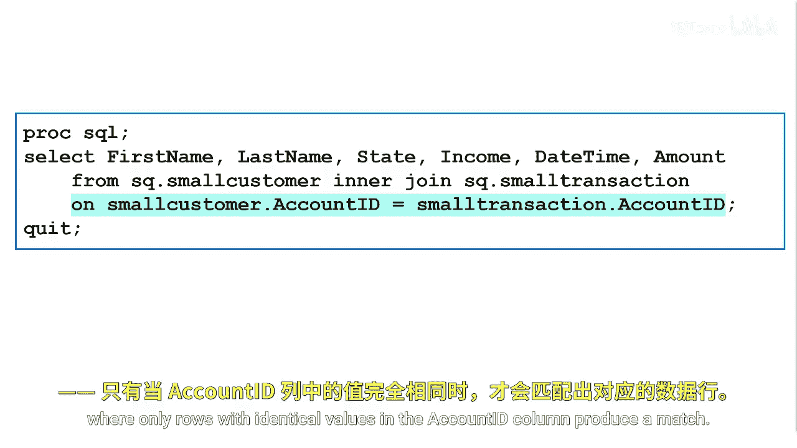

# 042：使用内连接合并两个表

在本节课中，我们将学习如何使用内连接（INNER JOIN）来合并两个表。我们将通过账户ID（account ID）来合并客户表和交易表，并返回一个仅包含匹配账户ID值的结果集，从而将每位客户及其交易的所有信息整合在一起。

## 内连接简介


上一节我们介绍了表连接的基本概念，本节中我们来看看最常用的连接类型之一：内连接。

内连接会根据你指定的连接条件返回匹配的行。其基本语法在 `FROM` 子句中定义。

## 内连接语法

以下是内连接的基本语法结构：

```sql
FROM table1
INNER JOIN table2
ON table1.column = table2.column;
```



在 `FROM` 子句中，首先指定第一个表，然后是关键字 `INNER JOIN`，接着是第二个表。在表名和连接类型之后，语法要求一个 `ON` 子句来描述表中行匹配的连接条件。省略 `ON` 子句会导致语法错误。

## 等值连接示例

这个内连接的例子也被称为**等值连接**，因为 `ON` 子句中使用的是等号（=）。只有两个表中账户ID列值完全相同的行才会被匹配并返回。



## 其他比较运算符


`ON` 子句中的条件也可以使用其他比较运算符，例如大于（>）、小于（<），或者特殊的 `WHERE` 运算符。

## 限定列名

当引用的两个表中有同名的列时，必须在每个账户ID列引用前加上表名。

以下是处理同名列的方法：
*   **限定列名**由表名、一个句点（.）和列名组成。
*   使用限定列名可以避免创建模糊的列引用，确保SAS能明确知道你所指的是哪个表中的哪一列。

## 总结


本节课中我们一起学习了如何使用内连接合并两个表。我们了解了内连接的基本语法，知道了它通过 `ON` 子句指定的条件返回匹配的行。我们还学习了等值连接的概念，以及当表中有同名列时，必须使用表名来限定列名以避免歧义。掌握内连接是进行高效数据合并与分析的基础。