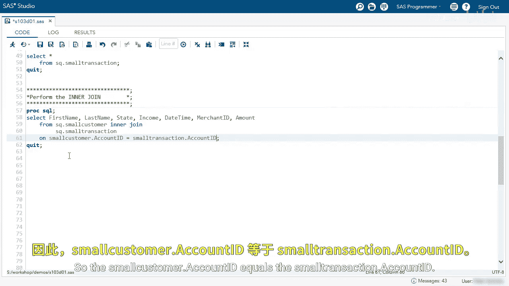
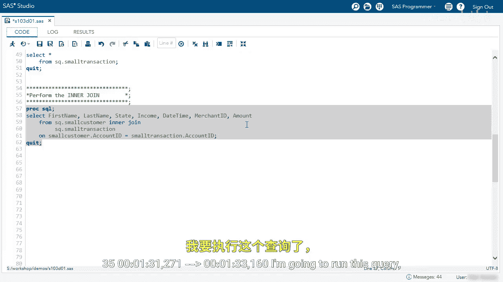
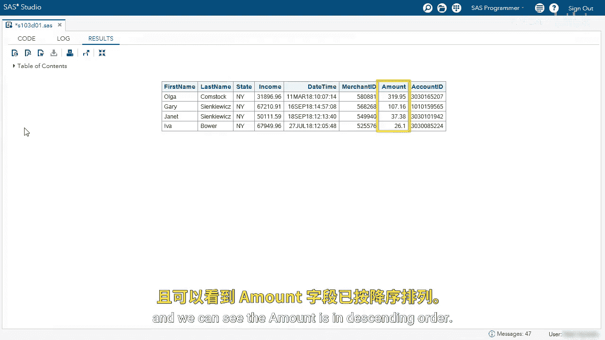

# 043：使用PROC SQL执行内连接演示 🧩

在本节课中，我们将学习如何使用SAS的PROC SQL过程步来执行两个表之间的内连接操作。我们将从探索数据表开始，逐步构建连接查询，并学习如何结合WHERE和ORDER BY子句来筛选和排序结果。


## 探索数据表


首先，我们需要了解将要连接的两个数据表。以下查询用于查看两个表中的所有数据。

```sql
SELECT * FROM SQ_SMALL_CUSTOMER;
SELECT * FROM SQ_SMALL_TRANSACTION;
```

两个数据表都包含一个名为`account ID`的列，这个列将作为我们连接两个表的关键字段。

## 执行内连接

现在，让我们开始执行内连接。我们将从两个表中选择几列数据。

以下是执行内连接的基本查询结构。我们首先指定主表，然后使用`INNER JOIN`关键字连接第二个表，并通过`ON`子句指定连接条件。



```sql
SELECT c.first_name, c.last_name, t.transaction_date, t.merchant, t.amount
FROM SQ_SMALL_CUSTOMER c
INNER JOIN SQ_SMALL_TRANSACTION t
ON c.account_ID = t.account_ID;
```

在这个查询中，我们选择了客户的名字、姓氏以及交易的日期、商户和金额。由于两个表都有`account_ID`列，我们在`ON`子句中使用了表别名（`c`和`t`）来明确指定列所属的表。

执行内连接后，结果集只包含两个表中`account_ID`匹配的行。例如，我们可以看到Gary有一笔交易，Sergio有两笔交易等。

## 处理列名歧义




如果我们想在结果中看到`account_ID`列，直接将其加入`SELECT`列表会导致错误。


```sql
-- 此查询会导致错误
SELECT c.first_name, c.last_name, t.transaction_date, t.merchant, t.amount, account_ID
FROM SQ_SMALL_CUSTOMER c
INNER JOIN SQ_SMALL_TRANSACTION t
ON c.account_ID = t.account_ID;
```

运行上述查询会报错：“ambiguous reference, column account_ID is in more than one table”。这是因为SQL无法确定我们想选择哪个表中的`account_ID`列。

为了解决这个问题，我们必须在`SELECT`子句中明确限定列名。在内连接中，由于只返回匹配的行，选择任意一个表中的`account_ID`都可以。


```sql
SELECT c.first_name, c.last_name, t.transaction_date, t.merchant, t.amount, c.account_ID
FROM SQ_SMALL_CUSTOMER c
INNER JOIN SQ_SMALL_TRANSACTION t
ON c.account_ID = t.account_ID;
```

现在，查询可以成功运行，并且`account_ID`作为最后一列出现在结果中。


## 结合其他子句

上一节我们完成了基本的内连接。本节中，我们来看看如何将内连接与之前学过的`WHERE`和`ORDER BY`子句结合使用，以进一步筛选和排序数据。

我们可以像在普通查询中一样，在连接查询后使用`WHERE`子句来筛选行，使用`ORDER BY`子句来排序结果。


以下是一个结合了所有子句的完整示例。我们将筛选出州为‘NY’的客户，并按照交易金额降序排列结果。

```sql
SELECT c.first_name, c.last_name, t.transaction_date, t.merchant, t.amount, c.account_ID
FROM SQ_SMALL_CUSTOMER c
INNER JOIN SQ_SMALL_TRANSACTION t
ON c.account_ID = t.account_ID
WHERE c.state = ‘NY’
ORDER BY t.amount DESC;
```


运行此查询后，生成的结果报告将只包含州为‘NY’的行，并且所有行按照交易金额从高到低排列。



## 总结

本节课中，我们一起学习了使用PROC SQL执行内连接的核心步骤。我们首先探索了源表，然后构建了基本的连接查询，并解决了列名歧义的问题。最后，我们演示了如何将内连接与`WHERE`和`ORDER BY`子句结合，以生成更具体、有序的数据报告。掌握这些技巧是进行复杂数据合并与分析的基础。