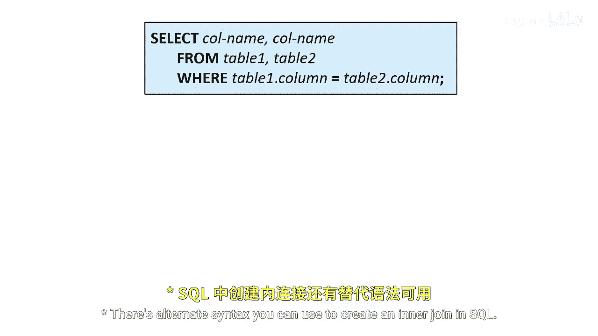
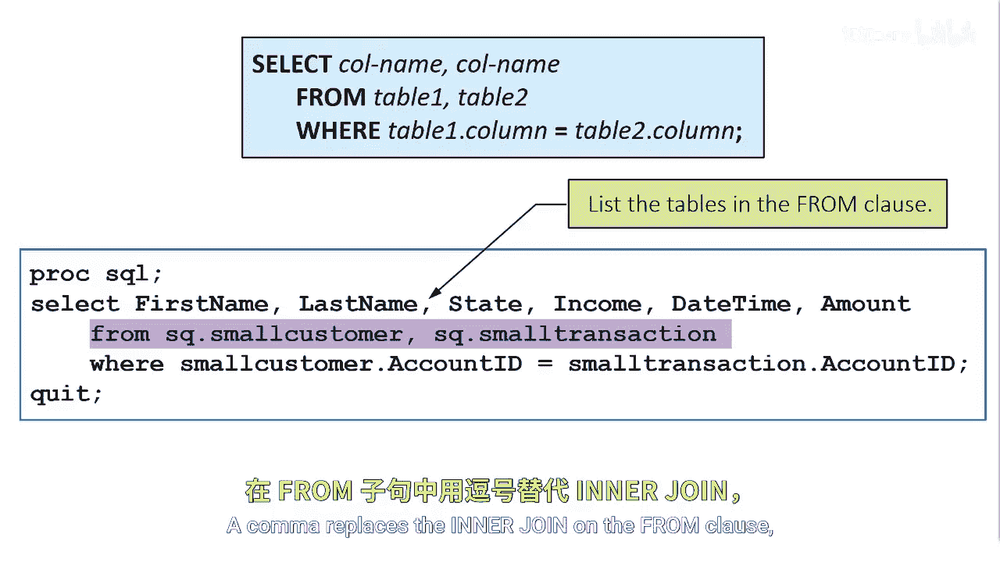
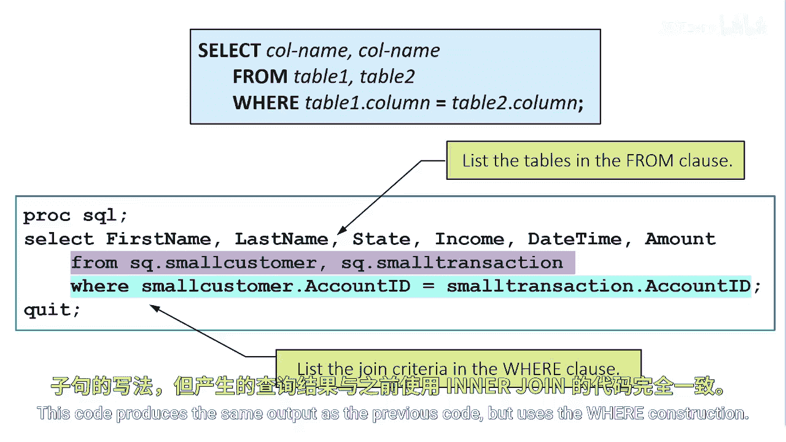
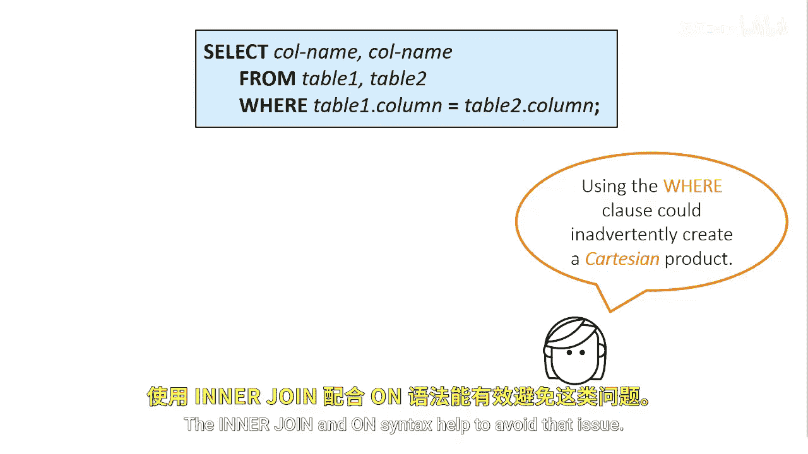

# 044：SQL内连接替代语法 ⚙️

在本节课中，我们将学习在SQL中创建内连接的另一种语法形式。这种语法不使用`INNER JOIN`和`ON`关键字，而是通过逗号和`WHERE`子句来实现相同的连接效果。

## 语法结构对比

上一节我们介绍了使用`INNER JOIN`和`ON`子句的标准内连接语法。本节中，我们来看看它的替代写法。

核心变化在于：
1.  **FROM子句**：用逗号`,`分隔要连接的表名，替代`INNER JOIN`。
2.  **连接条件**：将`ON`子句改为`WHERE`子句。



以下是两种语法的对比示例：



**标准语法：**
```sql
SELECT *
FROM table1
INNER JOIN table2
ON table1.column = table2.column;
```

**替代语法：**
```sql
SELECT *
FROM table1, table2
WHERE table1.column = table2.column;
```

## 功能等效性

在`FROM`子句中使用逗号分隔表，并在`WHERE`子句中指定连接列，其功能与使用`INNER JOIN`关键字和`ON`子句列出表是完全相同的。

以下代码使用了`WHERE`构造，但产生的输出结果与之前使用`INNER JOIN`的代码完全一致。




## 使用注意事项

虽然替代语法能达到相同目的，但在使用时需要格外小心。

使用`WHERE`子句创建连接时，如果忘记指定连接条件，可能会无意中创建笛卡尔积。如果涉及的表数据量很大，这将极大地消耗系统资源。

而使用`INNER JOIN`和`ON`的语法结构则有助于避免这个问题，因为它明确地将连接条件与表关联在一起。



---


本节课中我们一起学习了SQL内连接的替代语法。我们了解到，通过逗号分隔`FROM`子句中的表名，并将连接条件移至`WHERE`子句，可以实现与标准`INNER JOIN ... ON ...`语法相同的效果。但需要注意的是，替代语法在遗漏条件时容易产生笛卡尔积，因此在实际编程中应谨慎使用，或优先选择更清晰、更安全的`INNER JOIN`语法。